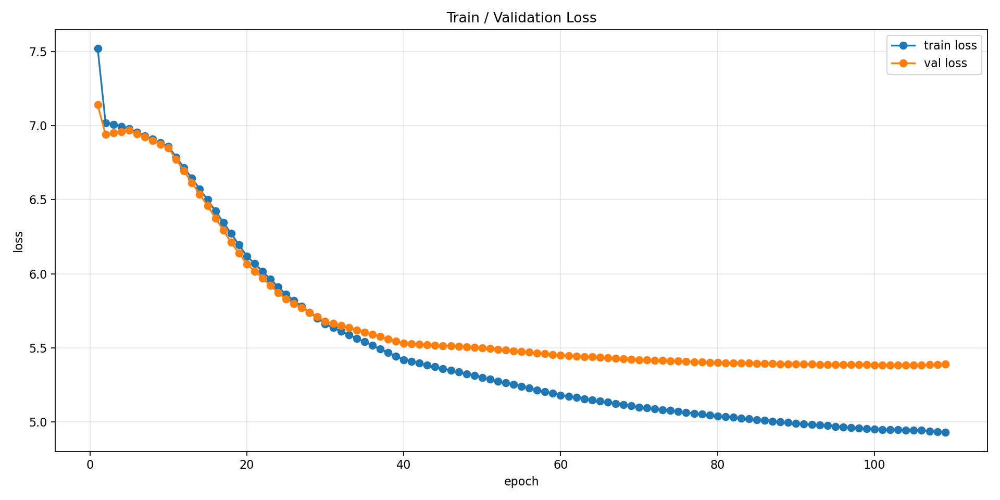
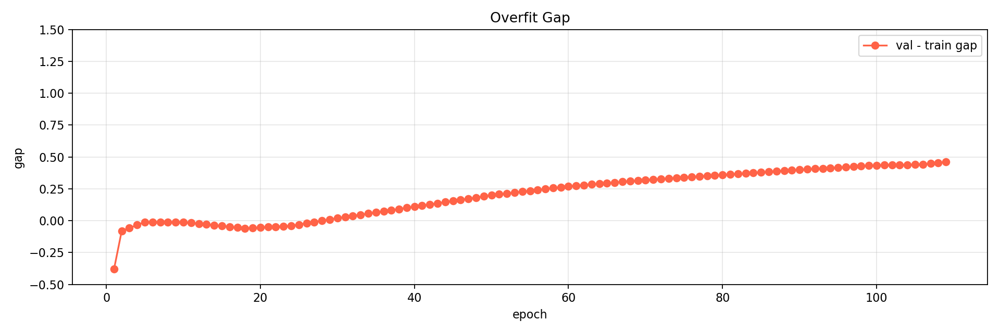
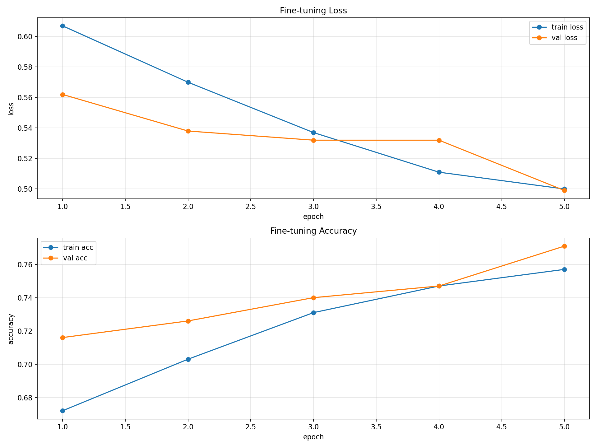
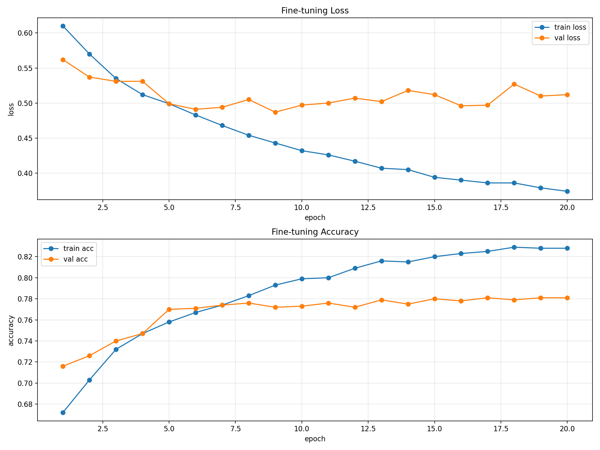

# mini GPT 구현 과제 보고서

## 0. 반·팀원

| 항목 | 내용 |
| --- | --- |
| 반 | 303호 7조 |
| 팀원 | 유승이, 이민정, 이우진, 홍윤기 |

---

## 1. 구현 현황

| 단계 | 구현 내용 | 구현 파일 | 담당자 |
| --- | --- | --- | --- |
| 1 | UTF-8 byte-level BPE tokenizer | `src/bpe.py` | ALL |
| 2 | GPTDataset, create_dataloader, InputEmbedding | `src/dataset.py`, `src/embeddings.py` | ALL |
| 3 | Causal MultiHeadAttention | `src/attention.py` | ALL |
| 4 | LayerNorm, GELU/ReLU, FeedForward, TransformerBlock, GPTModel, generate_text_simple | `src/model.py` | ALL |
| 5 | loss 계산, checkpoint 저장/로드, generate, train_model, 자동 사전학습 실험 함수 | `src/train.py` | ALL |
| 6 | NSMC 감성 분류 Dataset, classification head, train/evaluate 함수 | `src/finetune.py` | ALL |

주요 구현 내용은 과제 TODO 기준으로 모두 완료했다. `run_auto_pretraining_experiment`를 추가해 사전학습 실험에서 train/validation loss 기록, early stopping, best checkpoint 저장, 생성 샘플 확인을 자동화했다.

---

## 2. 테스트 통과 현황

| 실행 명령 | 결과 | 비고 |
| --- | --- | --- |
| `pytest tests/test_bpe.py -v` | 통과 | BPE tokenizer 기능 확인 |
| `pytest tests/test_dataset.py -v` | 통과 | Dataset/DataLoader/InputEmbedding 확인 |
| `pytest tests/test_attention.py -v` | 통과 | causal mask, attention output shape 확인 |
| `pytest tests/test_model.py -v` | 통과 | GPT 구성 요소와 forward/loss 확인 |
| `pytest tests/test_train.py -v` | 통과 | loss, checkpoint, generate 확인 |
| `pytest tests/test_finetune.py -v` | 통과 | 감성 분류 dataset/model/train/eval 함수 확인 |
| `pytest tests/ -v` | 통과 | 로컬 터미널 기준 `42 passed, 1 warning` |

경고는 `plot_losses()`에서 non-interactive backend 환경 때문에 발생한 `FigureCanvasAgg is non-interactive` 경고이며, 테스트 실패는 아니다.

노트북 내부에서도 전체 테스트를 실행했으며, 해당 시점의 테스트 구성 기준으로 `28 passed, 1 warning`을 확인했다. 이후 main 코드 기준 터미널 전체 테스트에서는 `42 passed, 1 warning`을 확인했다.

---

## 3. 데이터

| 항목 | 내용 |
| --- | --- |
| 원본 데이터 | NSMC, Naver Sentiment Movie Corpus |
| 원본 경로 | `data/ratings_train.txt`, `data/ratings_test.txt` |
| 사전 학습 데이터 | `data/nsmc_lm_train.txt`, `data/nsmc_lm_val.txt` |
| 감성 분류 데이터 | `data/nsmc_sentiment_train.jsonl`, `data/nsmc_sentiment_val.jsonl`, `data/nsmc_sentiment_test.jsonl` |
| 사전 학습 train 텍스트 크기 | `1,379,486`자 |
| 사전 학습 validation 텍스트 크기 | `120,560`자 |
| 감성 분류 train | `137,996`개 |
| 감성 분류 validation | `11,999`개 |
| 감성 분류 test | `49,997`개 |
| 전처리 방식 | 빈 리뷰 제거, 텍스트 정리, language modeling용 train/validation 파일과 sentiment용 jsonl 파일 생성 |

이번 사전학습 실험에서는 시간 제한을 고려해 전체 LM train 데이터 중 `corpus[:500000]`까지 사용했다. 실험 과정에서는 `100000`, `200000`, `300000`, `500000`으로 점진적으로 늘리며 validation loss 변화를 비교했다.

---

## 4. BPE

| 항목 | 내용 |
| --- | --- |
| 구현 파일 | `src/bpe.py` |
| 방식 | UTF-8 byte-level BPE |
| 특수 토큰 ID | `<pad>=0`, `<unk>=1`, `<bos>=2`, `<eos>=3` |
| byte token ID 범위 | `4~259` |
| merge token ID 범위 | `260` 이상 |
| 최종 실험 vocab_size | `2000` |
| 최종 실험 학습 corpus 크기 | `corpus[:500000]` |
| vocabulary 저장 경로 | `data/research_vocab/bpe_vocab_2000.json` |
| encode/decode 확인 | `decode(encode(text, add_bos_eos=True)) == text` 형태의 복원 테스트 통과 |

BPE 구현에서는 모든 문자를 UTF-8 byte 단위로 시작해 가장 자주 등장하는 인접 token pair를 반복적으로 merge했다. 이를 통해 처음 보는 한글 표현도 `<unk>`에 의존하지 않고 byte 단위로 표현할 수 있다.

최종 실험에서는 BPE vocabulary를 `data/research_vocab/bpe_vocab_2000.json`에 저장하고, 같은 설정으로 다시 실행할 때는 해당 파일을 load해서 재사용하는 것을 기준으로 정리한다. 한 번 학습한 vocabulary를 재사용해야 하므로 이 파일은 실험 재현에 필요한 산출물이다.

실험 중 `vocab_size=3000`보다 `vocab_size=2000`이 작은 데이터에서 더 안정적으로 학습되는 경향을 확인했다. 따라서 최종 사전학습 실험에는 `vocab_size=2000`을 사용했다.

---

## 5. 모델 구조

| 항목 | 내용 |
| --- | --- |
| 구현 파일 | `src/model.py` |
| 전체 구조 | InputEmbedding -> TransformerBlock x `n_layers` -> LayerNorm -> LM head |
| vocab_size | `2000` |
| context_length | `128` |
| emb_dim | `128` |
| n_heads | `2` |
| n_layers | `1` |
| drop_rate | `0.2` |
| activation | `ReLU` |
| qkv_bias | `False` |
| optimizer | `AdamW` |
| 총 파라미터 수 | `726,528` |

모델은 token ID를 token embedding과 position embedding의 합으로 바꾼 뒤, causal self-attention과 feed-forward network를 통과시킨다. 마지막 LM head는 각 위치에서 다음 token 후보에 대한 logits를 출력한다.

`n_layers=2` 실험은 이전 단계에서 빠르게 과적합되는 경향이 있어 최종 설정에서는 `n_layers=1`을 유지했다. `drop_rate=0.3`은 과적합을 늦추기는 했지만 validation loss가 더 나빠져 `drop_rate=0.2`를 최종값으로 선택했다.

---

## 6. 사전 학습

### 6.1 하이퍼파라미터

| 구분 | 항목 | 값 |
| --- | --- | --- |
| 데이터 | corpus_len | `500000` |
| BPE | vocab_size | `2000` |
| 모델 | context_length | `128` |
| 모델 | emb_dim | `128` |
| 모델 | n_heads | `2` |
| 모델 | n_layers | `1` |
| 모델 | drop_rate | `0.2` |
| 모델 | activation | `relu` |
| 학습 | batch_size | `32` |
| 학습 | num_epochs | `150` |
| 학습 | patience | `3` |
| 학습 | eval_iter | `None`, validation 전체 평가 |
| 최적화 | lr | `2e-4` |
| 최적화 | weight_decay | `0.01` |
| checkpoint | 저장 경로 | `best_checkpoint.pt`, git commit 제외 대상 |

### 6.2 최종 결과

| 항목 | 내용 |
| --- | --- |
| best validation loss | `5.3841` |
| best epoch | `106` |
| early stopping epoch | `109` |
| stopped reason | `early stopping: possible overfitting` |
| best epoch train loss | `4.9426` |
| best epoch validation loss | `5.3841` |
| best epoch gap | `0.4415` |

후반부 결과는 다음과 같다.

| epoch | train_loss | val_loss | gap | overfit_count |
| --- | --- | --- | --- | --- |
| 101 | 4.9609 | 5.3875 | 0.4266 | 0 |
| 102 | 4.9601 | 5.3865 | 0.4264 | 0 |
| 103 | 4.9550 | 5.3890 | 0.4339 | 1 |
| 104 | 4.9497 | 5.3860 | 0.4363 | 0 |
| 105 | 4.9449 | 5.3848 | 0.4399 | 0 |
| 106 | 4.9426 | 5.3841 | 0.4415 | 0 |
| 107 | 4.9401 | 5.3843 | 0.4443 | 1 |
| 108 | 4.9343 | 5.3854 | 0.4511 | 2 |
| 109 | 4.9330 | 5.3863 | 0.4534 | 3 |

epoch 106 이후 train loss는 계속 감소했지만 validation loss는 개선되지 않았다. 따라서 early stopping이 과적합 시작 지점을 적절히 감지했다고 판단했다.

### 6.3 학습 곡선과 과적합 분석

최종 `corpus_len=500000` 실험의 train/validation loss 곡선은 다음과 같다.



validation loss는 초반부터 꾸준히 감소했고, epoch 106에서 가장 낮은 값인 `5.3841`을 기록했다. 이후 train loss는 계속 내려갔지만 validation loss는 더 이상 뚜렷하게 개선되지 않아 early stopping이 발생했다.

val-train gap은 다음과 같다. gap 그래프는 과적합 정도가 과장되어 보이지 않도록 `plt.ylim(-0.5, 1.5)`를 적용해 같은 기준에서 해석했다.



overfit gap만 보면 gap이 커지는 흐름이 있어 과적합 신호가 있다. 하지만 실제 best epoch의 gap은 `0.4415` 수준이며, validation loss가 급격히 상승하지 않고 정체되는 형태였기 때문에 높은 과적합으로 보지는 않았다. 약한 과적합 신호가 있었고, patience=3 기준 early stopping으로 best checkpoint를 선택했다.

### 6.4 생성 샘플 비교

시작 문장:

```text
이 영화는 정말 재미가 있
```

초기 실험에서는 학습 데이터가 적고 tokenizer/model이 충분히 안정화되지 않아 다음과 같이 깨진 문자와 의미 없는 byte 조각이 섞여 출력되었다.

```text
이 영화는 정말 재미가 있�욀���&��� �W�s�...�는3١$��
```

다른 초기 출력에서도 한글 리뷰 문장보다는 byte가 깨진 듯한 문자가 반복되었다.

```text
이 영화는 정말 재미가 있j[제어문자]h���>D �XZ��uZ�...
```

최종 실험의 생성 결과는 다음과 같다.

```text
이 영화는 정말 재미가 있고 너무 좋다!
나와 함께 보면서도 좋다.
그러워서는 정말 재밌게
```

완전히 자연스러운 문장은 아니지만, 이전 실험에서 나타났던 깨진 문자 출력은 크게 줄었고 영화 리뷰에 가까운 표현과 문장부호가 생성되었다. 특히 `corpus_len`을 늘리고 best checkpoint를 사용한 뒤에는 출력이 byte 깨짐 중심에서 영화 리뷰 문장 조각 중심으로 바뀌었다.

### 6.5 하이퍼파라미터 실험 요약

| 실험 | 결과 | 해석 |
| --- | --- | --- |
| `corpus_len=100000`, `vocab_size=2000`, `lr=2e-4` | best val loss 약 `6.31`대 | 기본 동작 확인, 아직 데이터 부족 |
| `corpus_len=200000`, `lr=2e-4` | best val loss `5.8703` | 데이터 증가로 큰 개선 |
| `corpus_len=200000`, `drop_rate=0.3` | best val loss `5.8925` | 과적합은 늦췄지만 학습력도 줄어 성능 하락 |
| `corpus_len=200000`, `lr=1.5e-4` | best val loss `5.8750` | 더 오래 학습했지만 `2e-4`보다 이득 없음 |
| `corpus_len=300000`, `lr=2e-4` | best val loss `5.6508` | 데이터 증가 효과 확인 |
| `corpus_len=500000`, `lr=2e-4` | best val loss `5.3841` | 최종 최고 성능 |

현재 결과에서는 데이터 양을 늘릴수록 validation loss와 생성 품질이 좋아졌다. 다만 epoch를 오래 돌리는 것 자체가 좋은 것은 아니며, validation loss가 더 이상 감소하지 않는 구간에서는 과적합이 시작된다. 이번 최종 실험에서는 데이터가 커져 학습 시간이 늘어난 것이고, 실제로 validation loss가 개선되었으므로 의미 있는 학습 시간 증가로 판단했다.

---

## 7. 미세 조정

| 항목 | 내용 |
| --- | --- |
| 구현 파일 | `src/finetune.py` |
| 과제 | NSMC 리뷰 긍정/부정 분류 |
| 데이터 포맷 | JSONL, `text`, `label` |
| 구현 상태 | 구현 완료 |
| 테스트 결과 | `pytest tests/test_finetune.py -v`: `4 passed` |
| max_length | `128` |
| fine-tuning subset | train `20000`, validation `3000`, test `3000` |
| batch_size | train `16`, validation/test `32` |
| optimizer | `AdamW`, `weight_decay=0.01` |
| backbone learning rate | classifier와 동일하게 `3e-4` |
| classifier learning rate | `3e-4` |
| classifier dropout | `0.2` |
| validation loss / accuracy | 5 epoch 기준 val_loss `0.4989`, val_acc `0.7703` |
| test loss / accuracy | 5 epoch 기준 test_loss `0.4855`, test_acc `0.7827` |
| 오류 예시 | 별도 오류 샘플 분석은 수행하지 않음 |

`GPTForSequenceClassification`에서는 GPT backbone의 hidden state 위에 `nn.Linear(emb_dim, num_labels)` classifier를 붙였다. padding이 있는 입력에서는 `<pad>`가 아닌 마지막 유효 token의 hidden state를 문장 대표 벡터로 사용한다.

### 7.1 5 epoch fine-tuning 결과



5 epoch 실험에서는 train loss와 validation loss가 모두 감소했고, train accuracy와 validation accuracy가 모두 상승했다. loss는 train 기준 `0.6071 -> 0.4996`, validation 기준 `0.5621 -> 0.4989`로 내려갔다. accuracy는 train 기준 `0.6725 -> 0.7570`, validation 기준 `0.7157 -> 0.7703`으로 상승했다.

실험은 빠른 확인을 위해 NSMC 감성 분류 데이터의 subset을 사용했다. train은 `20000`개, validation은 `3000`개, test는 `3000`개로 제한했고, `ReviewSentimentDataset`에서 각 리뷰를 `max_length=128`까지 padding/truncation했다. optimizer는 `AdamW`를 사용했으며, backbone과 classifier head를 분리하지 않고 `classifier.parameters()` 전체를 같은 learning rate `3e-4`로 업데이트했다.

초기 fine-tuning에서 train subset을 `5000`개만 사용했을 때 test accuracy는 약 `54%`로 낮았다. 이후 train subset을 `20000`개로 늘리고 learning rate를 `3e-4`로 조정하자 test accuracy가 `78.27%`까지 상승했다. 이 결과는 사전학습된 GPT backbone이 NSMC 감성 분류 task에 정상적으로 적응하고 있음을 보여준다. 특히 validation accuracy가 함께 상승했기 때문에 5 epoch 범위에서는 뚜렷한 과적합보다 fine-tuning 성공 신호가 더 강하다고 판단했다.

| epoch | train_loss | train_acc | val_loss | val_acc |
| --- | --- | --- | --- | --- |
| 1 | `0.6071` | `0.6725` | `0.5621` | `0.7157` |
| 2 | `0.5701` | `0.7028` | `0.5381` | `0.7260` |
| 3 | `0.5367` | `0.7315` | `0.5318` | `0.7407` |
| 4 | `0.5112` | `0.7468` | `0.5317` | `0.7470` |
| 5 | `0.4996` | `0.7570` | `0.4989` | `0.7703` |

### 7.2 20 epoch 확장 실험과 과적합



20 epoch까지 확장한 결과, 초반에는 train/validation loss가 함께 감소하고 accuracy도 함께 상승했다. 하지만 약 8~10 epoch 이후부터는 train loss가 계속 감소하고 train accuracy가 약 `0.83` 근처까지 상승하는 반면, validation loss는 더 이상 안정적으로 내려가지 않고 validation accuracy도 `0.77~0.78` 근처에서 정체되었다.

즉 모델이 train 데이터에는 계속 더 잘 맞지만, validation 데이터에 대한 일반화 성능은 더 이상 크게 좋아지지 않는 상태가 관찰되었다. 이 흐름은 fine-tuning에서도 과적합 또는 plateau가 시작될 수 있음을 보여준다.

분류 문제에서는 accuracy도 중요한 지표이므로 validation accuracy 기준으로는 15~20 epoch에서도 약 `0.78` 수준을 유지한다. 다만 validation loss까지 함께 고려하면 5~10 epoch 근처가 더 안정적인 선택이다. 따라서 최종 모델은 validation loss/accuracy가 안정적인 epoch 근처에서 선택하고, 이후 구간은 early stopping으로 막는 것이 적절하다고 판단했다.

---

## 8. 실험 환경

| 항목 | 내용 |
| --- | --- |
| Python | `3.11.15` |
| PyTorch | `2.12.0+cpu` |
| 실행 환경 | 로컬 Windows, conda `gpt-lab` 환경 |
| device | `cpu` |
| 저장소 브랜치 | `main` |
| 전체 테스트 | `42 passed, 1 warning` |
| 최종 사전학습 실행 위치 | `gpt-lab-woojin.ipynb` |
| 총 학습 소요 시간 | 미측정, `corpus_len=500000` 기준 CPU에서 장시간 학습 |

원본 데이터 파일과 checkpoint는 GitHub에 commit하지 않는 것이 요구사항이므로 제출 전 제외 여부를 확인해야 한다. 다만 BPE vocabulary 파일은 재현을 위해 저장/재사용하는 산출물이므로, 제출 기준에 맞게 별도 관리한다.

---

## 9. 고찰

이번 과제에서 가장 어려웠던 부분은 BPE tokenizer의 merge rule을 학습하고, encode/decode에서 같은 규칙을 일관되게 적용하는 것이었다. 특히 merge token을 decode할 때 원본 byte token까지 재귀적으로 펼친 뒤 마지막에 한 번만 UTF-8 decode해야 한다는 점이 중요했다.

Dataset 단계에서는 input과 target을 한 칸 차이로 만드는 이유를 이해하는 것이 핵심이었다. GPT는 현재 token까지 보고 다음 token을 예측하므로, `input=[t0,t1,t2]`, `target=[t1,t2,t3]` 구조가 필요했다.

사전학습 실험에서는 처음에 작은 corpus와 작은 모델로 시작했고, 점진적으로 `corpus_len`을 늘리며 validation loss를 확인했다. 실험 결과 모델 구조를 크게 키우는 것보다 데이터 양을 늘리는 것이 더 안정적으로 성능을 개선했다.

하이퍼파라미터 실험에서 확인한 점은 다음과 같다.

- `vocab_size=2000`이 현재 데이터 규모에서 안정적이었다.
- `drop_rate=0.3`은 `0.2`보다 validation loss가 나빠져 채택하지 않았다.
- `lr=1.5e-4`는 `2e-4`보다 학습이 느리고 최종 validation loss 이득이 없었다.
- `corpus_len`을 `100000 -> 200000 -> 300000 -> 500000`으로 늘릴수록 validation loss와 생성 품질이 개선되었다.
- 학습 시간이 길어지는 것 자체가 문제는 아니지만, train loss만 감소하고 validation loss가 멈추거나 증가하면 과적합으로 봐야 한다.

한계도 있다. 최종 생성 결과는 이전보다 자연스러워졌지만, 긴 문장의 일관성과 문법은 아직 부족하다. 또한 CPU 환경에서 실험했기 때문에 Basic 권장 설정인 `corpus[:1500000]`, `vocab_size=3000`까지 충분히 확장하지는 못했다. 미세조정에서는 test accuracy 약 `78.27%`를 확인했지만, 20 epoch 확장 실험에서 8~10 epoch 이후 validation 성능이 정체되어 early stopping이 필요하다는 점도 확인했다.

다음 개선 방향은 다음과 같다.

- GPU 환경에서 더 큰 `corpus_len`과 더 긴 학습을 시도한다.
- 더 큰 corpus나 다른 vocab_size를 실험할 경우, 설정별 vocabulary 파일명을 구분해 저장하고 재사용한다.
- 최종 사전학습 모델에 대해 test loss를 한 번만 계산해 최종 평가 지표로 사용한다.
- 감성 분류 미세조정에서 early stopping을 적용해 validation loss가 가장 낮은 checkpoint를 선택한다.
- 학습률 warmup, cosine decay, gradient clipping을 추가 실험한다.
