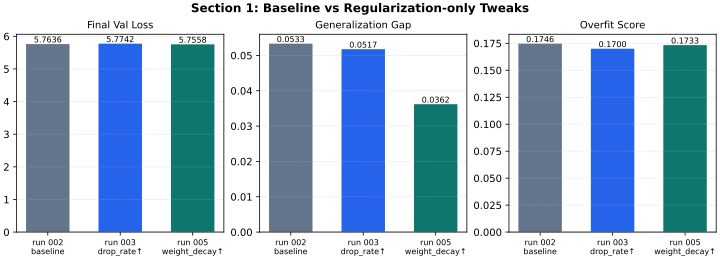
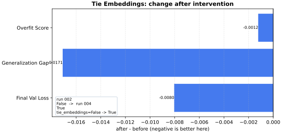
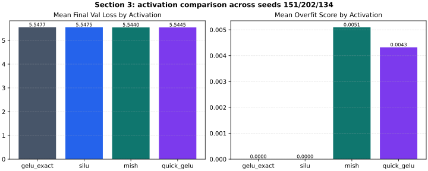
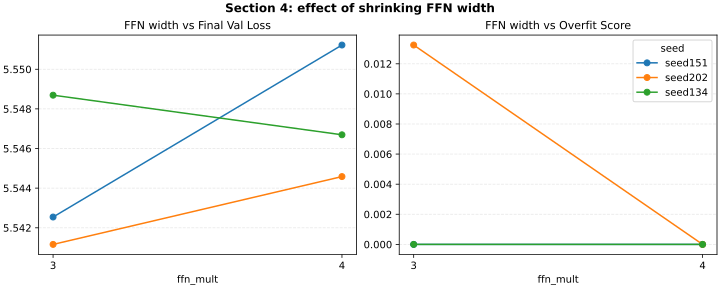
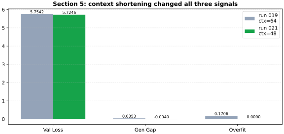
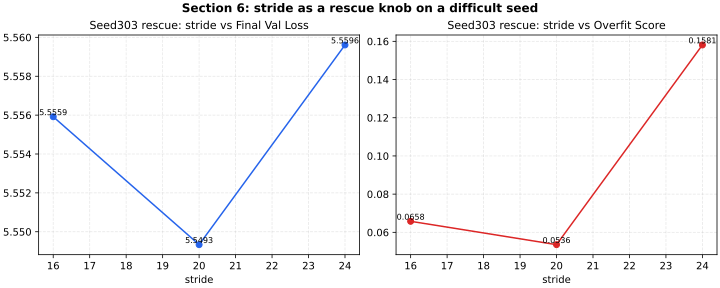
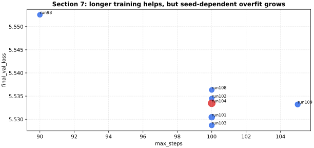

# Mini GPT 실험 결과 요약

이 문서는 `train/hypotheses.md`와 `train/runs/` 아래 실험 기록을 바탕으로, **주요 변경 축만** 추려서 요약한 결과 문서입니다.

참고:
- 현재 `train/`에 남아 있는 raw 데이터는 **step/epoch 전체 시계열이 아니라 실험 요약값** 중심입니다.
- 그래서 아래 시각화는 “완전한 학습 곡선”이 아니라, **가설 전/후의 핵심 지표 비교**를 바로 읽기 쉽게 정리한 형태입니다.

## 대표 비교 시각화

핵심 가설에 대해, 같은 seed/비슷한 조건에서 **실험 전/후의 실제 수치 차이**를 바로 볼 수 있도록 대표 비교 그래프를 만들었습니다.

- 비교 그래프:
  - [train/visuals/result_summary_comparisons.svg](/home/leeminjeong/workspace/python_project/week14-team-07-gpt-lab/train/visuals/result_summary_comparisons.svg)
  - [train/visuals/result_summary_comparisons.png](/home/leeminjeong/workspace/python_project/week14-team-07-gpt-lab/train/visuals/result_summary_comparisons.png)
- 숫자 표:
  - [train/result_summary_comparisons.csv](/home/leeminjeong/workspace/python_project/week14-team-07-gpt-lab/train/result_summary_comparisons.csv)

주요 before/after 차이:

- `tie_embeddings=False -> True` (`run 002 -> run 004`)
  - `final_val_loss`: `5.7636 -> 5.7555` (`-0.0080`)
  - `generalization_gap`: `0.0533 -> 0.0362` (`-0.0171`)
  - `overfit_score`: `0.1746 -> 0.1734` (`-0.0012`)

- `activation_name=gelu -> quick_gelu` (`run 007 -> run 008`)
  - `final_val_loss`: `5.7549 -> 5.7546` (`-0.0003`)
  - `generalization_gap`: `0.0470 -> 0.0469`
  - `overfit_score`: `0.1395 -> 0.1394`
  - 해석: 활성함수 교체는 효과가 **아주 작았다**.

- `context_length=64 -> 48` (`run 019 -> run 021`)
  - `final_val_loss`: `5.7542 -> 5.7246` (`-0.0296`)
  - `generalization_gap`: `0.0353 -> -0.0040` (`-0.0392`)
  - `overfit_score`: `0.1706 -> 0.0000` (`-0.1706`)
  - 해석: 이 문서 전체에서 **가장 큰 개선 축**이었다.

- `ffn_mult=4 -> 3` (`run 063 -> run 066`)
  - `final_val_loss`: `5.5446 -> 5.5412` (`-0.0034`)
  - `generalization_gap`: `-0.0048 -> -0.0003`
  - `overfit_score`: `0.0000 -> 0.0132`
  - 해석: validation은 약간 좋아졌지만, 과적합 점수는 조금 나빠져서 **효율 후보** 정도로 해석했다.

- `stride=24 -> 16` rescue (`run 085 -> run 086`)
  - `final_val_loss`: `5.5596 -> 5.5559` (`-0.0037`)
  - `generalization_gap`: `0.0423 -> 0.0136` (`-0.0287`)
  - `overfit_score`: `0.1581 -> 0.0658` (`-0.0923`)
  - 해석: 어려운 seed를 구하는 **rescue knob**로 유효했다.

- `max_steps=100 -> 105` (`run 108 -> run 109`)
  - `final_val_loss`: `5.5363 -> 5.5332` (`-0.0031`)
  - `generalization_gap`: `0.0039 -> 0.0129` (`+0.0090`)
  - `overfit_score`: `0.0224 -> 0.0494` (`+0.0270`)
  - 해석: 손실은 약간 좋아졌지만, 과적합 신호도 같이 커져 **무조건 더 오래 학습하는 게 답은 아니었다.**

## 1. 초기 기준선과 과적합 신호 확인

그래프 선택 이유:
- 이 섹션은 “정규화만 바꿨을 때 baseline 대비 얼마나 달라졌는가”가 핵심이라서, `baseline / drop_rate↑ / weight_decay↑`를 **같은 축에서 나란히 보는 막대 비교**가 가장 직관적입니다.
- 특히 여기서는 완전한 곡선보다 **최종 결과가 거의 안 좋아졌다는 점**을 빠르게 보여주는 것이 중요했습니다.

- 실험 구간: `run 001 ~ run 006`
- 핵심 가설:
  - 먼저 작은 기준선 모델에서 train/val loss 차이와 과적합 신호가 실제로 보이는지 확인한다.
  - `drop_rate`, `weight_decay` 같은 기본 정규화 축만으로 과적합을 줄일 수 있는지 본다.
- 검증 방식:
  - 기준선 설정에서 `drop_rate`만 올리거나 `weight_decay`만 키우는 **단일축 실험** 수행
  - 구조는 유지하고 정규화 강도만 조정
- 결과:
  - `drop_rate`, `weight_decay` 조정만으로는 **과적합 신호가 크게 해결되지 않았다.**
  - validation loss가 크게 좋아지지 않거나, gap 감소폭이 작았다.
- 해석:
  - 기본 정규화만 올리는 방식은 이 작은 코퍼스에서 **핵심 해결책이 아니었다.**

## 2. 입출력 임베딩 공유(`tie_embeddings`) 효과 검증

그래프 선택 이유:
- 이 섹션은 한 가지 변경(`tie_embeddings=False -> True`)의 효과만 보면 되므로, 절대값보다 **변화량(delta)** 을 보여주는 형식이 더 적절합니다.
- 그래서 `val_loss`, `gap`, `overfit_score`가 각각 얼마나 줄었는지를 바로 읽을 수 있는 **before/after delta 그래프**를 사용했습니다.

- 실험 구간: `run 004`부터 시작, 이후 다수 run에서 반복 사용
- 핵심 가설:
  - `tie_embeddings=True`로 파라미터 수를 줄이면 작은 코퍼스에서 외우는 힘이 약해져 일반화가 좋아질 수 있다.
- 검증 방식:
  - 같은 설정에서 `tie_embeddings=False -> True`만 바꾸는 단일축 비교
- 결과:
  - 파라미터 수를 줄이면서도 validation과 일반화 지표가 개선되는 방향이 반복 관찰되었다.
- 해석:
  - `tie_embeddings=True`는 이후 실험들의 **기본 안정 후보**로 승격됐다.

## 3. 활성함수 교체 실험

그래프 선택 이유:
- 활성함수 실험은 특정 한 쌍의 비교보다, `gelu_exact / silu / mish / quick_gelu`를 **여러 seed 평균으로 묶어 보는 것**이 핵심입니다.
- 그래서 개별 before/after보다 **활성함수별 평균 성능 비교 막대그래프**가 “큰 차이는 없고 미세한 차이만 있다”는 결론을 가장 잘 드러냅니다.

- 실험 구간:
  - `run 008 ~ run 017`: `gelu` ↔ `quick_gelu`
  - `run 043 ~ run 047`: `gelu_exact`
  - `run 060 ~ run 065`: `silu`
  - `run 072 ~ run 078`: `mish`, `quick_gelu`, `squared_relu` 계열
- 핵심 가설:
  - 활성함수만 바꿔도 validation loss나 overfit score가 의미 있게 달라질 수 있다.
- 검증 방식:
  - 구조/optimizer는 유지하고 `activation_name`만 단일축으로 변경
  - seed를 바꿔 재현성도 함께 확인
- 결과:
  - `quick_gelu`, `silu`, `mish`가 각각 일부 구간에서 약간 유리했다.
  - 하지만 **활성함수만으로 큰 도약은 없었고**, 전반적으로는 미세조정 축에 가까웠다.
- 해석:
  - 활성함수는 “좋은 설정 위에서 마지막 소폭 개선”용 축이지, 핵심 병목 해결 축은 아니었다.

## 4. FFN 폭(`ffn_mult`) 축소 실험

그래프 선택 이유:
- 이 섹션은 `ffn_mult=4 -> 3`이 **seed마다 다르게 반응했다**는 점이 중요합니다.
- 그래서 평균값 하나보다, 각 seed가 4에서 3으로 갈 때 `val_loss`와 `overfit_score`가 어떻게 움직였는지 보여주는 **seed별 선 연결 그래프**를 골랐습니다.

- 실험 구간: `run 066 ~ run 078`
- 핵심 가설:
  - `ffn_mult=4`가 약간 과한 용량일 수 있으므로 `ffn_mult=3`으로 줄여도 validation과 일반화가 유지될 수 있다.
- 검증 방식:
  - attention/activation/optimizer는 유지하고 `ffn_mult`만 단일축으로 변경
  - 여러 seed에서 반복
- 결과:
  - 어떤 seed에서는 비슷하거나 약간 좋아졌고, 어떤 seed에서는 소폭 악화되었다.
  - 완전한 승자는 아니지만 **효율 후보**로는 충분히 의미가 있었다.
- 해석:
  - FFN 폭 축소는 “무조건 좋다”는 아니지만, 파라미터 효율을 높일 수 있는 유력 축으로 남았다.

## 5. 문맥 길이(`context_length`) 단축 실험

그래프 선택 이유:
- 이 섹션은 전체 실험에서 **가장 큰 개선**이 있었던 구간이라, before/after를 직접 부딪혀 보여주는 것이 가장 중요합니다.
- 따라서 `ctx=64`와 `ctx=48`의 `val_loss`, `gap`, `overfit_score`를 한눈에 비교할 수 있도록 **정면 비교 막대그래프**를 사용했습니다.

- 실험 구간: `run 020 ~ run 023` 전후가 핵심 전환점
- 핵심 가설:
  - 작은 코퍼스에서는 긴 문맥(`64`)보다 짧은 문맥(`48`)이 더 안정적인 일반화를 만들 수 있다.
- 검증 방식:
  - 기존 설정에서 `context_length=64 -> 48`로 줄여 비교
  - 이후 여러 seed에 반복 적용
- 결과:
  - 이 축이 **가장 큰 개선 포인트**였다.
  - `val_loss`, `generalization_gap`, `overfit_score`가 모두 더 안정적인 방향으로 움직였고,
  - 여러 seed에서 `generalizing` 판정이 반복됐다.
- 해석:
  - 이 실험 로그 전체에서 가장 중요한 결론 중 하나는:
    - **작은 데이터셋에서는 `context_length=48`이 64보다 더 잘 맞았다**는 점이다.

## 6. stride 조정으로 seed 문제 구하기

그래프 선택 이유:
- 이 섹션은 stride가 “전역 최적값”이 아니라 **문제 seed를 rescue하는 조절축**이라는 점이 핵심입니다.
- 그래서 같은 어려운 seed에서 `stride=24, 20, 16`으로 바꿨을 때 `val_loss`와 `overfit_score`가 어떻게 움직였는지 보는 **stride 축 line plot**이 가장 설명력이 높습니다.

- 실험 구간: `run 056 ~ run 059`, `run 085 ~ run 099`
- 핵심 가설:
  - 특정 seed에서 과적합/불안정이 심할 때, `stride`를 줄여 더 촘촘한 윈도우를 쓰면 안정화될 수 있다.
- 검증 방식:
  - 좋은 기본 설정을 유지한 채 `stride=24`, `20`, `16` 등을 바꿔 seed별 비교
- 결과:
  - `stride=24`는 전반적인 안정화에 크게 기여했다.
  - `stride=20`이나 `16`은 **나쁜 seed를 구하는 rescue knob**로는 의미가 있었다.
  - 다만 모든 상황의 전역 기본값으로 무조건 더 낫다고 보기는 어려웠다.
- 해석:
  - stride는 “항상 최선의 기본값”이라기보다 **어려운 seed 대응용 조절축**에 가깝다.

## 7. 학습 길이(`max_steps`) 실험

그래프 선택 이유:
- 이 섹션은 “더 오래 학습하면 validation은 좋아질 수 있지만, 동시에 overfit risk가 커질 수 있다”는 **trade-off**를 보여줘야 합니다.
- 그래서 `max_steps`를 x축에 두고 `final_val_loss`를 보되, 점 크기/색으로 과적합 위험을 함께 읽게 하는 **scatter 형태**가 가장 적합했습니다.

- 실험 구간:
  - `run 030 ~ run 041`: `60/70/80` step 경계 확인
  - `run 098 ~ run 109`: `90/100/105` step 확장 확인
- 핵심 가설:
  - 너무 짧으면 underfit이고, 조금 더 길게 학습하면 validation loss를 더 낮출 수 있다.
  - 하지만 길이를 늘리면 일부 seed에서 다시 overfit risk가 커질 수 있다.
- 검증 방식:
  - 구조는 고정하고 `max_steps`만 늘리거나 줄이는 단일축 비교
  - 좋은 seed / 나쁜 seed 모두에서 반복
- 결과:
  - 짧은 학습은 underfit 성향이 있었고,
  - 긴 학습은 어떤 seed에서는 큰 개선을 주지만, 어떤 seed에서는 overfit risk가 커졌다.
- 해석:
  - `max_steps`는 전역 최적값 하나로 끝나는 문제가 아니고,
  - **seed와 설정에 따라 균형점이 달라지는 축**이었다.

## 8. seed 재현성과 강건성 검증

그래프를 따로 넣지 않은 이유:
- 이 섹션은 특정 한 조절축의 효과보다, 앞선 모든 좋은 후보 설정이 **seed에 따라 얼마나 흔들리는지**를 종합적으로 해석하는 역할입니다.
- 즉 단일 그래프 하나로 정리하면 오히려 정보가 뭉개질 수 있어서, 앞선 섹션들에서 이미 반복 등장한 seed별 반응을 종합 해석하는 방식으로 남겼습니다.

- 실험 구간: 거의 전체, 특히 `run 060` 이후와 `run 098 ~ run 109`
- 핵심 가설:
  - 좋아 보이는 설정이 단일 seed 운빨이 아니라 여러 seed에서도 유지되어야 한다.
- 검증 방식:
  - 같은 설정을 `seed=151`, `202`, `134`, `303`, `404`, `505`, `606`, `707`, `808` 등으로 반복
- 결과:
  - 설정 차이만큼이나 **seed variance가 크다**는 점이 분명히 드러났다.
  - 좋은 설정도 어떤 seed에서는 과적합 위험으로 바뀌었다.
- 해석:
  - 이 실험 로그는 단일 run best보다 **여러 seed에서 generalizing이 유지되는가**를 더 중요하게 보도록 바뀌었다.

## 최종 요약

### 가장 효과가 컸던 축

- `context_length=48`
- `tie_embeddings=True`
- `stride=24` 기반 안정화

### 미세조정 축

- `activation_name` (`quick_gelu`, `silu`, `mish`)
- `ffn_mult=3`

### 효과가 제한적이었던 축

- `drop_rate`만 올리는 방식
- `weight_decay`만 올리는 방식

### 현재까지의 가장 강한 결론

1. 작은 코퍼스에서는 **긴 문맥보다 짧은 문맥이 더 잘 맞았다.**
2. `tie_embeddings=True`는 작은 데이터셋에서 꽤 유효한 기본 옵션이었다.
3. `stride`는 전체 기본값이면서도, 어려운 seed를 rescue하는 중요한 축이었다.
4. 활성함수/FFN 폭은 의미는 있지만, 성능을 뒤집는 핵심 축은 아니었다.
5. 좋은 설정인지 판단하려면 단일 best run보다 **여러 seed에서 generalizing이 유지되는지**를 봐야 했다.
