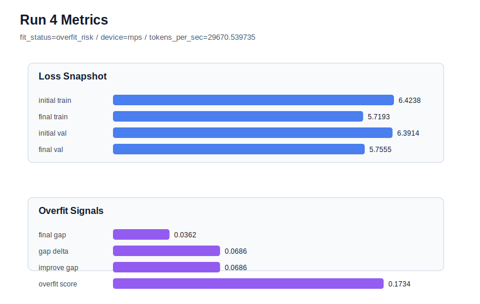

# run 004 실험 보고서

## 이번 가설

입출력 임베딩 공유 단일축 테스트: run 002가 현재 best지만 overfit_risk이고, run 003의 dropout 강화는 gap을 아주 조금만 낮췄다. 따라서 run 002 설정을 거의 고정하고 tie_embeddings=True만 적용하면 parameter_count가 줄어 작은 말뭉치에서 외우는 힘이 낮아져 final_generalization_gap과 overfit_score가 개선될 수 있다.

## 왜 이 가설을 세웠는가

dashboard 기준 최신 run 003은 final_val_loss=5.7742, final_generalization_gap=0.0517, overfit_score=0.1700으로 run 002보다 validation은 조금 나빠졌고 과적합 신호도 기대만큼 줄지 않았다. run 002는 final_val_loss=5.7636으로 best 후보지만 gap=0.0533, overfit_score=0.1746이 높다. dropout만으로는 충분하지 않았으므로 학습 길이, seed, 모델 폭, 깊이, learning_rate, dropout을 run 002와 동일하게 유지하고 weight tying만 적용해 capacity regularization의 순수 효과를 확인한다.

## 가설 작성 주체

llm_plan:docs/train/next_plan.json

## 바꾼 변수

```json
{
  "tie_embeddings": true
}
```

## 고정한 변수

seed=134, max_steps=40, batch_size=8, context_length=64, emb_dim=128, n_heads=4, n_layers=2, learning_rate=0.0003, weight_decay=0.01, drop_rate=0.1, activation_name=gelu, ffn_dropout_position=after_output, attention_impl=manual, ffn_mult=4

## 기대 결과

parameter_count가 감소하고 final_val_loss는 run 002와 비슷한 5.76~5.82 범위에 머물면서 final_generalization_gap은 0.045 이하, overfit_score는 0.14 이하로 내려간다. validation 손실이 크게 악화되지 않으면 tie_embeddings는 작은 데이터에서 유효한 regularization 후보로 본다.

## 실험 설정

```json
{
  "run_id": 4,
  "hypothesis": "입출력 임베딩 공유 단일축 테스트: run 002가 현재 best지만 overfit_risk이고, run 003의 dropout 강화는 gap을 아주 조금만 낮췄다. 따라서 run 002 설정을 거의 고정하고 tie_embeddings=True만 적용하면 parameter_count가 줄어 작은 말뭉치에서 외우는 힘이 낮아져 final_generalization_gap과 overfit_score가 개선될 수 있다.",
  "seed": 134,
  "vocab_size": 600,
  "min_frequency": 2,
  "context_length": 64,
  "stride": null,
  "batch_size": 8,
  "max_steps": 40,
  "eval_batches": 4,
  "train_ratio": 0.9,
  "learning_rate": 0.0003,
  "weight_decay": 0.01,
  "grad_clip": 1.0,
  "emb_dim": 128,
  "n_heads": 4,
  "n_layers": 2,
  "drop_rate": 0.1,
  "qkv_bias": false,
  "ffn_mult": 4,
  "norm_first": false,
  "norm_eps": 1e-05,
  "activation_name": "gelu",
  "ffn_dropout_position": "after_output",
  "attention_impl": "manual",
  "tie_embeddings": true,
  "init_std": 0.02
}
```

## 실행 환경

```json
{
  "timestamp": "2026-06-02T19:16:04+00:00",
  "hostname": "woonyong-MacBookPro.local",
  "platform": "macOS-26.3.1-arm64-arm-64bit-Mach-O",
  "machine": "arm64",
  "python": "3.13.13",
  "torch": "2.12.0",
  "cpu_count": 10,
  "memory_gb": 24.0,
  "cuda_available": false,
  "cuda_device_count": 0,
  "mps_available": true,
  "resolved_device": "mps",
  "profile": "mps_balanced"
}
```

- corpus: `src/learning/the-verdict.txt`
- artifact_dir: `docs/train/runs/run_004_artifacts`

## 실제 결과

| 지표 | 값 |
| --- | --- |
| initial_train_loss | 6.423763751983643 |
| initial_val_loss | 6.391382932662964 |
| final_train_loss | 5.719310164451599 |
| final_val_loss | 5.755529403686523 |
| final_generalization_gap | 0.036219239234924316 |
| generalization_gap_delta | 0.06860005855560303 |
| train_val_improvement_gap | 0.06860005855560303 |
| overfit_score | 0.17341935634613037 |
| fit_status | overfit_risk |
| parameter_count | 481024 |
| tokens_per_sec | 29670.53973536585 |
| elapsed_sec | 0.6729907908011228 |
| device | mps |

## 시각 지표




- 대시보드: `../dashboard.md`
- 지표 요약 CSV: `../metrics_summary.csv`

## 과적합 판단

과적합 위험. final gap=0.0362, overfit_score=0.1734. 다음 실험은 regularization 강화가 우선이다.

## 결론

현재 best 후보: run 4 / val=5.755529403686523 / status=overfit_risk

## 다음 실험 제안

- 성공 시: tie_embeddings=True를 유지하고 seed만 바꿔 재현성을 확인한다. 재현되면 activation_name=quick_gelu 또는 silu 같은 함수 교체를 단일축으로 비교한다.
- 과적합 시: tie_embeddings만으로도 과적합이 남으면 weight_decay=0.05를 단일축으로 올리거나 n_layers/ffn_mult를 줄이는 capacity 축소 실험으로 이동한다.
