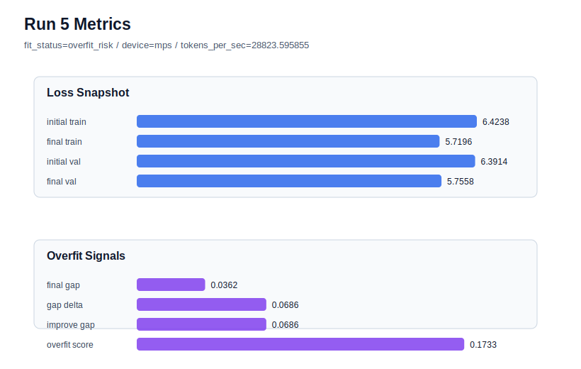

# run 005 실험 보고서

## 이번 가설

weight_decay 단일축 정규화 테스트: run 004는 tie_embeddings=True로 validation loss와 final gap을 개선해 best가 되었지만 overfit_score는 여전히 높다. run 004 설정을 유지하고 weight_decay만 0.01에서 0.05로 올리면 train 쪽 과도한 개선을 누그러뜨려 overfit_score와 train_val_improvement_gap을 낮출 수 있다.

## 왜 이 가설을 세웠는가

run 004는 final_val_loss=5.7555로 현재 best이며 final_generalization_gap도 0.0362까지 낮아졌다. 하지만 generalization_gap_delta=0.0686, train_val_improvement_gap=0.0686, overfit_score=0.1734로 fit_status는 계속 overfit_risk다. dropout 단일축(run 003)은 효과가 작았고 tie_embeddings(run 004)는 loss/gap 개선을 만들었으므로, 같은 tie_embeddings=True 설정을 유지한 채 weight_decay만 강화해 parameter_count와 구조를 그대로 두고 최적화 regularization이 과적합 신호를 완화하는지 분리해서 본다.

## 가설 작성 주체

llm_plan:docs/train/next_plan.json

## 바꾼 변수

```json
{
  "weight_decay": 0.05
}
```

## 고정한 변수

seed=134, max_steps=40, batch_size=8, context_length=64, emb_dim=128, n_heads=4, n_layers=2, learning_rate=0.0003, drop_rate=0.1, tie_embeddings=True, activation_name=gelu, ffn_dropout_position=after_output, attention_impl=manual, ffn_mult=4

## 기대 결과

final_val_loss가 run 004 대비 크게 악화되지 않는 5.75~5.82 범위에 머물고, train_val_improvement_gap과 overfit_score가 줄어든다. 특히 final_generalization_gap은 0.04 이하를 유지하고 overfit_score는 0.15 이하로 낮아지는 것을 기대한다.

## 실험 설정

```json
{
  "run_id": 5,
  "hypothesis": "weight_decay 단일축 정규화 테스트: run 004는 tie_embeddings=True로 validation loss와 final gap을 개선해 best가 되었지만 overfit_score는 여전히 높다. run 004 설정을 유지하고 weight_decay만 0.01에서 0.05로 올리면 train 쪽 과도한 개선을 누그러뜨려 overfit_score와 train_val_improvement_gap을 낮출 수 있다.",
  "seed": 134,
  "vocab_size": 600,
  "min_frequency": 2,
  "context_length": 64,
  "stride": null,
  "batch_size": 8,
  "max_steps": 40,
  "eval_batches": 4,
  "train_ratio": 0.9,
  "learning_rate": 0.0003,
  "weight_decay": 0.05,
  "grad_clip": 1.0,
  "emb_dim": 128,
  "n_heads": 4,
  "n_layers": 2,
  "drop_rate": 0.1,
  "qkv_bias": false,
  "ffn_mult": 4,
  "norm_first": false,
  "norm_eps": 1e-05,
  "activation_name": "gelu",
  "ffn_dropout_position": "after_output",
  "attention_impl": "manual",
  "tie_embeddings": true,
  "init_std": 0.02
}
```

## 실행 환경

```json
{
  "timestamp": "2026-06-02T19:18:18+00:00",
  "hostname": "woonyong-MacBookPro.local",
  "platform": "macOS-26.3.1-arm64-arm-64bit-Mach-O",
  "machine": "arm64",
  "python": "3.13.13",
  "torch": "2.12.0",
  "cpu_count": 10,
  "memory_gb": 24.0,
  "cuda_available": false,
  "cuda_device_count": 0,
  "mps_available": true,
  "resolved_device": "mps",
  "profile": "mps_balanced"
}
```

- corpus: `src/learning/the-verdict.txt`
- artifact_dir: `docs/train/runs/run_005_artifacts`

## 실제 결과

| 지표 | 값 |
| --- | --- |
| initial_train_loss | 6.423763751983643 |
| initial_val_loss | 6.391382932662964 |
| final_train_loss | 5.719560503959656 |
| final_val_loss | 5.755751132965088 |
| final_generalization_gap | 0.03619062900543213 |
| generalization_gap_delta | 0.06857144832611084 |
| train_val_improvement_gap | 0.06857144832611084 |
| overfit_score | 0.1733335256576538 |
| fit_status | overfit_risk |
| parameter_count | 481024 |
| tokens_per_sec | 28823.59585510851 |
| elapsed_sec | 0.6927657499909401 |
| device | mps |

## 시각 지표




- 대시보드: `../dashboard.md`
- 지표 요약 CSV: `../metrics_summary.csv`

## 과적합 판단

과적합 위험. final gap=0.0362, overfit_score=0.1733. 다음 실험은 regularization 강화가 우선이다.

## 결론

현재 best 후보: run 4 / val=5.755529403686523 / status=overfit_risk

## 다음 실험 제안

- 성공 시: weight_decay=0.05와 tie_embeddings=True 조합을 seed만 바꿔 재현성 검증한다. 재현되면 activation_name=quick_gelu 또는 silu 단일축 실험으로 넘어간다.
- 과적합 시: weight_decay 강화 후에도 overfit_score가 높으면 n_layers=1 또는 ffn_mult=3처럼 capacity를 한 축씩 줄여 parameter_count와 validation 안정성을 함께 비교한다.
