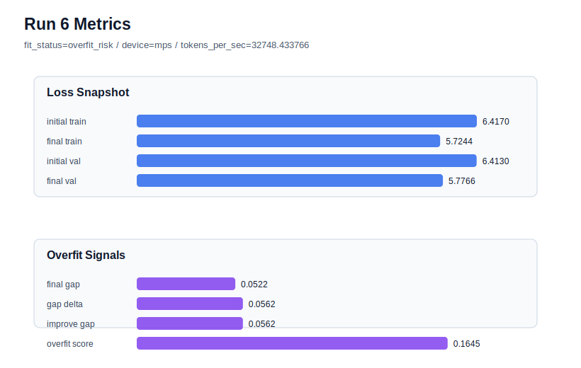

# run 006 실험 보고서

## 이번 가설

FFN 용량 축소 단일축 테스트: run 004의 tie_embeddings=True 설정은 validation loss와 final gap을 개선했지만 overfit_score는 여전히 높다. weight_decay 강화(run 005)는 거의 효과가 없었으므로, run 004 설정을 유지하고 ffn_mult만 4에서 3으로 줄이면 token별 FFN 암기 용량이 낮아져 validation 성능을 크게 잃지 않으면서 overfit_score와 train_val_improvement_gap이 완화될 수 있다.

## 왜 이 가설을 세웠는가

leaderboard와 dashboard에서 run 004는 final_val_loss=5.7555, final_generalization_gap=0.0362로 best 후보지만 overfit_score=0.1734와 fit_status=overfit_risk가 남아 있다. run 005는 weight_decay=0.05를 적용했지만 final_val_loss=5.7558, gap=0.0362, overfit_score=0.1733으로 사실상 변화가 없었다. 따라서 최적화 regularization보다 모델의 FFN capacity가 작은 말뭉치에서 train 개선 편향을 만드는지 확인할 차례다. n_layers를 바로 줄이면 attention/FFN block 전체 깊이가 바뀌므로, 더 작은 변화인 ffn_mult=3을 먼저 단일축으로 테스트한다.

## 가설 작성 주체

llm_plan:docs/train/next_plan.json

## 바꾼 변수

```json
{
  "ffn_mult": 3
}
```

## 고정한 변수

seed=134, max_steps=40, batch_size=8, context_length=64, emb_dim=128, n_heads=4, n_layers=2, learning_rate=0.0003, weight_decay=0.01, drop_rate=0.1, tie_embeddings=True, activation_name=gelu, ffn_dropout_position=after_output, attention_impl=manual

## 기대 결과

parameter_count가 run 004보다 줄고 final_val_loss는 5.75~5.85 범위에 머문다. 성공 기준은 final_generalization_gap이 0.04 이하를 유지하면서 train_val_improvement_gap 또는 overfit_score가 run 004보다 의미 있게 낮아지는 것이다.

## 실험 설정

```json
{
  "run_id": 6,
  "hypothesis": "FFN 용량 축소 단일축 테스트: run 004의 tie_embeddings=True 설정은 validation loss와 final gap을 개선했지만 overfit_score는 여전히 높다. weight_decay 강화(run 005)는 거의 효과가 없었으므로, run 004 설정을 유지하고 ffn_mult만 4에서 3으로 줄이면 token별 FFN 암기 용량이 낮아져 validation 성능을 크게 잃지 않으면서 overfit_score와 train_val_improvement_gap이 완화될 수 있다.",
  "seed": 134,
  "vocab_size": 600,
  "min_frequency": 2,
  "context_length": 64,
  "stride": null,
  "batch_size": 8,
  "max_steps": 40,
  "eval_batches": 4,
  "train_ratio": 0.9,
  "learning_rate": 0.0003,
  "weight_decay": 0.01,
  "grad_clip": 1.0,
  "emb_dim": 128,
  "n_heads": 4,
  "n_layers": 2,
  "drop_rate": 0.1,
  "qkv_bias": false,
  "ffn_mult": 3,
  "norm_first": false,
  "norm_eps": 1e-05,
  "activation_name": "gelu",
  "ffn_dropout_position": "after_output",
  "attention_impl": "manual",
  "tie_embeddings": true,
  "init_std": 0.02
}
```

## 실행 환경

```json
{
  "timestamp": "2026-06-02T19:23:26+00:00",
  "hostname": "woonyong-MacBookPro.local",
  "platform": "macOS-26.3.1-arm64-arm-64bit-Mach-O",
  "machine": "arm64",
  "python": "3.13.13",
  "torch": "2.12.0",
  "cpu_count": 10,
  "memory_gb": 24.0,
  "cuda_available": false,
  "cuda_device_count": 0,
  "mps_available": true,
  "resolved_device": "mps",
  "profile": "mps_balanced"
}
```

- corpus: `src/learning/the-verdict.txt`
- artifact_dir: `docs/train/runs/run_006_artifacts`

## 실제 결과

| 지표 | 값 |
| --- | --- |
| initial_train_loss | 6.417041063308716 |
| initial_val_loss | 6.413019895553589 |
| final_train_loss | 5.7244322299957275 |
| final_val_loss | 5.776598215103149 |
| final_generalization_gap | 0.052165985107421875 |
| generalization_gap_delta | 0.05618715286254883 |
| train_val_improvement_gap | 0.05618715286254883 |
| overfit_score | 0.16454029083251953 |
| fit_status | overfit_risk |
| parameter_count | 415232 |
| tokens_per_sec | 32748.433765575148 |
| elapsed_sec | 0.6097390837967396 |
| device | mps |

## 시각 지표




- 대시보드: `../dashboard.md`
- 지표 요약 CSV: `../metrics_summary.csv`

## 과적합 판단

과적합 위험. final gap=0.0522, overfit_score=0.1645. 다음 실험은 regularization 강화가 우선이다.

## 결론

현재 best 후보: run 4 / val=5.755529403686523 / status=overfit_risk

## 다음 실험 제안

- 성공 시: ffn_mult=3과 tie_embeddings=True 조합을 seed만 바꿔 재현성 검증한다. 재현되면 activation_name=quick_gelu 또는 silu를 단일축으로 비교한다.
- 과적합 시: ffn_mult 축소 후에도 overfit_score가 높거나 validation이 악화되면 n_layers=1 단일축 실험으로 깊이 자체를 줄여본다.
