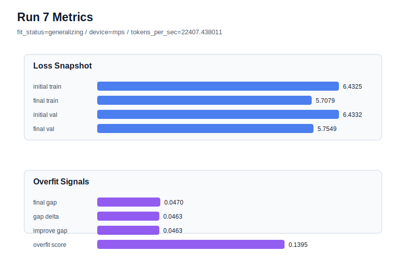

# run 007 실험 보고서

## 이번 가설

best 설정 seed 재현성 검증: run 004의 tie_embeddings=True 설정은 현재까지 가장 낮은 final_val_loss와 안정적인 final gap을 보였지만, 아직 seed=134 한 번의 결과다. 구조나 regularization 축을 더 바꾸기 전에 seed만 151로 바꿔도 validation 개선과 gap 완화가 유지되는지 확인한다.

## 왜 이 가설을 세웠는가

run 004는 final_val_loss=5.7555, final_generalization_gap=0.0362로 현재 best다. run 005의 weight_decay=0.05는 거의 변화가 없었고, run 006의 ffn_mult=3은 parameter_count와 속도는 개선했지만 final_val_loss=5.7766, final_generalization_gap=0.0522로 악화되었다. 따라서 run 004의 개선은 tie_embeddings 자체의 효과일 수도 있고 seed=134 초기화/셔플의 우연일 수도 있다. 현재 하드웨어는 mps_balanced이고 run 시간이 1초 내외로 짧으므로, seed 반복 검증은 비용이 낮고 다음 activation/capacity 실험의 기준 신뢰도를 높인다.

## 가설 작성 주체

llm_plan:docs/train/next_plan.json

## 바꾼 변수

```json
{
  "seed": 151
}
```

## 고정한 변수

vocab_size=600, context_length=64, batch_size=8, max_steps=40, learning_rate=0.0003, weight_decay=0.01, emb_dim=128, n_heads=4, n_layers=2, drop_rate=0.1, ffn_mult=4, tie_embeddings=True, activation_name=gelu, ffn_dropout_position=after_output, attention_impl=manual

## 기대 결과

final_val_loss가 5.75~5.85 범위에 머물고 final_generalization_gap이 0.05 이하로 유지되면 run 004 계열이 seed 하나의 우연이 아닐 가능성이 커진다. overfit_score는 아직 높을 수 있지만 run 006보다 validation/gap이 안정적이면 tie_embeddings=True를 기준선으로 채택한다.

## 실험 설정

```json
{
  "run_id": 7,
  "hypothesis": "best 설정 seed 재현성 검증: run 004의 tie_embeddings=True 설정은 현재까지 가장 낮은 final_val_loss와 안정적인 final gap을 보였지만, 아직 seed=134 한 번의 결과다. 구조나 regularization 축을 더 바꾸기 전에 seed만 151로 바꿔도 validation 개선과 gap 완화가 유지되는지 확인한다.",
  "seed": 151,
  "vocab_size": 600,
  "min_frequency": 2,
  "context_length": 64,
  "stride": null,
  "batch_size": 8,
  "max_steps": 40,
  "eval_batches": 4,
  "train_ratio": 0.9,
  "learning_rate": 0.0003,
  "weight_decay": 0.01,
  "grad_clip": 1.0,
  "emb_dim": 128,
  "n_heads": 4,
  "n_layers": 2,
  "drop_rate": 0.1,
  "qkv_bias": false,
  "ffn_mult": 4,
  "norm_first": false,
  "norm_eps": 1e-05,
  "activation_name": "gelu",
  "ffn_dropout_position": "after_output",
  "attention_impl": "manual",
  "tie_embeddings": true,
  "init_std": 0.02
}
```

## 실행 환경

```json
{
  "timestamp": "2026-06-02T19:28:31+00:00",
  "hostname": "woonyong-MacBookPro.local",
  "platform": "macOS-26.3.1-arm64-arm-64bit-Mach-O",
  "machine": "arm64",
  "python": "3.13.13",
  "torch": "2.12.0",
  "cpu_count": 10,
  "memory_gb": 24.0,
  "cuda_available": false,
  "cuda_device_count": 0,
  "mps_available": true,
  "resolved_device": "mps",
  "profile": "mps_balanced"
}
```

- corpus: `src/learning/the-verdict.txt`
- artifact_dir: `docs/train/runs/run_007_artifacts`

## 실제 결과

| 지표 | 값 |
| --- | --- |
| initial_train_loss | 6.432502627372742 |
| initial_val_loss | 6.4332191944122314 |
| final_train_loss | 5.707884669303894 |
| final_val_loss | 5.754852533340454 |
| final_generalization_gap | 0.04696786403656006 |
| generalization_gap_delta | 0.04625129699707031 |
| train_val_improvement_gap | 0.04625129699707031 |
| overfit_score | 0.13947045803070068 |
| fit_status | generalizing |
| parameter_count | 481024 |
| tokens_per_sec | 22407.438011280297 |
| elapsed_sec | 0.8911326671950519 |
| device | mps |

## 시각 지표




- 대시보드: `../dashboard.md`
- 지표 요약 CSV: `../metrics_summary.csv`

## 과적합 판단

일반화 개선 신호. final gap=0.0470, overfit_score=0.1395. seed 반복으로 재현성을 확인할 만하다.

## 결론

현재 best 후보: run 7 / val=5.754852533340454 / status=generalizing

## 다음 실험 제안

- 성공 시: tie_embeddings=True 기준선을 유지하고 activation_name=quick_gelu 또는 silu를 단일축으로 비교한다. seed 반복 둘 다 안정적이면 활성함수 실험의 해석 신뢰도가 올라간다.
- 과적합 시: seed 변경에서 validation이 크게 흔들리거나 gap이 커지면 seed variance가 큰 것으로 보고 run 004 계열을 2~3개 seed로 더 반복한 뒤 평균 기준으로 판단한다.
