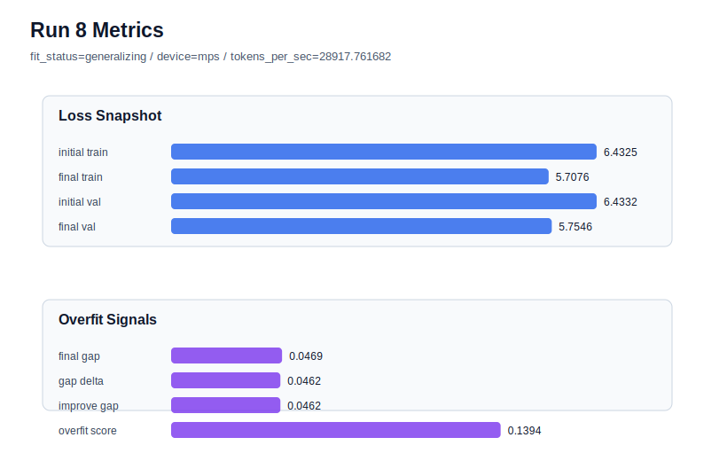
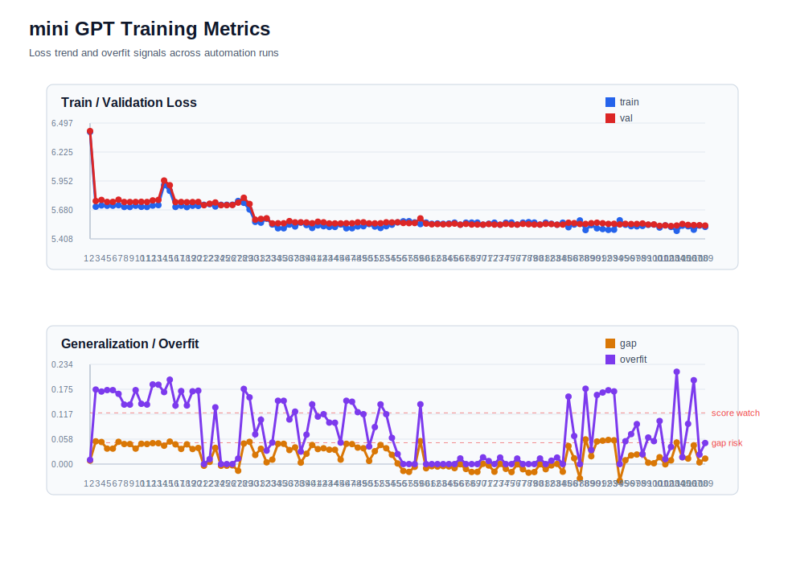

# run 008 실험 보고서

## 이번 가설

quick_gelu 활성함수 단일축 테스트: tie_embeddings=True 기준선은 seed=151에서 generalizing을 만들었으므로, 같은 설정에서 activation_name만 gelu에서 quick_gelu로 바꾸면 GELU 근사 특성으로 validation 성능을 유지하면서 처리량 또는 overfit_score가 개선될 수 있다.

## 왜 이 가설을 세웠는가

run 007은 seed=151, tie_embeddings=True, gelu 설정에서 final_val_loss=5.7549, final_generalization_gap=0.0470, overfit_score=0.1395, fit_status=generalizing으로 현재 best다. run 004와 run 007을 함께 보면 tie_embeddings=True 계열은 seed를 바꿔도 validation 성능이 유지된다. weight_decay 강화(run 005)는 변화가 거의 없었고 ffn_mult 축소(run 006)는 validation/gap을 악화시켰으므로, capacity 축소보다 작은 함수 교체가 다음에 더 안전한 실험 축이다. quick_gelu는 구조와 parameter_count를 바꾸지 않는 GELU 근사 계열이므로 현재 기준선과 의미 있게 비교하기 쉽다.

## 가설 작성 주체

llm_plan:docs/train/next_plan.json

## 바꾼 변수

```json
{
  "activation_name": "quick_gelu"
}
```

## 고정한 변수

seed=151, vocab_size=600, context_length=64, batch_size=8, max_steps=40, learning_rate=0.0003, weight_decay=0.01, emb_dim=128, n_heads=4, n_layers=2, drop_rate=0.1, ffn_mult=4, tie_embeddings=True, ffn_dropout_position=after_output, attention_impl=manual

## 기대 결과

final_val_loss가 run 007과 비슷한 5.74~5.82 범위에 머물고 final_generalization_gap이 0.05 이하로 유지된다. tokens_per_sec가 올라가거나 overfit_score가 0.139 이하로 낮아지면 quick_gelu를 유망한 GELU 대체 후보로 본다.

## 실험 설정

```json
{
  "run_id": 8,
  "hypothesis": "quick_gelu 활성함수 단일축 테스트: tie_embeddings=True 기준선은 seed=151에서 generalizing을 만들었으므로, 같은 설정에서 activation_name만 gelu에서 quick_gelu로 바꾸면 GELU 근사 특성으로 validation 성능을 유지하면서 처리량 또는 overfit_score가 개선될 수 있다.",
  "seed": 151,
  "vocab_size": 600,
  "min_frequency": 2,
  "context_length": 64,
  "stride": null,
  "batch_size": 8,
  "max_steps": 40,
  "eval_batches": 4,
  "train_ratio": 0.9,
  "learning_rate": 0.0003,
  "weight_decay": 0.01,
  "grad_clip": 1.0,
  "emb_dim": 128,
  "n_heads": 4,
  "n_layers": 2,
  "drop_rate": 0.1,
  "qkv_bias": false,
  "ffn_mult": 4,
  "norm_first": false,
  "norm_eps": 1e-05,
  "activation_name": "quick_gelu",
  "ffn_dropout_position": "after_output",
  "attention_impl": "manual",
  "tie_embeddings": true,
  "init_std": 0.02
}
```

## 실행 환경

```json
{
  "timestamp": "2026-06-02T19:33:14+00:00",
  "hostname": "woonyong-MacBookPro.local",
  "platform": "macOS-26.3.1-arm64-arm-64bit-Mach-O",
  "machine": "arm64",
  "python": "3.13.13",
  "torch": "2.12.0",
  "cpu_count": 10,
  "memory_gb": 24.0,
  "cuda_available": false,
  "cuda_device_count": 0,
  "mps_available": true,
  "resolved_device": "mps",
  "profile": "mps_balanced"
}
```

- corpus: `src/learning/the-verdict.txt`
- artifact_dir: `docs/train/runs/run_008_artifacts`

## 실제 결과

| 지표 | 값 |
| --- | --- |
| initial_train_loss | 6.432519197463989 |
| initial_val_loss | 6.433227300643921 |
| final_train_loss | 5.707627296447754 |
| final_val_loss | 5.75455904006958 |
| final_generalization_gap | 0.04693174362182617 |
| generalization_gap_delta | 0.04622364044189453 |
| train_val_improvement_gap | 0.04622364044189453 |
| overfit_score | 0.13937902450561523 |
| fit_status | generalizing |
| parameter_count | 481024 |
| tokens_per_sec | 28917.76168247565 |
| elapsed_sec | 0.6905098748393357 |
| device | mps |

## 시각 지표





- 대시보드: `../dashboard.md`
- 지표 요약 CSV: `../metrics_summary.csv`

## 과적합 판단

일반화 개선 신호. final gap=0.0469, overfit_score=0.1394. seed 반복으로 재현성을 확인할 만하다.

## 결론

현재 best 후보: run 8 / val=5.75455904006958 / status=generalizing

## 다음 실험 제안

- 성공 시: quick_gelu가 안정적이면 같은 activation을 다른 seed로 반복해 재현성을 확인한다. 이후 silu 또는 gelu_exact와 비교해 함수 계열별 의미를 정리한다.
- 과적합 시: quick_gelu에서 gap이나 overfit_score가 커지면 gelu 기준선으로 되돌리고 silu처럼 부드러운 activation 대안을 단일축으로 테스트한다.
