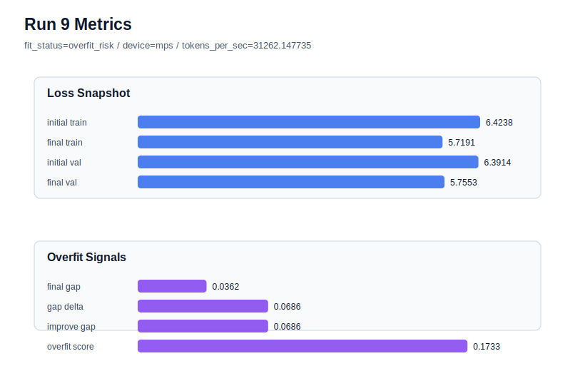

# run 009 실험 보고서

## 이번 가설

quick_gelu seed 재현성 검증: run 008은 seed=151에서 quick_gelu가 gelu 기준선(run 007)보다 validation loss, overfit_score, 처리량을 모두 조금 개선했다. 같은 quick_gelu + tie_embeddings=True 설정을 seed=134에서도 실행하면 run 004(gelu, seed=134) 대비 generalization gap과 overfit_score가 유지 또는 개선되는지 확인할 수 있다.

## 왜 이 가설을 세웠는가

현재 best는 run 008로 final_val_loss=5.7546, final_generalization_gap=0.0469, overfit_score=0.1394, fit_status=generalizing이다. 하지만 quick_gelu의 직접 비교는 seed=151에서 run 007 gelu와만 이루어졌다. seed=134에서는 gelu + tie_embeddings=True인 run 004가 final_val_loss=5.7555, gap=0.0362였지만 overfit_score=0.1734로 높았다. quick_gelu를 seed=134에도 적용하면 activation 교체가 특정 seed의 우연인지, 아니면 tie_embeddings=True 기준선 전반에서 유효한지 더 잘 판단할 수 있다. 실행 시간이 짧고 MPS에서 부담이 낮으므로 seed 재현성 검증의 정보 가치가 높다.

## 가설 작성 주체

llm_plan:docs/train/next_plan.json

## 바꾼 변수

```json
{
  "seed": 134
}
```

## 고정한 변수

activation_name=quick_gelu, vocab_size=600, context_length=64, batch_size=8, max_steps=40, learning_rate=0.0003, weight_decay=0.01, emb_dim=128, n_heads=4, n_layers=2, drop_rate=0.1, ffn_mult=4, tie_embeddings=True, ffn_dropout_position=after_output, attention_impl=manual

## 기대 결과

final_val_loss가 5.75~5.82 범위에 머물고 final_generalization_gap이 0.05 이하로 유지된다. run 004보다 overfit_score가 낮거나 run 008과 같은 generalizing 판정이 나오면 quick_gelu를 seed-robust 후보로 본다.

## 실험 설정

```json
{
  "run_id": 9,
  "hypothesis": "quick_gelu seed 재현성 검증: run 008은 seed=151에서 quick_gelu가 gelu 기준선(run 007)보다 validation loss, overfit_score, 처리량을 모두 조금 개선했다. 같은 quick_gelu + tie_embeddings=True 설정을 seed=134에서도 실행하면 run 004(gelu, seed=134) 대비 generalization gap과 overfit_score가 유지 또는 개선되는지 확인할 수 있다.",
  "seed": 134,
  "vocab_size": 600,
  "min_frequency": 2,
  "context_length": 64,
  "stride": null,
  "batch_size": 8,
  "max_steps": 40,
  "eval_batches": 4,
  "train_ratio": 0.9,
  "learning_rate": 0.0003,
  "weight_decay": 0.01,
  "grad_clip": 1.0,
  "emb_dim": 128,
  "n_heads": 4,
  "n_layers": 2,
  "drop_rate": 0.1,
  "qkv_bias": false,
  "ffn_mult": 4,
  "norm_first": false,
  "norm_eps": 1e-05,
  "activation_name": "quick_gelu",
  "ffn_dropout_position": "after_output",
  "attention_impl": "manual",
  "tie_embeddings": true,
  "init_std": 0.02
}
```

## 실행 환경

```json
{
  "timestamp": "2026-06-02T19:38:25+00:00",
  "hostname": "woonyong-MacBookPro.local",
  "platform": "macOS-26.3.1-arm64-arm-64bit-Mach-O",
  "machine": "arm64",
  "python": "3.13.13",
  "torch": "2.12.0",
  "cpu_count": 10,
  "memory_gb": 24.0,
  "cuda_available": false,
  "cuda_device_count": 0,
  "mps_available": true,
  "resolved_device": "mps",
  "profile": "mps_balanced"
}
```

- corpus: `src/learning/the-verdict.txt`
- artifact_dir: `docs/train/runs/run_009_artifacts`

## 실제 결과

| 지표 | 값 |
| --- | --- |
| initial_train_loss | 6.423758625984192 |
| initial_val_loss | 6.391381025314331 |
| final_train_loss | 5.719071745872498 |
| final_val_loss | 5.75526762008667 |
| final_generalization_gap | 0.03619587421417236 |
| generalization_gap_delta | 0.0685734748840332 |
| train_val_improvement_gap | 0.0685734748840332 |
| overfit_score | 0.17334282398223877 |
| fit_status | overfit_risk |
| parameter_count | 481024 |
| tokens_per_sec | 31262.147735452178 |
| elapsed_sec | 0.6387277089525014 |
| device | mps |

## 시각 지표




- 대시보드: `../dashboard.md`
- 지표 요약 CSV: `../metrics_summary.csv`

## 과적합 판단

과적합 위험. final gap=0.0362, overfit_score=0.1733. 다음 실험은 regularization 강화가 우선이다.

## 결론

현재 best 후보: run 8 / val=5.75455904006958 / status=generalizing

## 다음 실험 제안

- 성공 시: quick_gelu가 seed=134와 151에서 모두 안정적이면 quick_gelu + tie_embeddings=True를 새 기준선으로 채택하고 silu 또는 gelu_exact를 같은 seed=151 조건에서 단일축 비교한다.
- 과적합 시: seed=134에서 quick_gelu가 overfit_risk로 돌아가거나 validation이 악화되면 quick_gelu 효과는 seed 민감성이 있다고 보고 run 008 설정을 추가 seed로 반복하거나 gelu 기준으로 되돌린다.
