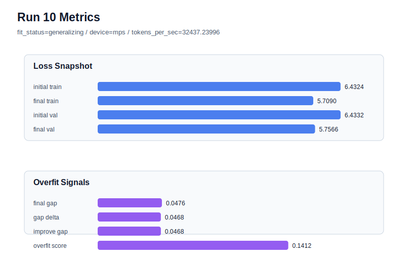

# run 010 실험 보고서

## 이번 가설

silu 활성함수 단일축 비교: quick_gelu는 seed=151에서 best를 만들었지만 seed=134에서는 overfit_risk로 돌아갔다. 같은 seed=151, tie_embeddings=True 기준선에서 activation_name만 silu로 바꾸면 부드러운 gate-like 비선형성이 validation 성능과 overfit_score를 quick_gelu 수준으로 유지하거나 더 안정화할 수 있다.

## 왜 이 가설을 세웠는가

run 008은 quick_gelu, seed=151에서 final_val_loss=5.7546, overfit_score=0.1394, fit_status=generalizing으로 현재 best다. 그러나 run 009는 같은 quick_gelu를 seed=134로 바꾸자 fit_status가 overfit_risk로 돌아갔다. seed 134 계열은 gelu와 quick_gelu 모두 overfit_score가 높았으므로, 지금은 같은 seed=151에서 activation family를 비교해 함수 자체의 상대 효과를 분리하는 편이 더 해석 가능하다. silu는 LLM에서 자주 쓰이는 부드러운 activation 계열이고 구조와 parameter_count를 바꾸지 않으므로, quick_gelu와 동일 조건에서 안전하게 비교할 수 있다.

## 가설 작성 주체

llm_plan:docs/train/next_plan.json

## 바꾼 변수

```json
{
  "activation_name": "silu"
}
```

## 고정한 변수

seed=151, vocab_size=600, context_length=64, batch_size=8, max_steps=40, learning_rate=0.0003, weight_decay=0.01, emb_dim=128, n_heads=4, n_layers=2, drop_rate=0.1, ffn_mult=4, tie_embeddings=True, ffn_dropout_position=after_output, attention_impl=manual

## 기대 결과

final_val_loss가 5.74~5.82 범위에 머물고 fit_status가 generalizing 또는 mixed 이상이면 silu를 유망 후보로 본다. overfit_score가 run 008의 0.1394보다 낮거나 final_generalization_gap이 0.047 이하이면 quick_gelu보다 더 안정적인 activation 후보가 된다.

## 실험 설정

```json
{
  "run_id": 10,
  "hypothesis": "silu 활성함수 단일축 비교: quick_gelu는 seed=151에서 best를 만들었지만 seed=134에서는 overfit_risk로 돌아갔다. 같은 seed=151, tie_embeddings=True 기준선에서 activation_name만 silu로 바꾸면 부드러운 gate-like 비선형성이 validation 성능과 overfit_score를 quick_gelu 수준으로 유지하거나 더 안정화할 수 있다.",
  "seed": 151,
  "vocab_size": 600,
  "min_frequency": 2,
  "context_length": 64,
  "stride": null,
  "batch_size": 8,
  "max_steps": 40,
  "eval_batches": 4,
  "train_ratio": 0.9,
  "learning_rate": 0.0003,
  "weight_decay": 0.01,
  "grad_clip": 1.0,
  "emb_dim": 128,
  "n_heads": 4,
  "n_layers": 2,
  "drop_rate": 0.1,
  "qkv_bias": false,
  "ffn_mult": 4,
  "norm_first": false,
  "norm_eps": 1e-05,
  "activation_name": "silu",
  "ffn_dropout_position": "after_output",
  "attention_impl": "manual",
  "tie_embeddings": true,
  "init_std": 0.02
}
```

## 실행 환경

```json
{
  "timestamp": "2026-06-02T19:43:25+00:00",
  "hostname": "woonyong-MacBookPro.local",
  "platform": "macOS-26.3.1-arm64-arm-64bit-Mach-O",
  "machine": "arm64",
  "python": "3.13.13",
  "torch": "2.12.0",
  "cpu_count": 10,
  "memory_gb": 24.0,
  "cuda_available": false,
  "cuda_device_count": 0,
  "mps_available": true,
  "resolved_device": "mps",
  "profile": "mps_balanced"
}
```

- corpus: `src/learning/the-verdict.txt`
- artifact_dir: `docs/train/runs/run_010_artifacts`

## 실제 결과

| 지표 | 값 |
| --- | --- |
| initial_train_loss | 6.432383179664612 |
| initial_val_loss | 6.43316125869751 |
| final_train_loss | 5.709047079086304 |
| final_val_loss | 5.756640195846558 |
| final_generalization_gap | 0.047593116760253906 |
| generalization_gap_delta | 0.04681503772735596 |
| train_val_improvement_gap | 0.04681503772735596 |
| overfit_score | 0.14122319221496582 |
| fit_status | generalizing |
| parameter_count | 481024 |
| tokens_per_sec | 32437.239959743027 |
| elapsed_sec | 0.6155887499917299 |
| device | mps |

## 시각 지표




- 대시보드: `../dashboard.md`
- 지표 요약 CSV: `../metrics_summary.csv`

## 과적합 판단

일반화 개선 신호. final gap=0.0476, overfit_score=0.1412. seed 반복으로 재현성을 확인할 만하다.

## 결론

현재 best 후보: run 8 / val=5.75455904006958 / status=generalizing

## 다음 실험 제안

- 성공 시: silu가 quick_gelu와 비슷하거나 더 좋으면 같은 silu 설정을 seed=134 또는 새 seed로 반복해 seed 안정성을 확인한다.
- 과적합 시: silu가 validation/gap을 악화시키면 quick_gelu를 seed=151 기준 best로 유지하고 gelu_exact 또는 quick_gelu 추가 seed 반복으로 GELU 계열 내부 비교를 이어간다.
