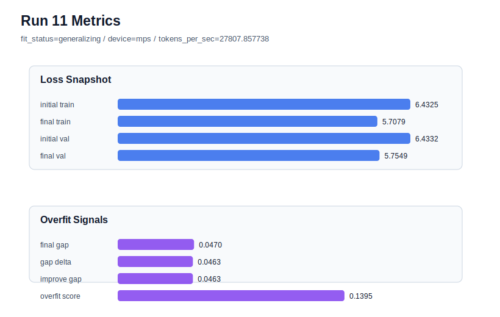

# run 011 실험 보고서

## 이번 가설

gelu_exact 활성함수 단일축 비교: run 008의 quick_gelu가 현재 best이고 run 010의 silu는 generalizing이지만 validation loss와 overfit_score가 약간 나빴다. 같은 seed=151, tie_embeddings=True 기준선에서 activation_name만 gelu_exact로 바꾸면 GELU 계열 내부에서 근사 quick_gelu의 이득이 계산 근사/속도 효과인지, exact GELU에서도 유지되는 안정성인지 분리해 확인할 수 있다.

## 왜 이 가설을 세웠는가

최근 추세는 seed=151에서 tie_embeddings=True 계열이 generalizing으로 안정되고, activation만 바꾼 run 007 gelu, run 008 quick_gelu, run 010 silu가 모두 비슷한 validation 범위에 머무는 모습을 보인다. run 008은 final_val_loss=5.754559, final_generalization_gap=0.046932, overfit_score=0.139379로 best이고, run 010 silu는 final_val_loss=5.756640, gap=0.047593, overfit_score=0.141223으로 안정적이지만 best는 아니다. 따라서 capacity나 regularization을 새로 섞기보다 동일 seed와 동일 하드웨어 친화 설정에서 gelu_exact만 비교하면 GELU 계열의 의미를 가장 해석 가능하게 좁힐 수 있다.

## 가설 작성 주체

llm_plan:docs/train/next_plan.json

## 바꾼 변수

```json
{
  "activation_name": "gelu_exact"
}
```

## 고정한 변수

seed=151, vocab_size=600, context_length=64, batch_size=8, max_steps=40, learning_rate=0.0003, weight_decay=0.01, grad_clip=1.0, emb_dim=128, n_heads=4, n_layers=2, drop_rate=0.1, qkv_bias=False, ffn_mult=4, norm_first=False, norm_eps=1e-5, ffn_dropout_position=after_output, attention_impl=manual, tie_embeddings=True, init_std=0.02

## 기대 결과

final_val_loss가 5.74~5.82 범위에 머물고 final_generalization_gap이 0.05 이하이면 GELU 계열은 안정적이라고 본다. overfit_score가 run 008의 0.139379보다 낮거나 final_val_loss가 5.754559보다 낮으면 gelu_exact를 새 후보로 삼고, 비슷하지만 느리면 quick_gelu를 속도와 성능의 균형 후보로 유지한다.

## 실험 설정

```json
{
  "run_id": 11,
  "hypothesis": "gelu_exact 활성함수 단일축 비교: run 008의 quick_gelu가 현재 best이고 run 010의 silu는 generalizing이지만 validation loss와 overfit_score가 약간 나빴다. 같은 seed=151, tie_embeddings=True 기준선에서 activation_name만 gelu_exact로 바꾸면 GELU 계열 내부에서 근사 quick_gelu의 이득이 계산 근사/속도 효과인지, exact GELU에서도 유지되는 안정성인지 분리해 확인할 수 있다.",
  "seed": 151,
  "vocab_size": 600,
  "min_frequency": 2,
  "context_length": 64,
  "stride": null,
  "batch_size": 8,
  "max_steps": 40,
  "eval_batches": 4,
  "train_ratio": 0.9,
  "learning_rate": 0.0003,
  "weight_decay": 0.01,
  "grad_clip": 1.0,
  "emb_dim": 128,
  "n_heads": 4,
  "n_layers": 2,
  "drop_rate": 0.1,
  "qkv_bias": false,
  "ffn_mult": 4,
  "norm_first": false,
  "norm_eps": 1e-05,
  "activation_name": "gelu_exact",
  "ffn_dropout_position": "after_output",
  "attention_impl": "manual",
  "tie_embeddings": true,
  "init_std": 0.02
}
```

## 실행 환경

```json
{
  "timestamp": "2026-06-02T19:48:50+00:00",
  "hostname": "woonyong-MacBookPro.local",
  "platform": "macOS-26.3.1-arm64-arm-64bit-Mach-O",
  "machine": "arm64",
  "python": "3.13.13",
  "torch": "2.12.0",
  "cpu_count": 10,
  "memory_gb": 24.0,
  "cuda_available": false,
  "cuda_device_count": 0,
  "mps_available": true,
  "resolved_device": "mps",
  "profile": "mps_balanced"
}
```

- corpus: `src/learning/the-verdict.txt`
- artifact_dir: `docs/train/runs/run_011_artifacts`

## 실제 결과

| 지표 | 값 |
| --- | --- |
| initial_train_loss | 6.432502746582031 |
| initial_val_loss | 6.4332194328308105 |
| final_train_loss | 5.707884311676025 |
| final_val_loss | 5.754852056503296 |
| final_generalization_gap | 0.04696774482727051 |
| generalization_gap_delta | 0.04625105857849121 |
| train_val_improvement_gap | 0.04625105857849121 |
| overfit_score | 0.13946986198425293 |
| fit_status | generalizing |
| parameter_count | 481024 |
| tokens_per_sec | 27807.857737654744 |
| elapsed_sec | 0.7180704169441015 |
| device | mps |

## 시각 지표




- 대시보드: `../dashboard.md`
- 지표 요약 CSV: `../metrics_summary.csv`

## 과적합 판단

일반화 개선 신호. final gap=0.0470, overfit_score=0.1395. seed 반복으로 재현성을 확인할 만하다.

## 결론

현재 best 후보: run 8 / val=5.75455904006958 / status=generalizing

## 다음 실험 제안

- 성공 시: gelu_exact가 quick_gelu보다 낮은 final_val_loss 또는 overfit_score를 만들면 seed=134 또는 새 seed=202로 반복해 activation 효과가 seed에 강건한지 확인한다.
- 과적합 시: gelu_exact가 overfit_risk이거나 run 008보다 validation/gap을 악화시키면 quick_gelu를 GELU 계열 best로 유지하고, 다음에는 quick_gelu seed=202 반복으로 seed variance를 추정한다.
