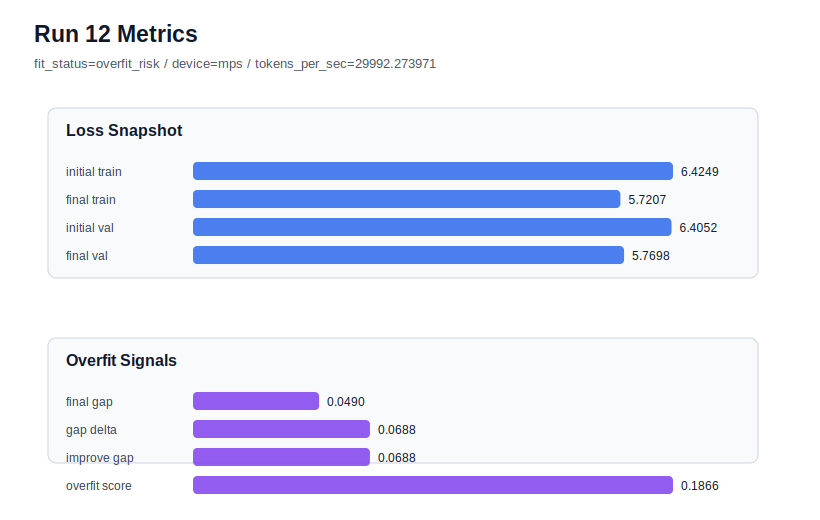

# run 012 실험 보고서

## 이번 가설

quick_gelu seed variance 검증: run 008은 seed=151에서 현재 best였고 gelu_exact(run 011)는 거의 같은 수준이지만 미세하게 뒤졌다. quick_gelu의 우세가 특정 seed의 우연인지 확인하기 위해, 구조와 학습 조건은 run 008과 동일하게 유지하고 seed만 202로 바꿔 validation loss, gap, overfit_score의 흔들림을 측정한다.

## 왜 이 가설을 세웠는가

최근 seed=151 activation 비교에서 quick_gelu(run 008), gelu(run 007), gelu_exact(run 011)는 모두 generalizing이며 매우 근접했다. 그중 quick_gelu는 final_val_loss=5.754559, final_generalization_gap=0.046932, overfit_score=0.139379로 best이고 처리량도 균형이 좋다. 반면 seed=134의 quick_gelu(run 009)는 final_val_loss는 비슷했지만 overfit_score=0.173343, fit_status=overfit_risk로 돌아갔다. 따라서 다음 의사결정은 새 activation을 더 늘리기보다, quick_gelu가 새 seed에서도 generalizing 범위와 낮은 overfit_score를 유지하는지 확인하는 것이 더 의미 있다.

## 가설 작성 주체

llm_plan:docs/train/next_plan.json

## 바꾼 변수

```json
{
  "seed": 202
}
```

## 고정한 변수

activation_name=quick_gelu, vocab_size=600, context_length=64, batch_size=8, max_steps=40, learning_rate=0.0003, weight_decay=0.01, grad_clip=1.0, emb_dim=128, n_heads=4, n_layers=2, drop_rate=0.1, qkv_bias=False, ffn_mult=4, norm_first=False, norm_eps=1e-5, ffn_dropout_position=after_output, attention_impl=manual, tie_embeddings=True, init_std=0.02

## 기대 결과

final_val_loss가 5.74~5.82 범위에 있고 final_generalization_gap이 0.05 이하, overfit_score가 0.15 이하이면 quick_gelu의 seed 안정성이 강화된다. final_val_loss가 best보다 약간 높더라도 fit_status가 generalizing이면 activation 결론은 유지하고 seed 평균 관점으로 해석한다.

## 실험 설정

```json
{
  "run_id": 12,
  "hypothesis": "quick_gelu seed variance 검증: run 008은 seed=151에서 현재 best였고 gelu_exact(run 011)는 거의 같은 수준이지만 미세하게 뒤졌다. quick_gelu의 우세가 특정 seed의 우연인지 확인하기 위해, 구조와 학습 조건은 run 008과 동일하게 유지하고 seed만 202로 바꿔 validation loss, gap, overfit_score의 흔들림을 측정한다.",
  "seed": 202,
  "vocab_size": 600,
  "min_frequency": 2,
  "context_length": 64,
  "stride": null,
  "batch_size": 8,
  "max_steps": 40,
  "eval_batches": 4,
  "train_ratio": 0.9,
  "learning_rate": 0.0003,
  "weight_decay": 0.01,
  "grad_clip": 1.0,
  "emb_dim": 128,
  "n_heads": 4,
  "n_layers": 2,
  "drop_rate": 0.1,
  "qkv_bias": false,
  "ffn_mult": 4,
  "norm_first": false,
  "norm_eps": 1e-05,
  "activation_name": "quick_gelu",
  "ffn_dropout_position": "after_output",
  "attention_impl": "manual",
  "tie_embeddings": true,
  "init_std": 0.02
}
```

## 실행 환경

```json
{
  "timestamp": "2026-06-02T19:53:25+00:00",
  "hostname": "woonyong-MacBookPro.local",
  "platform": "macOS-26.3.1-arm64-arm-64bit-Mach-O",
  "machine": "arm64",
  "python": "3.13.13",
  "torch": "2.12.0",
  "cpu_count": 10,
  "memory_gb": 24.0,
  "cuda_available": false,
  "cuda_device_count": 0,
  "mps_available": true,
  "resolved_device": "mps",
  "profile": "mps_balanced"
}
```

- corpus: `src/learning/the-verdict.txt`
- artifact_dir: `docs/train/runs/run_012_artifacts`

## 실제 결과

| 지표 | 값 |
| --- | --- |
| initial_train_loss | 6.424937129020691 |
| initial_val_loss | 6.405178546905518 |
| final_train_loss | 5.720723867416382 |
| final_val_loss | 5.769758224487305 |
| final_generalization_gap | 0.04903435707092285 |
| generalization_gap_delta | 0.06879293918609619 |
| train_val_improvement_gap | 0.06879293918609619 |
| overfit_score | 0.18662023544311523 |
| fit_status | overfit_risk |
| parameter_count | 481024 |
| tokens_per_sec | 29992.273970558083 |
| elapsed_sec | 0.6657714589964598 |
| device | mps |

## 시각 지표




- 대시보드: `../dashboard.md`
- 지표 요약 CSV: `../metrics_summary.csv`

## 과적합 판단

과적합 위험. final gap=0.0490, overfit_score=0.1866. 다음 실험은 regularization 강화가 우선이다.

## 결론

현재 best 후보: run 8 / val=5.75455904006958 / status=generalizing

## 다음 실험 제안

- 성공 시: seed=202에서도 generalizing이면 quick_gelu를 현재 기본 후보로 유지하고, 다음에는 learning_rate 또는 dropout을 작은 폭으로 단일축 조정해 overfit_score를 더 낮출 수 있는지 본다.
- 과적합 시: seed=202가 overfit_risk이면 quick_gelu 효과는 seed 민감성이 크다고 보고, 다음에는 같은 조건에서 seed 반복을 한 번 더 하거나 drop_rate=0.15를 결합하지 않고 단일축으로 비교해 regularization 필요성을 분리한다.
