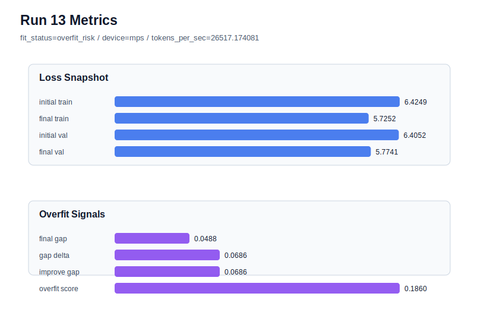

# run 013 실험 보고서

## 이번 가설

drop_rate 정규화 단일축 테스트: quick_gelu seed=202 반복(run 012)은 final_val_loss가 악화되고 overfit_score가 0.1866까지 상승해 seed 민감성과 과적합 위험을 드러냈다. 같은 seed=202와 quick_gelu 설정을 유지하고 drop_rate만 0.10에서 0.15로 올리면 train 쪽 과도한 개선을 누그러뜨려 overfit_score와 train_val_improvement_gap을 낮출 수 있다.

## 왜 이 가설을 세웠는가

run 008 quick_gelu seed=151은 final_val_loss=5.754559, gap=0.046932, overfit_score=0.139379로 현재 best다. 그러나 같은 quick_gelu 계열에서 seed=134(run 009)와 seed=202(run 012)는 overfit_risk로 돌아갔다. 특히 run 012는 final_val_loss=5.769758, gap=0.049034, train_val_improvement_gap=0.068793, overfit_score=0.186620으로 train 개선이 validation보다 크게 앞섰다. 이전 drop_rate=0.20 실험(run 003)은 tie_embeddings=False 기준선에서 validation을 악화시켰으므로, 이번에는 더 작은 0.15를 tie_embeddings=True + quick_gelu + seed=202 조건에 단일축으로 적용해 regularization이 seed 202의 과적합을 완화하는지 분리해서 본다.

## 가설 작성 주체

llm_plan:docs/train/next_plan.json

## 바꾼 변수

```json
{
  "drop_rate": 0.15
}
```

## 고정한 변수

seed=202, activation_name=quick_gelu, vocab_size=600, context_length=64, batch_size=8, max_steps=40, learning_rate=0.0003, weight_decay=0.01, grad_clip=1.0, emb_dim=128, n_heads=4, n_layers=2, qkv_bias=False, ffn_mult=4, norm_first=False, norm_eps=1e-5, ffn_dropout_position=after_output, attention_impl=manual, tie_embeddings=True, init_std=0.02

## 기대 결과

성공 기준은 final_val_loss가 run 012의 5.769758보다 낮아지거나 최소한 5.74~5.82 범위에 머물면서 overfit_score가 0.15 이하로 내려가는 것이다. final_generalization_gap은 0.05 이하를 유지하고, train_val_improvement_gap이 run 012의 0.068793보다 줄어들면 dropout 0.15가 seed 202의 과적합 완화에 유효하다고 본다.

## 실험 설정

```json
{
  "run_id": 13,
  "hypothesis": "drop_rate 정규화 단일축 테스트: quick_gelu seed=202 반복(run 012)은 final_val_loss가 악화되고 overfit_score가 0.1866까지 상승해 seed 민감성과 과적합 위험을 드러냈다. 같은 seed=202와 quick_gelu 설정을 유지하고 drop_rate만 0.10에서 0.15로 올리면 train 쪽 과도한 개선을 누그러뜨려 overfit_score와 train_val_improvement_gap을 낮출 수 있다.",
  "seed": 202,
  "vocab_size": 600,
  "min_frequency": 2,
  "context_length": 64,
  "stride": null,
  "batch_size": 8,
  "max_steps": 40,
  "eval_batches": 4,
  "train_ratio": 0.9,
  "learning_rate": 0.0003,
  "weight_decay": 0.01,
  "grad_clip": 1.0,
  "emb_dim": 128,
  "n_heads": 4,
  "n_layers": 2,
  "drop_rate": 0.15,
  "qkv_bias": false,
  "ffn_mult": 4,
  "norm_first": false,
  "norm_eps": 1e-05,
  "activation_name": "quick_gelu",
  "ffn_dropout_position": "after_output",
  "attention_impl": "manual",
  "tie_embeddings": true,
  "init_std": 0.02
}
```

## 실행 환경

```json
{
  "timestamp": "2026-06-02T19:58:35+00:00",
  "hostname": "woonyong-MacBookPro.local",
  "platform": "macOS-26.3.1-arm64-arm-64bit-Mach-O",
  "machine": "arm64",
  "python": "3.13.13",
  "torch": "2.12.0",
  "cpu_count": 10,
  "memory_gb": 24.0,
  "cuda_available": false,
  "cuda_device_count": 0,
  "mps_available": true,
  "resolved_device": "mps",
  "profile": "mps_balanced"
}
```

- corpus: `src/learning/the-verdict.txt`
- artifact_dir: `docs/train/runs/run_013_artifacts`

## 실제 결과

| 지표 | 값 |
| --- | --- |
| initial_train_loss | 6.424937129020691 |
| initial_val_loss | 6.405178546905518 |
| final_train_loss | 5.725237846374512 |
| final_val_loss | 5.774077653884888 |
| final_generalization_gap | 0.04883980751037598 |
| generalization_gap_delta | 0.06859838962554932 |
| train_val_improvement_gap | 0.06859838962554932 |
| overfit_score | 0.1860365867614746 |
| fit_status | overfit_risk |
| parameter_count | 481024 |
| tokens_per_sec | 26517.17408092089 |
| elapsed_sec | 0.7530214169528335 |
| device | mps |

## 시각 지표




- 대시보드: `../dashboard.md`
- 지표 요약 CSV: `../metrics_summary.csv`

## 과적합 판단

과적합 위험. final gap=0.0488, overfit_score=0.1860. 다음 실험은 regularization 강화가 우선이다.

## 결론

현재 best 후보: run 8 / val=5.75455904006958 / status=generalizing

## 다음 실험 제안

- 성공 시: drop_rate=0.15가 seed=202에서 generalizing으로 바꾸면 같은 설정을 seed=151 또는 seed=134에서 반복해 dropout 정규화가 평균적으로 유리한지 확인한다.
- 과적합 시: drop_rate=0.15에서도 overfit_risk가 유지되면 dropout 단독으로는 부족하다고 보고, 다음에는 learning_rate를 0.0002로 낮추거나 max_steps를 줄이는 최적화 조건 단일축 실험으로 넘어간다.
