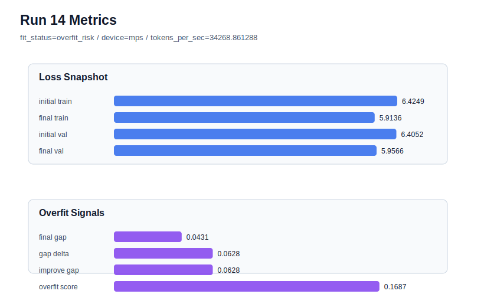

# run 014 실험 보고서

## 이번 가설

learning_rate 하향 최적화 단일축 테스트: quick_gelu seed=202 계열은 run 012와 run 013에서 모두 overfit_risk였고, drop_rate=0.15는 validation loss를 더 악화시켰다. dropout을 기준값 0.10으로 되돌리고 learning_rate만 0.0003에서 0.0002로 낮추면 train loss가 너무 빠르게 내려가며 validation 개선을 앞지르는 현상을 줄여 overfit_score와 train_val_improvement_gap을 낮출 수 있다.

## 왜 이 가설을 세웠는가

run 012(seed=202, quick_gelu, drop_rate=0.10)는 final_val_loss=5.769758, gap=0.049034, train_val_improvement_gap=0.068793, overfit_score=0.186620으로 overfit_risk였다. run 013은 같은 seed에서 drop_rate만 0.15로 올렸지만 final_val_loss=5.774078로 더 나빠졌고 overfit_score도 0.186037로 거의 줄지 않았다. 따라서 seed=202의 문제는 단순 dropout 부족보다 학습 속도 또는 step당 업데이트 크기와 관련될 가능성이 있다. 구조, activation, parameter_count를 그대로 유지하고 learning_rate만 낮추면 작은 데이터에서 train 쪽으로 치우친 업데이트를 완만하게 만들어 validation 안정성을 회복할 수 있는지 볼 수 있다.

## 가설 작성 주체

llm_plan:docs/train/next_plan.json

## 바꾼 변수

```json
{
  "learning_rate": 0.0002
}
```

## 고정한 변수

seed=202, activation_name=quick_gelu, drop_rate=0.10, vocab_size=600, context_length=64, batch_size=8, max_steps=40, weight_decay=0.01, grad_clip=1.0, emb_dim=128, n_heads=4, n_layers=2, qkv_bias=False, ffn_mult=4, norm_first=False, norm_eps=1e-5, ffn_dropout_position=after_output, attention_impl=manual, tie_embeddings=True, init_std=0.02

## 기대 결과

성공 기준은 run 012 대비 final_val_loss가 5.769758 이하로 내려가거나, 최소한 overfit_score가 0.15 이하로 줄어 fit_status가 generalizing 또는 mixed에 가까워지는 것이다. 학습이 너무 느려져 final_val_loss가 크게 악화되면 learning_rate 하향은 underfit 방향으로 판단한다.

## 실험 설정

```json
{
  "run_id": 14,
  "hypothesis": "learning_rate 하향 최적화 단일축 테스트: quick_gelu seed=202 계열은 run 012와 run 013에서 모두 overfit_risk였고, drop_rate=0.15는 validation loss를 더 악화시켰다. dropout을 기준값 0.10으로 되돌리고 learning_rate만 0.0003에서 0.0002로 낮추면 train loss가 너무 빠르게 내려가며 validation 개선을 앞지르는 현상을 줄여 overfit_score와 train_val_improvement_gap을 낮출 수 있다.",
  "seed": 202,
  "vocab_size": 600,
  "min_frequency": 2,
  "context_length": 64,
  "stride": null,
  "batch_size": 8,
  "max_steps": 40,
  "eval_batches": 4,
  "train_ratio": 0.9,
  "learning_rate": 0.0002,
  "weight_decay": 0.01,
  "grad_clip": 1.0,
  "emb_dim": 128,
  "n_heads": 4,
  "n_layers": 2,
  "drop_rate": 0.1,
  "qkv_bias": false,
  "ffn_mult": 4,
  "norm_first": false,
  "norm_eps": 1e-05,
  "activation_name": "quick_gelu",
  "ffn_dropout_position": "after_output",
  "attention_impl": "manual",
  "tie_embeddings": true,
  "init_std": 0.02
}
```

## 실행 환경

```json
{
  "timestamp": "2026-06-02T20:03:24+00:00",
  "hostname": "woonyong-MacBookPro.local",
  "platform": "macOS-26.3.1-arm64-arm-64bit-Mach-O",
  "machine": "arm64",
  "python": "3.13.13",
  "torch": "2.12.0",
  "cpu_count": 10,
  "memory_gb": 24.0,
  "cuda_available": false,
  "cuda_device_count": 0,
  "mps_available": true,
  "resolved_device": "mps",
  "profile": "mps_balanced"
}
```

- corpus: `src/learning/the-verdict.txt`
- artifact_dir: `docs/train/runs/run_014_artifacts`

## 실제 결과

| 지표 | 값 |
| --- | --- |
| initial_train_loss | 6.424937129020691 |
| initial_val_loss | 6.405178546905518 |
| final_train_loss | 5.913574934005737 |
| final_val_loss | 5.956626892089844 |
| final_generalization_gap | 0.043051958084106445 |
| generalization_gap_delta | 0.06281054019927979 |
| train_val_improvement_gap | 0.06281054019927979 |
| overfit_score | 0.16867303848266602 |
| fit_status | overfit_risk |
| parameter_count | 481024 |
| tokens_per_sec | 34268.86128823347 |
| elapsed_sec | 0.5826864170376211 |
| device | mps |

## 시각 지표




- 대시보드: `../dashboard.md`
- 지표 요약 CSV: `../metrics_summary.csv`

## 과적합 판단

과적합 위험. final gap=0.0431, overfit_score=0.1687. 다음 실험은 regularization 강화가 우선이다.

## 결론

현재 best 후보: run 8 / val=5.75455904006958 / status=generalizing

## 다음 실험 제안

- 성공 시: learning_rate=0.0002가 seed=202의 overfit_score를 의미 있게 낮추면 같은 learning_rate를 seed=151의 best 계열에 적용해 best run 008을 넘어서는지 확인한다.
- 과적합 시: learning_rate=0.0002에서도 overfit_risk가 유지되면 업데이트 크기만으로는 부족하다고 보고, 다음에는 max_steps를 30으로 줄이는 조기 중단 단일축 실험으로 train_val_improvement_gap을 직접 낮출 수 있는지 확인한다.
