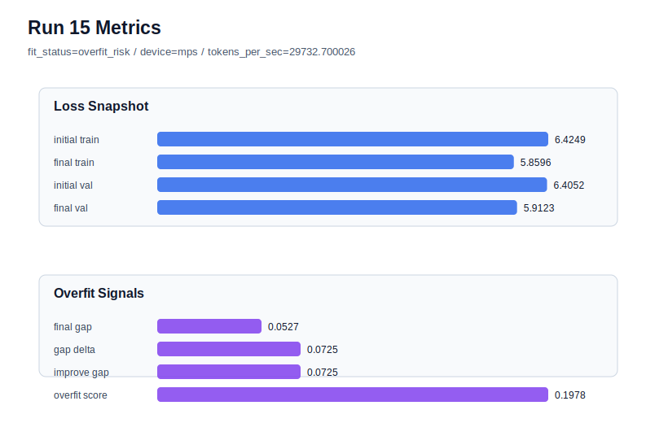

# run 015 실험 보고서

## 이번 가설

max_steps 조기 중단 단일축 테스트: seed=202 quick_gelu 계열은 learning_rate를 낮추면 validation loss가 크게 악화되고, dropout을 올려도 overfit_score가 거의 줄지 않았다. learning_rate를 0.0003으로 되돌리고 max_steps만 40에서 30으로 줄이면 train 쪽 과도한 개선이 누적되기 전에 멈춰 train_val_improvement_gap과 overfit_score를 낮추면서 run 012보다 validation 손실을 덜 악화시킬 수 있다.

## 왜 이 가설을 세웠는가

run 012는 seed=202, quick_gelu, learning_rate=0.0003, max_steps=40에서 final_val_loss=5.769758, train_val_improvement_gap=0.068793, overfit_score=0.186620으로 overfit_risk였다. run 013은 drop_rate만 0.15로 올렸지만 final_val_loss=5.774078로 더 나빠졌고 overfit_score도 거의 줄지 않았다. run 014는 learning_rate를 0.0002로 낮춰 overfit_score를 0.168673까지 낮췄지만 final_val_loss=5.956627로 너무 나빠져 underfit 성격이 강했다. 따라서 같은 learning_rate=0.0003을 유지하면서 학습 길이만 줄이는 조기 중단이, validation 성능을 과도하게 희생하지 않고 train 과개선을 낮출 수 있는지 확인하는 다음 단일축 실험이다.

## 가설 작성 주체

llm_plan:docs/train/next_plan.json

## 바꾼 변수

```json
{
  "max_steps": 30
}
```

## 고정한 변수

seed=202, activation_name=quick_gelu, learning_rate=0.0003, drop_rate=0.10, vocab_size=600, context_length=64, batch_size=8, weight_decay=0.01, grad_clip=1.0, emb_dim=128, n_heads=4, n_layers=2, qkv_bias=False, ffn_mult=4, norm_first=False, norm_eps=1e-5, ffn_dropout_position=after_output, attention_impl=manual, tie_embeddings=True, init_std=0.02

## 기대 결과

성공 기준은 final_val_loss가 run 012의 5.769758 이하이거나 비슷한 범위에 머물면서 overfit_score가 run 012의 0.186620보다 의미 있게 낮아지는 것이다. 특히 train_val_improvement_gap이 0.068793보다 줄면 max_steps=30이 seed=202의 과적합 누적을 줄였다고 본다. final_val_loss가 5.9 이상으로 악화되면 너무 짧은 학습으로 판단한다.

## 실험 설정

```json
{
  "run_id": 15,
  "hypothesis": "max_steps 조기 중단 단일축 테스트: seed=202 quick_gelu 계열은 learning_rate를 낮추면 validation loss가 크게 악화되고, dropout을 올려도 overfit_score가 거의 줄지 않았다. learning_rate를 0.0003으로 되돌리고 max_steps만 40에서 30으로 줄이면 train 쪽 과도한 개선이 누적되기 전에 멈춰 train_val_improvement_gap과 overfit_score를 낮추면서 run 012보다 validation 손실을 덜 악화시킬 수 있다.",
  "seed": 202,
  "vocab_size": 600,
  "min_frequency": 2,
  "context_length": 64,
  "stride": null,
  "batch_size": 8,
  "max_steps": 30,
  "eval_batches": 4,
  "train_ratio": 0.9,
  "learning_rate": 0.0003,
  "weight_decay": 0.01,
  "grad_clip": 1.0,
  "emb_dim": 128,
  "n_heads": 4,
  "n_layers": 2,
  "drop_rate": 0.1,
  "qkv_bias": false,
  "ffn_mult": 4,
  "norm_first": false,
  "norm_eps": 1e-05,
  "activation_name": "quick_gelu",
  "ffn_dropout_position": "after_output",
  "attention_impl": "manual",
  "tie_embeddings": true,
  "init_std": 0.02
}
```

## 실행 환경

```json
{
  "timestamp": "2026-06-02T20:08:27+00:00",
  "hostname": "woonyong-MacBookPro.local",
  "platform": "macOS-26.3.1-arm64-arm-64bit-Mach-O",
  "machine": "arm64",
  "python": "3.13.13",
  "torch": "2.12.0",
  "cpu_count": 10,
  "memory_gb": 24.0,
  "cuda_available": false,
  "cuda_device_count": 0,
  "mps_available": true,
  "resolved_device": "mps",
  "profile": "mps_balanced"
}
```

- corpus: `src/learning/the-verdict.txt`
- artifact_dir: `docs/train/runs/run_015_artifacts`

## 실제 결과

| 지표 | 값 |
| --- | --- |
| initial_train_loss | 6.424937129020691 |
| initial_val_loss | 6.405178546905518 |
| final_train_loss | 5.859577775001526 |
| final_val_loss | 5.912327766418457 |
| final_generalization_gap | 0.05274999141693115 |
| generalization_gap_delta | 0.07250857353210449 |
| train_val_improvement_gap | 0.07250857353210449 |
| overfit_score | 0.19776713848114014 |
| fit_status | overfit_risk |
| parameter_count | 481024 |
| tokens_per_sec | 29732.70002604865 |
| elapsed_sec | 0.49938283395022154 |
| device | mps |

## 시각 지표




- 대시보드: `../dashboard.md`
- 지표 요약 CSV: `../metrics_summary.csv`

## 과적합 판단

과적합 위험. final gap=0.0527, overfit_score=0.1978. 다음 실험은 regularization 강화가 우선이다.

## 결론

현재 best 후보: run 8 / val=5.75455904006958 / status=generalizing

## 다음 실험 제안

- 성공 시: max_steps=30이 validation 손실을 유지하면서 overfit_score를 낮추면 같은 조기 중단 설정을 seed=151의 best quick_gelu 계열에 적용해 run 008보다 더 균형 잡힌 후보가 되는지 확인한다.
- 과적합 시: max_steps=30에서도 overfit_risk가 유지되면 seed=202은 초기화/셔플 민감성이 큰 케이스로 보고, 다음에는 seed=151 best 계열에서 더 작은 정규화나 조기 중단을 적용해 best 개선 가능성을 탐색한다.
