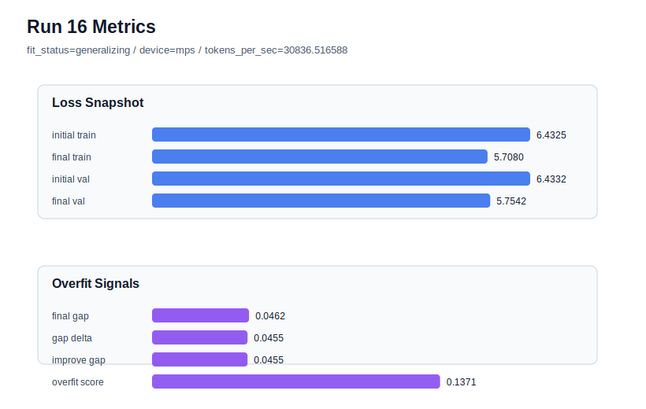

# run 016 실험 보고서

## 이번 가설

FFN dropout 위치 교체 단일축 테스트: run 008 quick_gelu seed=151이 현재 best지만 overfit_score는 0.139379로 아직 완전히 낮지는 않다. 같은 best 설정에서 ffn_dropout_position만 after_output에서 after_activation으로 바꾸면 FFN hidden activation에 직접 dropout이 걸려 train 쪽 과개선을 조금 줄이고, 구조를 바꾸지 않으면서 final_val_loss와 overfit_score의 균형을 개선할 수 있다.

## 왜 이 가설을 세웠는가

최근 seed=202 계열은 seed 자체의 민감성이 커서 dropout, learning_rate, max_steps 조정이 모두 validation 또는 overfit_score를 악화시켰다. 반대로 seed=151 계열은 run 007 gelu, run 008 quick_gelu, run 011 gelu_exact가 모두 generalizing이며 매우 안정적이다. 현재 best인 run 008은 final_val_loss=5.754559, final_generalization_gap=0.046932, overfit_score=0.139379이고, activation 비교에서는 quick_gelu가 gelu_exact와 silu보다 약간 낫다. 따라서 activation을 더 바꾸기보다, 사용자가 추가한 실험 축 중 구조 순서를 크게 바꾸지 않는 dropout 위치만 바꿔 hidden FFN 표현에 대한 regularization 위치 효과를 확인하는 것이 해석 가능하다.

## 가설 작성 주체

llm_plan:docs/train/next_plan.json

## 바꾼 변수

```json
{
  "ffn_dropout_position": "after_activation"
}
```

## 고정한 변수

seed=151, activation_name=quick_gelu, learning_rate=0.0003, drop_rate=0.10, vocab_size=600, context_length=64, batch_size=8, max_steps=40, weight_decay=0.01, grad_clip=1.0, emb_dim=128, n_heads=4, n_layers=2, qkv_bias=False, ffn_mult=4, norm_first=False, norm_eps=1e-5, attention_impl=manual, tie_embeddings=True, init_std=0.02

## 기대 결과

성공 기준은 final_val_loss가 run 008의 5.754559와 같거나 더 낮고, overfit_score가 0.139379 이하로 내려가는 것이다. final_val_loss가 약간 높아져도 final_generalization_gap과 train_val_improvement_gap이 안정적으로 낮아지면 위치 교체가 regularization 관점에서 후보가 될 수 있다.

## 실험 설정

```json
{
  "run_id": 16,
  "hypothesis": "FFN dropout 위치 교체 단일축 테스트: run 008 quick_gelu seed=151이 현재 best지만 overfit_score는 0.139379로 아직 완전히 낮지는 않다. 같은 best 설정에서 ffn_dropout_position만 after_output에서 after_activation으로 바꾸면 FFN hidden activation에 직접 dropout이 걸려 train 쪽 과개선을 조금 줄이고, 구조를 바꾸지 않으면서 final_val_loss와 overfit_score의 균형을 개선할 수 있다.",
  "seed": 151,
  "vocab_size": 600,
  "min_frequency": 2,
  "context_length": 64,
  "stride": null,
  "batch_size": 8,
  "max_steps": 40,
  "eval_batches": 4,
  "train_ratio": 0.9,
  "learning_rate": 0.0003,
  "weight_decay": 0.01,
  "grad_clip": 1.0,
  "emb_dim": 128,
  "n_heads": 4,
  "n_layers": 2,
  "drop_rate": 0.1,
  "qkv_bias": false,
  "ffn_mult": 4,
  "norm_first": false,
  "norm_eps": 1e-05,
  "activation_name": "quick_gelu",
  "ffn_dropout_position": "after_activation",
  "attention_impl": "manual",
  "tie_embeddings": true,
  "init_std": 0.02
}
```

## 실행 환경

```json
{
  "timestamp": "2026-06-02T20:13:30+00:00",
  "hostname": "woonyong-MacBookPro.local",
  "platform": "macOS-26.3.1-arm64-arm-64bit-Mach-O",
  "machine": "arm64",
  "python": "3.13.13",
  "torch": "2.12.0",
  "cpu_count": 10,
  "memory_gb": 24.0,
  "cuda_available": false,
  "cuda_device_count": 0,
  "mps_available": true,
  "resolved_device": "mps",
  "profile": "mps_balanced"
}
```

- corpus: `src/learning/the-verdict.txt`
- artifact_dir: `docs/train/runs/run_016_artifacts`

## 실제 결과

| 지표 | 값 |
| --- | --- |
| initial_train_loss | 6.432519197463989 |
| initial_val_loss | 6.433227300643921 |
| final_train_loss | 5.707980751991272 |
| final_val_loss | 5.754159450531006 |
| final_generalization_gap | 0.04617869853973389 |
| generalization_gap_delta | 0.045470595359802246 |
| train_val_improvement_gap | 0.045470595359802246 |
| overfit_score | 0.13711988925933838 |
| fit_status | generalizing |
| parameter_count | 481024 |
| tokens_per_sec | 30836.516588093175 |
| elapsed_sec | 0.6475439579226077 |
| device | mps |

## 시각 지표




- 대시보드: `../dashboard.md`
- 지표 요약 CSV: `../metrics_summary.csv`

## 과적합 판단

일반화 개선 신호. final gap=0.0462, overfit_score=0.1371. seed 반복으로 재현성을 확인할 만하다.

## 결론

현재 best 후보: run 16 / val=5.754159450531006 / status=generalizing

## 다음 실험 제안

- 성공 시: after_activation이 run 008보다 낮은 overfit_score 또는 비슷한 validation loss를 만들면 같은 설정을 seed=134 또는 새 seed로 반복해 dropout 위치 효과가 seed에 강건한지 확인한다.
- 과적합 시: after_activation이 validation을 악화시키거나 overfit_score를 낮추지 못하면 after_output을 유지하고, 다음에는 ffn_dropout_position=none으로 dropout 자체의 ablation을 수행해 현재 dropout이 실제로 유효한지 확인한다.
