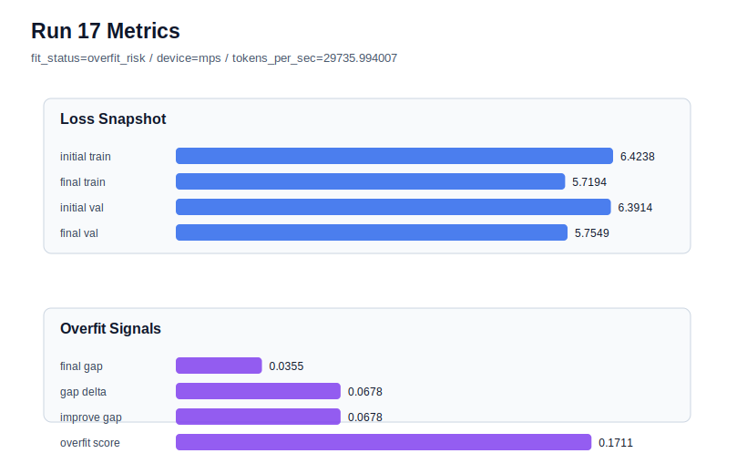

# run 017 실험 보고서

## 이번 가설

after_activation dropout 위치 효과 seed=134 재현성 검증: run 016은 seed=151에서 ffn_dropout_position=after_activation이 새 best를 만들었다. 같은 설정을 seed=134로 반복하면, 기존 seed=134 quick_gelu 기준선(run 009)의 overfit_risk가 dropout 위치 변경으로 완화되는지 확인할 수 있다.

## 왜 이 가설을 세웠는가

run 016은 seed=151에서 final_val_loss=5.754159, final_generalization_gap=0.046179, overfit_score=0.137120으로 run 008보다 validation과 overfit_score를 모두 개선했다. 하지만 seed=151 계열은 원래도 generalizing이 강했으므로, 위치 교체가 seed 하나의 우연인지 검증해야 한다. seed=134에는 직접 비교군이 있다. run 009는 quick_gelu + tie_embeddings=True + after_output + seed=134에서 final_val_loss=5.755268로 validation은 나쁘지 않았지만 overfit_score=0.173343, fit_status=overfit_risk였다. 따라서 seed=134에서 after_activation만 적용하면 FFN dropout 위치가 과적합 신호를 줄이는지 명확히 비교할 수 있다.

## 가설 작성 주체

llm_plan:docs/train/next_plan.json

## 바꾼 변수

```json
{
  "seed": 134
}
```

## 고정한 변수

activation_name=quick_gelu, ffn_dropout_position=after_activation, learning_rate=0.0003, drop_rate=0.10, vocab_size=600, context_length=64, batch_size=8, max_steps=40, weight_decay=0.01, grad_clip=1.0, emb_dim=128, n_heads=4, n_layers=2, qkv_bias=False, ffn_mult=4, norm_first=False, norm_eps=1e-5, attention_impl=manual, tie_embeddings=True, init_std=0.02

## 기대 결과

성공 기준은 run 009 대비 final_val_loss가 5.755268 근처를 유지하면서 overfit_score가 0.173343보다 의미 있게 낮아지는 것이다. fit_status가 generalizing으로 바뀌거나 train_val_improvement_gap이 줄면 after_activation 위치 효과가 seed=134에서도 재현된 것으로 본다.

## 실험 설정

```json
{
  "run_id": 17,
  "hypothesis": "after_activation dropout 위치 효과 seed=134 재현성 검증: run 016은 seed=151에서 ffn_dropout_position=after_activation이 새 best를 만들었다. 같은 설정을 seed=134로 반복하면, 기존 seed=134 quick_gelu 기준선(run 009)의 overfit_risk가 dropout 위치 변경으로 완화되는지 확인할 수 있다.",
  "seed": 134,
  "vocab_size": 600,
  "min_frequency": 2,
  "context_length": 64,
  "stride": null,
  "batch_size": 8,
  "max_steps": 40,
  "eval_batches": 4,
  "train_ratio": 0.9,
  "learning_rate": 0.0003,
  "weight_decay": 0.01,
  "grad_clip": 1.0,
  "emb_dim": 128,
  "n_heads": 4,
  "n_layers": 2,
  "drop_rate": 0.1,
  "qkv_bias": false,
  "ffn_mult": 4,
  "norm_first": false,
  "norm_eps": 1e-05,
  "activation_name": "quick_gelu",
  "ffn_dropout_position": "after_activation",
  "attention_impl": "manual",
  "tie_embeddings": true,
  "init_std": 0.02
}
```

## 실행 환경

```json
{
  "timestamp": "2026-06-02T20:18:32+00:00",
  "hostname": "woonyong-MacBookPro.local",
  "platform": "macOS-26.3.1-arm64-arm-64bit-Mach-O",
  "machine": "arm64",
  "python": "3.13.13",
  "torch": "2.12.0",
  "cpu_count": 10,
  "memory_gb": 24.0,
  "cuda_available": false,
  "cuda_device_count": 0,
  "mps_available": true,
  "resolved_device": "mps",
  "profile": "mps_balanced"
}
```

- corpus: `src/learning/the-verdict.txt`
- artifact_dir: `docs/train/runs/run_017_artifacts`

## 실제 결과

| 지표 | 값 |
| --- | --- |
| initial_train_loss | 6.423758625984192 |
| initial_val_loss | 6.391381025314331 |
| final_train_loss | 5.719405770301819 |
| final_val_loss | 5.754857540130615 |
| final_generalization_gap | 0.03545176982879639 |
| generalization_gap_delta | 0.06782937049865723 |
| train_val_improvement_gap | 0.06782937049865723 |
| overfit_score | 0.17111051082611084 |
| fit_status | overfit_risk |
| parameter_count | 481024 |
| tokens_per_sec | 29735.994007362377 |
| elapsed_sec | 0.6715094170067459 |
| device | mps |

## 시각 지표




- 대시보드: `../dashboard.md`
- 지표 요약 CSV: `../metrics_summary.csv`

## 과적합 판단

과적합 위험. final gap=0.0355, overfit_score=0.1711. 다음 실험은 regularization 강화가 우선이다.

## 결론

현재 best 후보: run 16 / val=5.754159450531006 / status=generalizing

## 다음 실험 제안

- 성공 시: seed=134에서도 after_activation이 overfit_score를 낮추면 dropout 위치 효과를 유망한 기본값 후보로 보고, 다음에는 seed=202처럼 어려운 seed에서 같은 위치를 적용해 강건성을 더 확인한다.
- 과적합 시: seed=134에서도 overfit_risk가 유지되면 after_activation 효과는 seed=151에 국한될 수 있으므로, 다음에는 ffn_dropout_position=none ablation으로 dropout 자체의 기여도를 확인한다.
