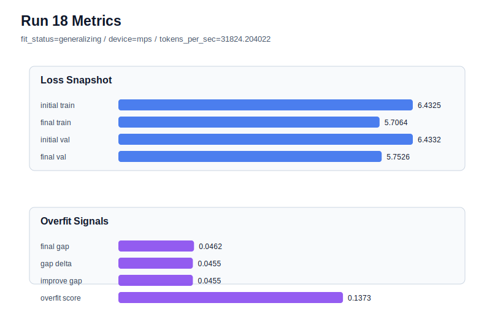

# run 018 실험 보고서

## 이번 가설

FFN dropout 자체 기여도 ablation: run 016은 quick_gelu + tie_embeddings=True + seed=151에서 ffn_dropout_position=after_activation이 현재 best를 만들었지만, run 017에서는 seed=134 재현성이 충분하지 않았다. 같은 best seed=151 설정에서 ffn_dropout_position만 none으로 바꾸면 dropout regularization 자체가 validation 성능과 overfit_score에 실제로 기여하는지 분리해서 확인할 수 있다.

## 왜 이 가설을 세웠는가

최근 흐름에서 seed=151 계열은 run 007, 008, 011, 016 모두 generalizing으로 안정적이고, 그중 run 016은 after_activation이 final_val_loss=5.754159와 overfit_score=0.137120으로 가장 좋았다. 반면 seed=134에서는 after_activation이 run 009 대비 final_val_loss와 overfit_score를 아주 조금만 개선했고 fit_status는 overfit_risk로 남았다. 따라서 새 activation이나 capacity 변경을 섞기 전에, best 계열의 seed=151에서 dropout을 완전히 제거해 after_activation의 이득이 dropout 위치 때문인지, dropout 자체가 꼭 필요한지 확인하는 것이 해석 가능하다.

## 가설 작성 주체

llm_plan:docs/train/next_plan.json

## 바꾼 변수

```json
{
  "ffn_dropout_position": "none"
}
```

## 고정한 변수

seed=151, activation_name=quick_gelu, tie_embeddings=True, learning_rate=0.0003, drop_rate=0.10, vocab_size=600, context_length=64, batch_size=8, max_steps=40, weight_decay=0.01, grad_clip=1.0, emb_dim=128, n_heads=4, n_layers=2, qkv_bias=False, ffn_mult=4, norm_first=False, norm_eps=1e-5, attention_impl=manual, init_std=0.02

## 기대 결과

성공 기준은 run 016과 비교해 final_val_loss가 5.754159 이하로 내려가거나 거의 같고, overfit_score가 0.137120 이하를 유지하는 것이다. 만약 final_train_loss만 더 낮아지고 final_val_loss 또는 overfit_score가 악화되면 dropout 제거가 train 암기만 키운 것으로 판단한다. validation이 악화되면 after_activation dropout을 best 계열의 기본 후보로 유지한다.

## 실험 설정

```json
{
  "run_id": 18,
  "hypothesis": "FFN dropout 자체 기여도 ablation: run 016은 quick_gelu + tie_embeddings=True + seed=151에서 ffn_dropout_position=after_activation이 현재 best를 만들었지만, run 017에서는 seed=134 재현성이 충분하지 않았다. 같은 best seed=151 설정에서 ffn_dropout_position만 none으로 바꾸면 dropout regularization 자체가 validation 성능과 overfit_score에 실제로 기여하는지 분리해서 확인할 수 있다.",
  "seed": 151,
  "vocab_size": 600,
  "min_frequency": 2,
  "context_length": 64,
  "stride": null,
  "batch_size": 8,
  "max_steps": 40,
  "eval_batches": 4,
  "train_ratio": 0.9,
  "learning_rate": 0.0003,
  "weight_decay": 0.01,
  "grad_clip": 1.0,
  "emb_dim": 128,
  "n_heads": 4,
  "n_layers": 2,
  "drop_rate": 0.1,
  "qkv_bias": false,
  "ffn_mult": 4,
  "norm_first": false,
  "norm_eps": 1e-05,
  "activation_name": "quick_gelu",
  "ffn_dropout_position": "none",
  "attention_impl": "manual",
  "tie_embeddings": true,
  "init_std": 0.02
}
```

## 실행 환경

```json
{
  "timestamp": "2026-06-02T20:23:47+00:00",
  "hostname": "woonyong-MacBookPro.local",
  "platform": "macOS-26.3.1-arm64-arm-64bit-Mach-O",
  "machine": "arm64",
  "python": "3.13.13",
  "torch": "2.12.0",
  "cpu_count": 10,
  "memory_gb": 24.0,
  "cuda_available": false,
  "cuda_device_count": 0,
  "mps_available": true,
  "resolved_device": "mps",
  "profile": "mps_balanced"
}
```

- corpus: `src/learning/the-verdict.txt`
- artifact_dir: `docs/train/runs/run_018_artifacts`

## 실제 결과

| 지표 | 값 |
| --- | --- |
| initial_train_loss | 6.432519197463989 |
| initial_val_loss | 6.433227300643921 |
| final_train_loss | 5.706410646438599 |
| final_val_loss | 5.752647876739502 |
| final_generalization_gap | 0.04623723030090332 |
| generalization_gap_delta | 0.04552912712097168 |
| train_val_improvement_gap | 0.04552912712097168 |
| overfit_score | 0.13729548454284668 |
| fit_status | generalizing |
| parameter_count | 481024 |
| tokens_per_sec | 31824.20402193155 |
| elapsed_sec | 0.6274469578638673 |
| device | mps |

## 시각 지표




- 대시보드: `../dashboard.md`
- 지표 요약 CSV: `../metrics_summary.csv`

## 과적합 판단

일반화 개선 신호. final gap=0.0462, overfit_score=0.1373. seed 반복으로 재현성을 확인할 만하다.

## 결론

현재 best 후보: run 18 / val=5.752647876739502 / status=generalizing

## 다음 실험 제안

- 성공 시: ffn_dropout_position=none이 run 016보다 낮은 final_val_loss와 안정적 overfit_score를 만들면 같은 none 설정을 seed=134로 반복해 dropout 제거가 seed 전반에 유효한지 확인한다.
- 과적합 시: dropout 제거가 overfit_score를 키우거나 validation을 악화시키면 after_activation을 유지하고, 다음에는 attention_impl=sdpa처럼 성능/속도 위주의 안전한 구현 교체 또는 seed=202의 after_activation 강건성 검증으로 넘어간다.
