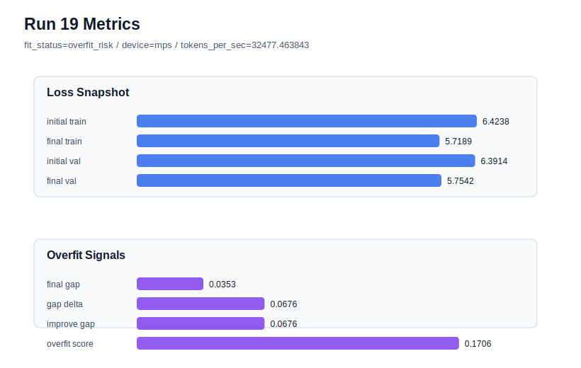

# run 019 실험 보고서

## 이번 가설

ffn_dropout_position=none seed 강건성 검증: run 018은 seed=151에서 dropout 제거가 새 best를 만들었다. 같은 quick_gelu + tie_embeddings=True + ffn_dropout_position=none 설정을 seed=134로 반복하면, dropout 제거의 이득이 seed=151에만 국한된 우연인지 아니면 seed=134의 기존 overfit_risk까지 완화하는지 확인할 수 있다.

## 왜 이 가설을 세웠는가

run 018은 final_val_loss=5.752648, overfit_score=0.137295, fit_status=generalizing으로 현재 best가 되었고, run 016(after_activation)보다 validation loss가 낮았다. 그러나 seed=134 계열에서는 run 009(after_output)와 run 017(after_activation)이 모두 final_val_loss는 괜찮았지만 overfit_score가 각각 0.173343, 0.171111로 높아 overfit_risk였다. 따라서 이번에는 best 설정에서 seed만 134로 바꿔, dropout 제거가 seed=134에서도 train_val_improvement_gap과 overfit_score를 낮추는지 직접 비교한다.

## 가설 작성 주체

llm_plan:docs/train/next_plan.json

## 바꾼 변수

```json
{
  "seed": 134
}
```

## 고정한 변수

activation_name=quick_gelu, ffn_dropout_position=none, tie_embeddings=True, learning_rate=0.0003, drop_rate=0.10, vocab_size=600, context_length=64, batch_size=8, max_steps=40, weight_decay=0.01, grad_clip=1.0, emb_dim=128, n_heads=4, n_layers=2, qkv_bias=False, ffn_mult=4, norm_first=False, norm_eps=1e-5, attention_impl=manual, init_std=0.02

## 기대 결과

성공 기준은 run 009와 run 017 대비 final_val_loss를 5.755 이하로 유지하면서 overfit_score를 0.171 이하로 낮추거나 fit_status를 generalizing으로 바꾸는 것이다. final_val_loss가 좋아져도 train_val_improvement_gap과 overfit_score가 유지되면 seed=134의 과적합은 dropout 위치/제거만으로 해결되지 않는다고 판단한다.

## 실험 설정

```json
{
  "run_id": 19,
  "hypothesis": "ffn_dropout_position=none seed 강건성 검증: run 018은 seed=151에서 dropout 제거가 새 best를 만들었다. 같은 quick_gelu + tie_embeddings=True + ffn_dropout_position=none 설정을 seed=134로 반복하면, dropout 제거의 이득이 seed=151에만 국한된 우연인지 아니면 seed=134의 기존 overfit_risk까지 완화하는지 확인할 수 있다.",
  "seed": 134,
  "vocab_size": 600,
  "min_frequency": 2,
  "context_length": 64,
  "stride": null,
  "batch_size": 8,
  "max_steps": 40,
  "eval_batches": 4,
  "train_ratio": 0.9,
  "learning_rate": 0.0003,
  "weight_decay": 0.01,
  "grad_clip": 1.0,
  "emb_dim": 128,
  "n_heads": 4,
  "n_layers": 2,
  "drop_rate": 0.1,
  "qkv_bias": false,
  "ffn_mult": 4,
  "norm_first": false,
  "norm_eps": 1e-05,
  "activation_name": "quick_gelu",
  "ffn_dropout_position": "none",
  "attention_impl": "manual",
  "tie_embeddings": true,
  "init_std": 0.02
}
```

## 실행 환경

```json
{
  "timestamp": "2026-06-02T20:28:26+00:00",
  "hostname": "woonyong-MacBookPro.local",
  "platform": "macOS-26.3.1-arm64-arm-64bit-Mach-O",
  "machine": "arm64",
  "python": "3.13.13",
  "torch": "2.12.0",
  "cpu_count": 10,
  "memory_gb": 24.0,
  "cuda_available": false,
  "cuda_device_count": 0,
  "mps_available": true,
  "resolved_device": "mps",
  "profile": "mps_balanced"
}
```

- corpus: `src/learning/the-verdict.txt`
- artifact_dir: `docs/train/runs/run_019_artifacts`

## 실제 결과

| 지표 | 값 |
| --- | --- |
| initial_train_loss | 6.423758625984192 |
| initial_val_loss | 6.391381025314331 |
| final_train_loss | 5.718900561332703 |
| final_val_loss | 5.754166841506958 |
| final_generalization_gap | 0.03526628017425537 |
| generalization_gap_delta | 0.06764388084411621 |
| train_val_improvement_gap | 0.06764388084411621 |
| overfit_score | 0.1705540418624878 |
| fit_status | overfit_risk |
| parameter_count | 481024 |
| tokens_per_sec | 32477.46384287795 |
| elapsed_sec | 0.6148263330105692 |
| device | mps |

## 시각 지표




- 대시보드: `../dashboard.md`
- 지표 요약 CSV: `../metrics_summary.csv`

## 과적합 판단

과적합 위험. final gap=0.0353, overfit_score=0.1706. 다음 실험은 regularization 강화가 우선이다.

## 결론

현재 best 후보: run 18 / val=5.752647876739502 / status=generalizing

## 다음 실험 제안

- 성공 시: seed=134에서도 ffn_dropout_position=none이 overfit_score를 낮추거나 generalizing을 만들면 none 설정을 새 후보로 유지하고, 다음에는 어려운 seed=202에 적용해 seed 전반의 강건성을 확인한다.
- 과적합 시: seed=134에서 여전히 overfit_risk라면 dropout 위치/제거보다 seed variance와 데이터 분할/문맥 조건의 영향이 더 큰 것으로 보고, 다음에는 context_length 또는 stride를 단일축으로 조정하거나 seed=151에서 attention_impl=sdpa 속도 검증으로 안전하게 넘어간다.
