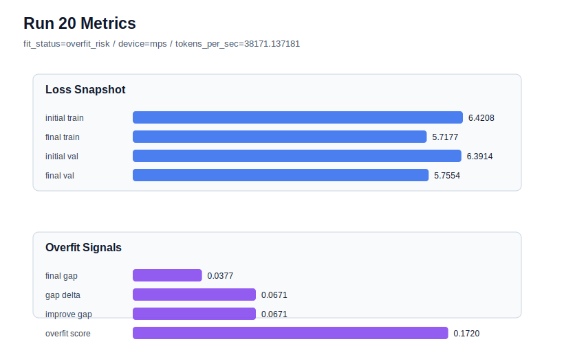

# run 020 실험 보고서

## 이번 가설

학습 윈도우 stride 단일축 테스트: seed=134 계열은 dropout 위치와 제거를 바꿔도 overfit_score가 0.17대에 머물렀다. best 계열의 quick_gelu + tie_embeddings=True + ffn_dropout_position=none 설정을 유지하고 train stride만 64 상당의 기본값에서 32로 줄이면, 겹치는 학습 윈도우가 늘어나 같은 구조에서 더 많은 문맥 시작점을 보게 되어 validation loss와 train_val_improvement_gap의 균형이 개선될 수 있다.

## 왜 이 가설을 세웠는가

run 009(after_output), run 017(after_activation), run 019(none)은 모두 seed=134에서 final_val_loss는 5.755 안팎으로 괜찮지만 overfit_score가 0.170 이상으로 높았다. 특히 run 019는 dropout 제거가 seed=134에서 약간 개선됐지만 fit_status는 여전히 overfit_risk였다. 이는 FFN dropout 위치보다 seed=134의 데이터 순서/윈도우 구성 영향이 클 수 있음을 시사한다. stride는 모델 구조, parameter_count, activation을 바꾸지 않고 학습 샘플의 시작점만 바꾸는 작은 학습 조건 교체이므로 다음 단일축으로 적절하다.

## 가설 작성 주체

llm_plan:docs/train/next_plan.json

## 바꾼 변수

```json
{
  "stride": 32
}
```

## 고정한 변수

seed=134, context_length=64, activation_name=quick_gelu, ffn_dropout_position=none, tie_embeddings=True, learning_rate=0.0003, drop_rate=0.10, vocab_size=600, batch_size=8, max_steps=40, weight_decay=0.01, grad_clip=1.0, emb_dim=128, n_heads=4, n_layers=2, qkv_bias=False, ffn_mult=4, norm_first=False, norm_eps=1e-5, attention_impl=manual, init_std=0.02

## 기대 결과

성공 기준은 run 019 대비 final_val_loss를 5.754 이하로 유지하거나 낮추면서 overfit_score를 0.170 이하로 낮추는 것이다. 특히 train_val_improvement_gap이 0.067644보다 줄면 stride 변경이 seed=134의 train/val 개선 불균형을 완화한 것으로 본다. 반대로 final_train_loss만 더 낮아지고 overfit_score가 커지면 overlap이 데이터 중복만 늘려 과적합을 강화한 것으로 판단한다.

## 실험 설정

```json
{
  "run_id": 20,
  "hypothesis": "학습 윈도우 stride 단일축 테스트: seed=134 계열은 dropout 위치와 제거를 바꿔도 overfit_score가 0.17대에 머물렀다. best 계열의 quick_gelu + tie_embeddings=True + ffn_dropout_position=none 설정을 유지하고 train stride만 64 상당의 기본값에서 32로 줄이면, 겹치는 학습 윈도우가 늘어나 같은 구조에서 더 많은 문맥 시작점을 보게 되어 validation loss와 train_val_improvement_gap의 균형이 개선될 수 있다.",
  "seed": 134,
  "vocab_size": 600,
  "min_frequency": 2,
  "context_length": 64,
  "stride": 32,
  "batch_size": 8,
  "max_steps": 40,
  "eval_batches": 4,
  "train_ratio": 0.9,
  "learning_rate": 0.0003,
  "weight_decay": 0.01,
  "grad_clip": 1.0,
  "emb_dim": 128,
  "n_heads": 4,
  "n_layers": 2,
  "drop_rate": 0.1,
  "qkv_bias": false,
  "ffn_mult": 4,
  "norm_first": false,
  "norm_eps": 1e-05,
  "activation_name": "quick_gelu",
  "ffn_dropout_position": "none",
  "attention_impl": "manual",
  "tie_embeddings": true,
  "init_std": 0.02
}
```

## 실행 환경

```json
{
  "timestamp": "2026-06-02T20:33:37+00:00",
  "hostname": "woonyong-MacBookPro.local",
  "platform": "macOS-26.3.1-arm64-arm-64bit-Mach-O",
  "machine": "arm64",
  "python": "3.13.13",
  "torch": "2.12.0",
  "cpu_count": 10,
  "memory_gb": 24.0,
  "cuda_available": false,
  "cuda_device_count": 0,
  "mps_available": true,
  "resolved_device": "mps",
  "profile": "mps_balanced"
}
```

- corpus: `src/learning/the-verdict.txt`
- artifact_dir: `docs/train/runs/run_020_artifacts`

## 실제 결과

| 지표 | 값 |
| --- | --- |
| initial_train_loss | 6.420774221420288 |
| initial_val_loss | 6.391381025314331 |
| final_train_loss | 5.717697978019714 |
| final_val_loss | 5.755429744720459 |
| final_generalization_gap | 0.03773176670074463 |
| generalization_gap_delta | 0.06712496280670166 |
| train_val_improvement_gap | 0.06712496280670166 |
| overfit_score | 0.17198169231414795 |
| fit_status | overfit_risk |
| parameter_count | 481024 |
| tokens_per_sec | 38171.13718097376 |
| elapsed_sec | 0.536531041841954 |
| device | mps |

## 시각 지표




- 대시보드: `../dashboard.md`
- 지표 요약 CSV: `../metrics_summary.csv`

## 과적합 판단

과적합 위험. final gap=0.0377, overfit_score=0.1720. 다음 실험은 regularization 강화가 우선이다.

## 결론

현재 best 후보: run 18 / val=5.752647876739502 / status=generalizing

## 다음 실험 제안

- 성공 시: stride=32가 seed=134의 overfit_score를 낮추면 같은 stride를 best seed=151 설정에 적용해 run 018보다 validation과 overfit_score를 동시에 개선하는지 확인한다.
- 과적합 시: stride=32가 overfit_score를 키우거나 validation을 악화시키면 겹치는 윈도우가 중복 학습을 늘린 것으로 보고, 다음에는 context_length=48 또는 32처럼 문맥 길이 자체를 줄이는 단일축 실험으로 capacity와 샘플 수의 균형을 확인한다.
