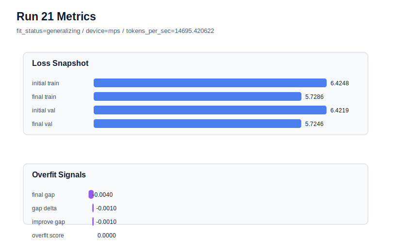

# run 021 실험 보고서

## 이번 가설

context_length 축소 단일축 테스트: seed=134 계열은 dropout 위치, dropout 제거, stride overlap을 바꿔도 overfit_risk가 유지되었다. 같은 quick_gelu + tie_embeddings=True + ffn_dropout_position=none 설정에서 context_length만 64에서 48로 줄이면, 위치 임베딩 부담과 한 샘플당 문맥 암기 범위가 작아지고 학습/검증 윈도우 수가 늘어 seed=134의 train_val_improvement_gap과 overfit_score가 완화될 수 있다.

## 왜 이 가설을 세웠는가

run 019는 ffn_dropout_position=none과 seed=134에서 final_val_loss=5.754167, overfit_score=0.170554로 run 009/017보다 조금 나았지만 여전히 overfit_risk였다. run 020은 stride=32로 겹치는 윈도우를 늘렸으나 final_val_loss=5.755430, overfit_score=0.171982로 오히려 악화되어, 단순 overlap은 중복 학습을 늘린 것으로 보인다. 따라서 다음에는 중복도를 늘리기보다 context_length 자체를 48로 줄여 더 짧은 문맥과 더 많은 독립 윈도우가 과적합 신호를 낮추는지 본다. 32는 변화가 크므로 먼저 48을 선택해 해석 가능성을 유지한다.

## 가설 작성 주체

llm_plan:docs/train/next_plan.json

## 바꾼 변수

```json
{
  "context_length": 48
}
```

## 고정한 변수

seed=134, stride=null, activation_name=quick_gelu, ffn_dropout_position=none, tie_embeddings=True, learning_rate=0.0003, drop_rate=0.10, vocab_size=600, batch_size=8, max_steps=40, weight_decay=0.01, grad_clip=1.0, emb_dim=128, n_heads=4, n_layers=2, qkv_bias=False, ffn_mult=4, norm_first=False, norm_eps=1e-5, attention_impl=manual, init_std=0.02

## 기대 결과

성공 기준은 run 019 대비 final_val_loss가 5.754167 근처 이하로 유지되고 overfit_score가 0.170554보다 낮아지는 것이다. train_val_improvement_gap이 0.067644보다 줄면 context_length 축소가 seed=134의 train/val 개선 불균형을 완화한 것으로 본다. validation loss가 크게 악화되면 문맥이 너무 짧아져 underfit 또는 정보 부족으로 판단한다.

## 실험 설정

```json
{
  "run_id": 21,
  "hypothesis": "context_length 축소 단일축 테스트: seed=134 계열은 dropout 위치, dropout 제거, stride overlap을 바꿔도 overfit_risk가 유지되었다. 같은 quick_gelu + tie_embeddings=True + ffn_dropout_position=none 설정에서 context_length만 64에서 48로 줄이면, 위치 임베딩 부담과 한 샘플당 문맥 암기 범위가 작아지고 학습/검증 윈도우 수가 늘어 seed=134의 train_val_improvement_gap과 overfit_score가 완화될 수 있다.",
  "seed": 134,
  "vocab_size": 600,
  "min_frequency": 2,
  "context_length": 48,
  "stride": null,
  "batch_size": 8,
  "max_steps": 40,
  "eval_batches": 4,
  "train_ratio": 0.9,
  "learning_rate": 0.0003,
  "weight_decay": 0.01,
  "grad_clip": 1.0,
  "emb_dim": 128,
  "n_heads": 4,
  "n_layers": 2,
  "drop_rate": 0.1,
  "qkv_bias": false,
  "ffn_mult": 4,
  "norm_first": false,
  "norm_eps": 1e-05,
  "activation_name": "quick_gelu",
  "ffn_dropout_position": "none",
  "attention_impl": "manual",
  "tie_embeddings": true,
  "init_std": 0.02
}
```

## 실행 환경

```json
{
  "timestamp": "2026-06-02T20:38:22+00:00",
  "hostname": "woonyong-MacBookPro.local",
  "platform": "macOS-26.3.1-arm64-arm-64bit-Mach-O",
  "machine": "arm64",
  "python": "3.13.13",
  "torch": "2.12.0",
  "cpu_count": 10,
  "memory_gb": 24.0,
  "cuda_available": false,
  "cuda_device_count": 0,
  "mps_available": true,
  "resolved_device": "mps",
  "profile": "mps_balanced"
}
```

- corpus: `src/learning/the-verdict.txt`
- artifact_dir: `docs/train/runs/run_021_artifacts`

## 실제 결과

| 지표 | 값 |
| --- | --- |
| initial_train_loss | 6.424759149551392 |
| initial_val_loss | 6.4218573570251465 |
| final_train_loss | 5.728558659553528 |
| final_val_loss | 5.724607149759929 |
| final_generalization_gap | -0.0039515097935991506 |
| generalization_gap_delta | -0.0010497172673540334 |
| train_val_improvement_gap | -0.0010497172673540334 |
| overfit_score | 0.0 |
| fit_status | generalizing |
| parameter_count | 478976 |
| tokens_per_sec | 14695.420621576694 |
| elapsed_sec | 1.0125603331252933 |
| device | mps |

## 시각 지표




- 대시보드: `../dashboard.md`
- 지표 요약 CSV: `../metrics_summary.csv`

## 과적합 판단

일반화 개선 신호. final gap=-0.0040, overfit_score=0.0000. seed 반복으로 재현성을 확인할 만하다.

## 결론

현재 best 후보: run 21 / val=5.724607149759929 / status=generalizing

## 다음 실험 제안

- 성공 시: context_length=48이 overfit_score를 낮추고 validation을 유지하면 같은 context_length를 best seed=151 설정에 적용해 run 018보다 더 좋은 평균 후보인지 확인한다.
- 과적합 시: context_length=48에서도 overfit_risk가 유지되거나 validation이 악화되면 context_length=32로 더 줄이는 대신, seed=151 best 설정에서 attention_impl=sdpa를 비교해 구현 속도/동등성 축을 검증하거나 seed=202에 none 설정을 적용해 seed variance를 정리한다.
