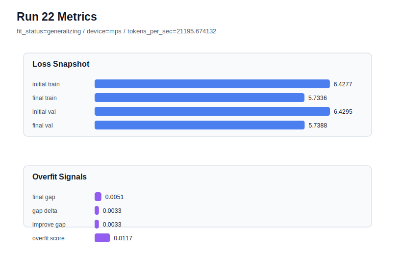

# run 022 실험 보고서

## 이번 가설

context_length=48 seed 재현성 검증: run 021은 seed=134에서 context_length를 64에서 48로 줄이자 final_val_loss와 overfit_score가 크게 개선되어 새 best가 되었다. 같은 quick_gelu + tie_embeddings=True + ffn_dropout_position=none + context_length=48 설정을 seed=151로 반복하면, 이 개선이 seed=134의 우연인지 아니면 현재 데이터 규모에서 더 짧은 문맥이 일반적으로 유리한지 확인할 수 있다.

## 왜 이 가설을 세웠는가

run 018은 seed=151, context_length=64에서 final_val_loss=5.752648, overfit_score=0.137295로 기존 best였고, run 021은 seed=134, context_length=48에서 final_val_loss=5.724607, overfit_score=0.0으로 이를 크게 앞질렀다. 또한 run 020의 stride=32는 중복 윈도우를 늘렸지만 overfit_score를 악화시켰기 때문에, 개선 원인은 overlap이 아니라 문맥 길이 축소와 그에 따른 위치 임베딩/샘플 구성 변화일 가능성이 커졌다. 이제 seed만 151로 바꿔 재현성을 확인해야 context_length=48을 새 기본 후보로 믿을 수 있다.

## 가설 작성 주체

llm_plan:docs/train/next_plan.json

## 바꾼 변수

```json
{
  "seed": 151
}
```

## 고정한 변수

context_length=48, stride=null, activation_name=quick_gelu, ffn_dropout_position=none, tie_embeddings=True, learning_rate=0.0003, drop_rate=0.10, vocab_size=600, batch_size=8, max_steps=40, weight_decay=0.01, grad_clip=1.0, emb_dim=128, n_heads=4, n_layers=2, qkv_bias=False, ffn_mult=4, norm_first=False, norm_eps=1e-5, attention_impl=manual, init_std=0.02

## 기대 결과

성공 기준은 seed=151에서도 final_val_loss가 run 018의 5.752648보다 낮고, overfit_score가 0.137295보다 낮게 유지되는 것이다. run 021만큼 낮지는 않더라도 fit_status가 generalizing이고 train_val_improvement_gap이 안정적이면 context_length=48 효과가 seed 전반에 재현된 것으로 본다.

## 실험 설정

```json
{
  "run_id": 22,
  "hypothesis": "context_length=48 seed 재현성 검증: run 021은 seed=134에서 context_length를 64에서 48로 줄이자 final_val_loss와 overfit_score가 크게 개선되어 새 best가 되었다. 같은 quick_gelu + tie_embeddings=True + ffn_dropout_position=none + context_length=48 설정을 seed=151로 반복하면, 이 개선이 seed=134의 우연인지 아니면 현재 데이터 규모에서 더 짧은 문맥이 일반적으로 유리한지 확인할 수 있다.",
  "seed": 151,
  "vocab_size": 600,
  "min_frequency": 2,
  "context_length": 48,
  "stride": null,
  "batch_size": 8,
  "max_steps": 40,
  "eval_batches": 4,
  "train_ratio": 0.9,
  "learning_rate": 0.0003,
  "weight_decay": 0.01,
  "grad_clip": 1.0,
  "emb_dim": 128,
  "n_heads": 4,
  "n_layers": 2,
  "drop_rate": 0.1,
  "qkv_bias": false,
  "ffn_mult": 4,
  "norm_first": false,
  "norm_eps": 1e-05,
  "activation_name": "quick_gelu",
  "ffn_dropout_position": "none",
  "attention_impl": "manual",
  "tie_embeddings": true,
  "init_std": 0.02
}
```

## 실행 환경

```json
{
  "timestamp": "2026-06-02T20:43:17+00:00",
  "hostname": "woonyong-MacBookPro.local",
  "platform": "macOS-26.3.1-arm64-arm-64bit-Mach-O",
  "machine": "arm64",
  "python": "3.13.13",
  "torch": "2.12.0",
  "cpu_count": 10,
  "memory_gb": 24.0,
  "cuda_available": false,
  "cuda_device_count": 0,
  "mps_available": true,
  "resolved_device": "mps",
  "profile": "mps_balanced"
}
```

- corpus: `src/learning/the-verdict.txt`
- artifact_dir: `docs/train/runs/run_022_artifacts`

## 실제 결과

| 지표 | 값 |
| --- | --- |
| initial_train_loss | 6.427652597427368 |
| initial_val_loss | 6.429500897725423 |
| final_train_loss | 5.733633399009705 |
| final_val_loss | 5.738766193389893 |
| final_generalization_gap | 0.005132794380187988 |
| generalization_gap_delta | 0.0032844940821332713 |
| train_val_improvement_gap | 0.0032844940821332713 |
| overfit_score | 0.011701782544454531 |
| fit_status | generalizing |
| parameter_count | 478976 |
| tokens_per_sec | 21195.674131826632 |
| elapsed_sec | 0.7020300419535488 |
| device | mps |

## 시각 지표




- 대시보드: `../dashboard.md`
- 지표 요약 CSV: `../metrics_summary.csv`

## 과적합 판단

일반화 개선 신호. final gap=0.0051, overfit_score=0.0117. seed 반복으로 재현성을 확인할 만하다.

## 결론

현재 best 후보: run 21 / val=5.724607149759929 / status=generalizing

## 다음 실험 제안

- 성공 시: seed=151에서도 context_length=48이 개선되면 seed=202에 같은 설정을 적용해 어려운 seed에서도 과적합이 줄어드는지 확인한다.
- 과적합 시: seed=151에서 context_length=48이 validation을 악화시키거나 overfit_risk로 돌아가면, run 021은 seed=134 특이 효과일 수 있으므로 context_length=56 같은 중간값 또는 attention_impl=sdpa 구현 비교로 안전한 축을 탐색한다.
