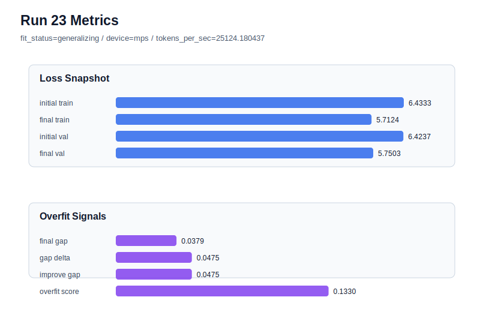

# run 023 실험 보고서

## 이번 가설

context_length=48 어려운 seed 강건성 검증: seed=202는 context_length=64 계열에서 overfit_risk와 validation 악화를 반복했다. 같은 quick_gelu + tie_embeddings=True + ffn_dropout_position=none + context_length=48 설정을 seed=202로 실행하면, 짧은 문맥이 seed=134/151뿐 아니라 어려운 seed에서도 train_val_improvement_gap과 overfit_score를 안정화하는지 확인할 수 있다.

## 왜 이 가설을 세웠는가

run 021(seed=134, context_length=48)은 final_val_loss=5.724607, overfit_score=0.0으로 새 best가 되었고, run 022(seed=151, context_length=48)도 final_val_loss=5.738766, overfit_score=0.011702로 기존 seed=151 context_length=64 best(run 018)보다 뚜렷하게 좋았다. 반면 seed=202의 context_length=64 계열은 run 012/013/014/015에서 dropout, learning_rate, max_steps 조정에도 overfit_risk 또는 underfit 성격이 남았다. 따라서 seed=202에 context_length=48을 적용하면 이 개선 축이 단순 seed 운이 아니라 현재 데이터 규모에 맞는 문맥 길이 효과인지 가장 강하게 검증할 수 있다.

## 가설 작성 주체

llm_plan:docs/train/next_plan.json

## 바꾼 변수

```json
{
  "seed": 202
}
```

## 고정한 변수

context_length=48, stride=null, activation_name=quick_gelu, ffn_dropout_position=none, tie_embeddings=True, learning_rate=0.0003, drop_rate=0.10, vocab_size=600, batch_size=8, max_steps=40, weight_decay=0.01, grad_clip=1.0, emb_dim=128, n_heads=4, n_layers=2, qkv_bias=False, ffn_mult=4, norm_first=False, norm_eps=1e-5, attention_impl=manual, init_std=0.02

## 기대 결과

성공 기준은 seed=202에서도 final_val_loss가 run 012의 5.769758보다 낮고, overfit_score가 0.186620보다 크게 낮아지는 것이다. fit_status가 generalizing 또는 low-risk가 되면 context_length=48을 현재 데이터 규모의 핵심 기본 후보로 본다. validation은 좋아지지만 overfit_score가 여전히 높으면 seed=202는 별도 regularization 또는 capacity 축이 필요한 것으로 판단한다.

## 실험 설정

```json
{
  "run_id": 23,
  "hypothesis": "context_length=48 어려운 seed 강건성 검증: seed=202는 context_length=64 계열에서 overfit_risk와 validation 악화를 반복했다. 같은 quick_gelu + tie_embeddings=True + ffn_dropout_position=none + context_length=48 설정을 seed=202로 실행하면, 짧은 문맥이 seed=134/151뿐 아니라 어려운 seed에서도 train_val_improvement_gap과 overfit_score를 안정화하는지 확인할 수 있다.",
  "seed": 202,
  "vocab_size": 600,
  "min_frequency": 2,
  "context_length": 48,
  "stride": null,
  "batch_size": 8,
  "max_steps": 40,
  "eval_batches": 4,
  "train_ratio": 0.9,
  "learning_rate": 0.0003,
  "weight_decay": 0.01,
  "grad_clip": 1.0,
  "emb_dim": 128,
  "n_heads": 4,
  "n_layers": 2,
  "drop_rate": 0.1,
  "qkv_bias": false,
  "ffn_mult": 4,
  "norm_first": false,
  "norm_eps": 1e-05,
  "activation_name": "quick_gelu",
  "ffn_dropout_position": "none",
  "attention_impl": "manual",
  "tie_embeddings": true,
  "init_std": 0.02
}
```

## 실행 환경

```json
{
  "timestamp": "2026-06-02T20:48:24+00:00",
  "hostname": "woonyong-MacBookPro.local",
  "platform": "macOS-26.3.1-arm64-arm-64bit-Mach-O",
  "machine": "arm64",
  "python": "3.13.13",
  "torch": "2.12.0",
  "cpu_count": 10,
  "memory_gb": 24.0,
  "cuda_available": false,
  "cuda_device_count": 0,
  "mps_available": true,
  "resolved_device": "mps",
  "profile": "mps_balanced"
}
```

- corpus: `src/learning/the-verdict.txt`
- artifact_dir: `docs/train/runs/run_023_artifacts`

## 실제 결과

| 지표 | 값 |
| --- | --- |
| initial_train_loss | 6.433324933052063 |
| initial_val_loss | 6.423727830251058 |
| final_train_loss | 5.712400913238525 |
| final_val_loss | 5.7503306070963545 |
| final_generalization_gap | 0.03792969385782907 |
| generalization_gap_delta | 0.047526796658834414 |
| train_val_improvement_gap | 0.047526796658834414 |
| overfit_score | 0.1329832871754979 |
| fit_status | generalizing |
| parameter_count | 478976 |
| tokens_per_sec | 25124.18043744355 |
| elapsed_sec | 0.5922581250779331 |
| device | mps |

## 시각 지표




- 대시보드: `../dashboard.md`
- 지표 요약 CSV: `../metrics_summary.csv`

## 과적합 판단

일반화 개선 신호. final gap=0.0379, overfit_score=0.1330. seed 반복으로 재현성을 확인할 만하다.

## 결론

현재 best 후보: run 21 / val=5.724607149759929 / status=generalizing

## 다음 실험 제안

- 성공 시: seed=202에서도 context_length=48이 generalizing이면, 다음에는 context_length=48을 고정하고 attention_impl=sdpa 또는 activation_name=gelu_exact/quick_gelu 비교처럼 구현/함수 교체 축으로 넘어간다.
- 과적합 시: seed=202에서 context_length=48도 overfit_risk이면, context_length 축은 평균적으로 유효하지만 어려운 seed에는 추가 regularization이 필요하다고 보고 drop_rate=0.15 또는 ffn_mult=3을 context_length=48 위에서 단일축으로 재검토한다.
