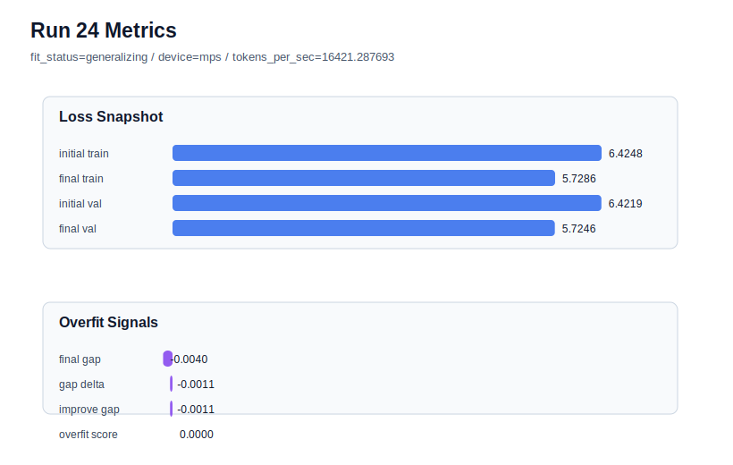

# run 024 실험 보고서

## 이번 가설

attention_impl=sdpa 구현 교체 단일축 테스트: context_length=48은 seed=134/151/202에서 모두 기존 64보다 좋은 일반화 신호를 만들었다. 이 설정을 고정하고 attention_impl만 manual에서 sdpa로 바꾸면, Transformer 구조 의미를 유지하면서 MPS에서 처리량을 개선하거나 최소한 같은 validation/overfit 품질을 유지할 수 있는지 확인할 수 있다.

## 왜 이 가설을 세웠는가

run 021(seed=134, context_length=48, manual)은 final_val_loss=5.724607, overfit_score=0.0으로 현재 best이고, run 022/023도 context_length=48에서 generalizing을 재현했다. 이제 데이터 문맥 길이 축은 강한 후보로 정리되었으므로, 다음 실험은 구조를 바꾸지 않는 구현 축을 검증하는 것이 안전하다. scaled_dot_product_attention은 attention 계산 경로만 바꾸며 외부 shape와 Transformer block 순서는 유지된다. run 021의 tokens_per_sec는 14695로 상대적으로 낮았기 때문에, sdpa가 품질을 유지하면서 속도를 개선하는지 확인하면 이후 실험 기본 구현 선택에 도움이 된다.

## 가설 작성 주체

llm_plan:docs/train/next_plan.json

## 바꾼 변수

```json
{
  "attention_impl": "sdpa"
}
```

## 고정한 변수

seed=134, context_length=48, stride=null, activation_name=quick_gelu, ffn_dropout_position=none, tie_embeddings=True, learning_rate=0.0003, drop_rate=0.10, vocab_size=600, batch_size=8, max_steps=40, weight_decay=0.01, grad_clip=1.0, emb_dim=128, n_heads=4, n_layers=2, qkv_bias=False, ffn_mult=4, norm_first=False, norm_eps=1e-5, init_std=0.02

## 기대 결과

성공 기준은 final_val_loss와 overfit_score가 run 021과 같은 low-risk/generalizing 범위에 머물고, tokens_per_sec가 manual 대비 의미 있게 개선되거나 최소한 악화되지 않는 것이다. validation이 크게 흔들리면 sdpa의 수치 경로가 이 작은 실험에서 학습 궤적을 바꾸는 것으로 보고 manual을 유지한다.

## 실험 설정

```json
{
  "run_id": 24,
  "hypothesis": "attention_impl=sdpa 구현 교체 단일축 테스트: context_length=48은 seed=134/151/202에서 모두 기존 64보다 좋은 일반화 신호를 만들었다. 이 설정을 고정하고 attention_impl만 manual에서 sdpa로 바꾸면, Transformer 구조 의미를 유지하면서 MPS에서 처리량을 개선하거나 최소한 같은 validation/overfit 품질을 유지할 수 있는지 확인할 수 있다.",
  "seed": 134,
  "vocab_size": 600,
  "min_frequency": 2,
  "context_length": 48,
  "stride": null,
  "batch_size": 8,
  "max_steps": 40,
  "eval_batches": 4,
  "train_ratio": 0.9,
  "learning_rate": 0.0003,
  "weight_decay": 0.01,
  "grad_clip": 1.0,
  "emb_dim": 128,
  "n_heads": 4,
  "n_layers": 2,
  "drop_rate": 0.1,
  "qkv_bias": false,
  "ffn_mult": 4,
  "norm_first": false,
  "norm_eps": 1e-05,
  "activation_name": "quick_gelu",
  "ffn_dropout_position": "none",
  "attention_impl": "sdpa",
  "tie_embeddings": true,
  "init_std": 0.02
}
```

## 실행 환경

```json
{
  "timestamp": "2026-06-02T20:53:24+00:00",
  "hostname": "woonyong-MacBookPro.local",
  "platform": "macOS-26.3.1-arm64-arm-64bit-Mach-O",
  "machine": "arm64",
  "python": "3.13.13",
  "torch": "2.12.0",
  "cpu_count": 10,
  "memory_gb": 24.0,
  "cuda_available": false,
  "cuda_device_count": 0,
  "mps_available": true,
  "resolved_device": "mps",
  "profile": "mps_balanced"
}
```

- corpus: `src/learning/the-verdict.txt`
- artifact_dir: `docs/train/runs/run_024_artifacts`

## 실제 결과

| 지표 | 값 |
| --- | --- |
| initial_train_loss | 6.424758791923523 |
| initial_val_loss | 6.4218573570251465 |
| final_train_loss | 5.728558659553528 |
| final_val_loss | 5.724607149759929 |
| final_generalization_gap | -0.0039515097935991506 |
| generalization_gap_delta | -0.0010500748952226857 |
| train_val_improvement_gap | -0.0010500748952226857 |
| overfit_score | 0.0 |
| fit_status | generalizing |
| parameter_count | 478976 |
| tokens_per_sec | 16421.287693074628 |
| elapsed_sec | 0.9061408750712872 |
| device | mps |

## 시각 지표




- 대시보드: `../dashboard.md`
- 지표 요약 CSV: `../metrics_summary.csv`

## 과적합 판단

일반화 개선 신호. final gap=-0.0040, overfit_score=0.0000. seed 반복으로 재현성을 확인할 만하다.

## 결론

현재 best 후보: run 21 / val=5.724607149759929 / status=generalizing

## 다음 실험 제안

- 성공 시: sdpa가 품질을 유지하고 속도를 개선하면 context_length=48 + sdpa를 새 기본 후보로 두고 activation_name=gelu_exact 또는 silu를 다시 비교한다.
- 과적합 시: sdpa에서 validation 또는 overfit_score가 악화되면 attention_impl=manual을 유지하고, 다음에는 context_length=48 위에서 activation_name=gelu_exact 단일축 비교로 넘어간다.
