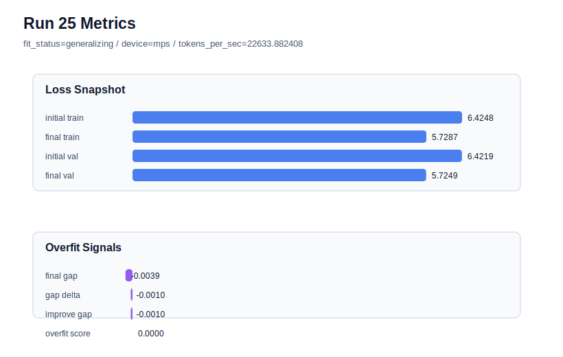

# run 025 실험 보고서

## 이번 가설

context_length=48 + sdpa 기준의 activation 단일축 재비교: quick_gelu가 현재 best 계열이지만, sdpa와 짧은 문맥으로 학습 조건이 안정화된 상태에서도 gelu_exact가 validation loss와 overfit_score에서 계속 뒤처지는지 확인한다.

## 왜 이 가설을 세웠는가

run 021은 context_length=48에서 seed=134의 overfit_score를 0.0으로 낮추며 현재 best를 만들었고, run 022와 run 023도 같은 문맥 길이에서 seed 강건성을 보였다. run 024는 attention_impl만 sdpa로 바꿔도 final_val_loss=5.724607, overfit_score=0.0을 그대로 유지하면서 처리량을 개선했다. 이제 context_length=48 + sdpa를 새 기준 후보로 두고, 이전 64-token 조건에서 근소하게 경쟁했던 gelu_exact를 activation_name 단일축으로 다시 비교하면 activation 효과가 문맥 길이와 attention 구현에 독립적인지 해석할 수 있다.

## 가설 작성 주체

llm_plan:docs/train/next_plan.json

## 바꾼 변수

```json
{
  "activation_name": "gelu_exact"
}
```

## 고정한 변수

seed=134, vocab_size=600, context_length=48, stride=null, batch_size=8, max_steps=40, learning_rate=0.0003, weight_decay=0.01, grad_clip=1.0, emb_dim=128, n_heads=4, n_layers=2, drop_rate=0.1, qkv_bias=False, ffn_mult=4, norm_first=False, norm_eps=1e-5, ffn_dropout_position=none, attention_impl=sdpa, tie_embeddings=True, init_std=0.02

## 기대 결과

성공 기준은 run 024의 final_val_loss=5.724607, overfit_score=0.0과 같거나 더 좋은 validation/generalization 균형을 보이는 것이다. final_val_loss가 같더라도 tokens_per_sec가 크게 느려지면 quick_gelu를 기본 후보로 유지한다. final_val_loss가 개선되고 overfit_score가 낮게 유지되면 gelu_exact를 seed=151 또는 seed=202로 반복 검증한다.

## 실험 설정

```json
{
  "run_id": 25,
  "hypothesis": "context_length=48 + sdpa 기준의 activation 단일축 재비교: quick_gelu가 현재 best 계열이지만, sdpa와 짧은 문맥으로 학습 조건이 안정화된 상태에서도 gelu_exact가 validation loss와 overfit_score에서 계속 뒤처지는지 확인한다.",
  "seed": 134,
  "vocab_size": 600,
  "min_frequency": 2,
  "context_length": 48,
  "stride": null,
  "batch_size": 8,
  "max_steps": 40,
  "eval_batches": 4,
  "train_ratio": 0.9,
  "learning_rate": 0.0003,
  "weight_decay": 0.01,
  "grad_clip": 1.0,
  "emb_dim": 128,
  "n_heads": 4,
  "n_layers": 2,
  "drop_rate": 0.1,
  "qkv_bias": false,
  "ffn_mult": 4,
  "norm_first": false,
  "norm_eps": 1e-05,
  "activation_name": "gelu_exact",
  "ffn_dropout_position": "none",
  "attention_impl": "sdpa",
  "tie_embeddings": true,
  "init_std": 0.02
}
```

## 실행 환경

```json
{
  "timestamp": "2026-06-02T20:59:41+00:00",
  "hostname": "woonyong-MacBookPro.local",
  "platform": "macOS-26.3.1-arm64-arm-64bit-Mach-O",
  "machine": "arm64",
  "python": "3.13.13",
  "torch": "2.12.0",
  "cpu_count": 10,
  "memory_gb": 24.0,
  "cuda_available": false,
  "cuda_device_count": 0,
  "mps_available": true,
  "resolved_device": "mps",
  "profile": "mps_balanced"
}
```

- corpus: `src/learning/the-verdict.txt`
- artifact_dir: `docs/train/runs/run_025_artifacts`

## 실제 결과

| 지표 | 값 |
| --- | --- |
| initial_train_loss | 6.4247660636901855 |
| initial_val_loss | 6.421878337860107 |
| final_train_loss | 5.728741645812988 |
| final_val_loss | 5.724879423777263 |
| final_generalization_gap | -0.0038622220357256154 |
| generalization_gap_delta | -0.0009744962056474904 |
| train_val_improvement_gap | -0.0009744962056474904 |
| overfit_score | 0.0 |
| fit_status | generalizing |
| parameter_count | 478976 |
| tokens_per_sec | 22633.882407576573 |
| elapsed_sec | 0.6574214592110366 |
| device | mps |

## 시각 지표




- 대시보드: `../dashboard.md`
- 지표 요약 CSV: `../metrics_summary.csv`

## 과적합 판단

일반화 개선 신호. final gap=-0.0039, overfit_score=0.0000. seed 반복으로 재현성을 확인할 만하다.

## 결론

현재 best 후보: run 21 / val=5.724607149759929 / status=generalizing

## 다음 실험 제안

- 성공 시: gelu_exact가 run 024와 동등하거나 더 좋은 validation loss와 low overfit_score를 만들면 seed=151에서 같은 context_length=48 + sdpa + gelu_exact 설정을 반복해 activation 효과가 seed에 강건한지 확인한다.
- 과적합 시: gelu_exact에서 gap이나 overfit_score가 커지면 quick_gelu + context_length=48 + sdpa를 유지하고, 다음에는 silu 또는 swiglu/geglu처럼 함수 계열이 다른 activation을 parameter_count와 함께 단일축으로 비교한다.
