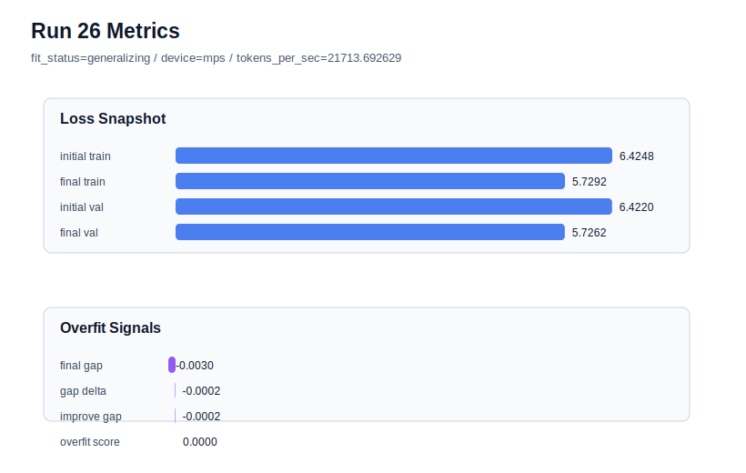

# run 026 실험 보고서

## 이번 가설

context_length=48 + sdpa 기준의 activation 계열 확장 테스트: quick_gelu와 gelu_exact가 거의 같은 low-overfit 결과를 냈지만 quick_gelu가 아직 best에 가깝다. 같은 구조와 parameter_count를 유지한 채 activation_name만 silu로 바꾸면, 더 부드러운 비단조 계열이 작은 데이터에서 train/val 균형을 개선하거나 최소한 과적합 없이 경쟁 가능한지 확인할 수 있다.

## 왜 이 가설을 세웠는가

run 021은 context_length=48로 줄이면서 final_val_loss=5.724607, overfit_score=0.0의 best를 만들었고, run 024는 attention_impl=sdpa로 바꿔 같은 validation/generalization 품질을 유지했다. run 025의 gelu_exact는 final_val_loss=5.724879와 overfit_score=0.0으로 안전했지만 best를 넘지는 못했다. 따라서 같은 context_length=48 + sdpa + tie_embeddings=True + ffn_dropout_position=none 설정을 고정하고, parameter_count를 바꾸지 않는 activation 단일축으로 silu를 비교하면 smooth activation 계열이 현재 데이터/문맥 조건에서 유리한지 해석할 수 있다.

## 가설 작성 주체

llm_plan:docs/train/next_plan.json

## 바꾼 변수

```json
{
  "activation_name": "silu"
}
```

## 고정한 변수

seed=134, vocab_size=600, context_length=48, stride=null, batch_size=8, max_steps=40, learning_rate=0.0003, weight_decay=0.01, grad_clip=1.0, emb_dim=128, n_heads=4, n_layers=2, drop_rate=0.1, qkv_bias=False, ffn_mult=4, norm_first=False, norm_eps=1e-5, ffn_dropout_position=none, attention_impl=sdpa, tie_embeddings=True, init_std=0.02

## 기대 결과

성공 기준은 run 024의 final_val_loss=5.724607 및 overfit_score=0.0과 같거나 더 좋은 validation/generalization 균형이다. final_val_loss가 약간 높더라도 overfit_score가 0에 가깝고 tokens_per_sec가 안정적이면 silu는 seed 반복 후보가 된다. final_val_loss가 악화되거나 train_val_improvement_gap이 커지면 quick_gelu를 activation 기본 후보로 유지한다.

## 실험 설정

```json
{
  "run_id": 26,
  "hypothesis": "context_length=48 + sdpa 기준의 activation 계열 확장 테스트: quick_gelu와 gelu_exact가 거의 같은 low-overfit 결과를 냈지만 quick_gelu가 아직 best에 가깝다. 같은 구조와 parameter_count를 유지한 채 activation_name만 silu로 바꾸면, 더 부드러운 비단조 계열이 작은 데이터에서 train/val 균형을 개선하거나 최소한 과적합 없이 경쟁 가능한지 확인할 수 있다.",
  "seed": 134,
  "vocab_size": 600,
  "min_frequency": 2,
  "context_length": 48,
  "stride": null,
  "batch_size": 8,
  "max_steps": 40,
  "eval_batches": 4,
  "train_ratio": 0.9,
  "learning_rate": 0.0003,
  "weight_decay": 0.01,
  "grad_clip": 1.0,
  "emb_dim": 128,
  "n_heads": 4,
  "n_layers": 2,
  "drop_rate": 0.1,
  "qkv_bias": false,
  "ffn_mult": 4,
  "norm_first": false,
  "norm_eps": 1e-05,
  "activation_name": "silu",
  "ffn_dropout_position": "none",
  "attention_impl": "sdpa",
  "tie_embeddings": true,
  "init_std": 0.02
}
```

## 실행 환경

```json
{
  "timestamp": "2026-06-02T21:03:24+00:00",
  "hostname": "woonyong-MacBookPro.local",
  "platform": "macOS-26.3.1-arm64-arm-64bit-Mach-O",
  "machine": "arm64",
  "python": "3.13.13",
  "torch": "2.12.0",
  "cpu_count": 10,
  "memory_gb": 24.0,
  "cuda_available": false,
  "cuda_device_count": 0,
  "mps_available": true,
  "resolved_device": "mps",
  "profile": "mps_balanced"
}
```

- corpus: `src/learning/the-verdict.txt`
- artifact_dir: `docs/train/runs/run_026_artifacts`

## 실제 결과

| 지표 | 값 |
| --- | --- |
| initial_train_loss | 6.4248257875442505 |
| initial_val_loss | 6.422019799550374 |
| final_train_loss | 5.729202747344971 |
| final_val_loss | 5.726201057434082 |
| final_generalization_gap | -0.003001689910888672 |
| generalization_gap_delta | -0.0001957019170122365 |
| train_val_improvement_gap | -0.0001957019170122365 |
| overfit_score | 0.0 |
| fit_status | generalizing |
| parameter_count | 478976 |
| tokens_per_sec | 21713.692629495356 |
| elapsed_sec | 0.685281875077635 |
| device | mps |

## 시각 지표




- 대시보드: `../dashboard.md`
- 지표 요약 CSV: `../metrics_summary.csv`

## 과적합 판단

일반화 개선 신호. final gap=-0.0030, overfit_score=0.0000. seed 반복으로 재현성을 확인할 만하다.

## 결론

현재 best 후보: run 21 / val=5.724607149759929 / status=generalizing

## 다음 실험 제안

- 성공 시: silu가 run 024와 동등하거나 더 좋은 validation loss를 유지하면 seed=151에서 같은 설정을 반복해 smooth activation 효과가 seed에 강건한지 확인한다.
- 과적합 시: silu에서 gap이나 overfit_score가 커지면 quick_gelu + context_length=48 + sdpa를 유지하고, 다음에는 parameter_count가 달라지는 swiglu/geglu를 별도 gated FFN 축으로 비교하되 parameter_count와 overfit_score를 함께 해석한다.
