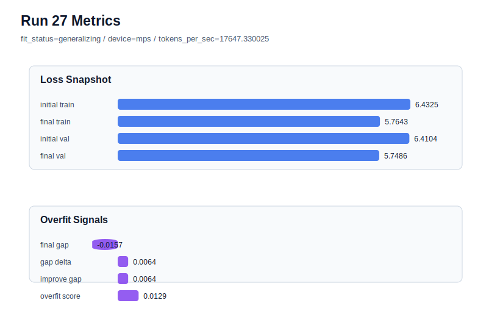

# run 027 실험 보고서

## 이번 가설

context_length=48 + sdpa 기준의 gated FFN 단일축 테스트: quick_gelu, gelu_exact, silu는 모두 low-overfit였지만 best를 갱신하지 못했고, silu는 validation이 약간 밀렸다. activation_name만 swiglu로 바꾸면 gated FFN의 value-gate 상호작용이 작은 문맥 조건에서 표현력을 높여 validation loss를 낮출 수 있는지, 그리고 추가 parameter_count가 과적합으로 이어지는지 확인할 수 있다.

## 왜 이 가설을 세웠는가

run 021과 run 024는 context_length=48에서 final_val_loss=5.724607, overfit_score=0.0으로 현재 기준선을 만들었다. run 025의 gelu_exact는 final_val_loss=5.724879, run 026의 silu는 final_val_loss=5.726201로 모두 과적합 없이 안정적이었지만 quick_gelu 기준을 넘지 못했다. 따라서 단순 smooth activation 계열은 충분히 확인되었고, 다음에는 사용자가 구현한 교체 지점 중 구조 순서를 유지하면서도 FFN 내부 함수만 gated 방식으로 바꾸는 swiglu를 테스트할 만하다. swiglu는 parameter_count 증가 가능성이 있으므로 final_val_loss 개선이 overfit_score와 parameter_count 증가를 정당화하는지 함께 판단한다.

## 가설 작성 주체

llm_plan:docs/train/next_plan.json

## 바꾼 변수

```json
{
  "activation_name": "swiglu"
}
```

## 고정한 변수

seed=134, vocab_size=600, context_length=48, stride=null, batch_size=8, max_steps=40, learning_rate=0.0003, weight_decay=0.01, grad_clip=1.0, emb_dim=128, n_heads=4, n_layers=2, drop_rate=0.1, qkv_bias=False, ffn_mult=4, norm_first=False, norm_eps=1e-5, ffn_dropout_position=none, attention_impl=sdpa, tie_embeddings=True, init_std=0.02

## 기대 결과

성공 기준은 run 024의 final_val_loss=5.724607보다 낮거나 거의 같으면서 overfit_score가 0.05 이하로 유지되는 것이다. parameter_count가 증가할 것이므로, validation loss가 명확히 개선되지 않거나 gap이 커지면 swiglu의 추가 표현력은 이 데이터 규모에서 정당화되지 않는다고 판단한다. tokens_per_sec가 크게 떨어지는지도 함께 본다.

## 실험 설정

```json
{
  "run_id": 27,
  "hypothesis": "context_length=48 + sdpa 기준의 gated FFN 단일축 테스트: quick_gelu, gelu_exact, silu는 모두 low-overfit였지만 best를 갱신하지 못했고, silu는 validation이 약간 밀렸다. activation_name만 swiglu로 바꾸면 gated FFN의 value-gate 상호작용이 작은 문맥 조건에서 표현력을 높여 validation loss를 낮출 수 있는지, 그리고 추가 parameter_count가 과적합으로 이어지는지 확인할 수 있다.",
  "seed": 134,
  "vocab_size": 600,
  "min_frequency": 2,
  "context_length": 48,
  "stride": null,
  "batch_size": 8,
  "max_steps": 40,
  "eval_batches": 4,
  "train_ratio": 0.9,
  "learning_rate": 0.0003,
  "weight_decay": 0.01,
  "grad_clip": 1.0,
  "emb_dim": 128,
  "n_heads": 4,
  "n_layers": 2,
  "drop_rate": 0.1,
  "qkv_bias": false,
  "ffn_mult": 4,
  "norm_first": false,
  "norm_eps": 1e-05,
  "activation_name": "swiglu",
  "ffn_dropout_position": "none",
  "attention_impl": "sdpa",
  "tie_embeddings": true,
  "init_std": 0.02
}
```

## 실행 환경

```json
{
  "timestamp": "2026-06-02T21:08:31+00:00",
  "hostname": "woonyong-MacBookPro.local",
  "platform": "macOS-26.3.1-arm64-arm-64bit-Mach-O",
  "machine": "arm64",
  "python": "3.13.13",
  "torch": "2.12.0",
  "cpu_count": 10,
  "memory_gb": 24.0,
  "cuda_available": false,
  "cuda_device_count": 0,
  "mps_available": true,
  "resolved_device": "mps",
  "profile": "mps_balanced"
}
```

- corpus: `src/learning/the-verdict.txt`
- artifact_dir: `docs/train/runs/run_027_artifacts`

## 실제 결과

| 지표 | 값 |
| --- | --- |
| initial_train_loss | 6.432539224624634 |
| initial_val_loss | 6.410429954528809 |
| final_train_loss | 5.764282464981079 |
| final_val_loss | 5.748608907063802 |
| final_generalization_gap | -0.015673557917277314 |
| generalization_gap_delta | 0.006435712178547881 |
| train_val_improvement_gap | 0.006435712178547881 |
| overfit_score | 0.012871424357095762 |
| fit_status | generalizing |
| parameter_count | 611072 |
| tokens_per_sec | 17647.33002537187 |
| elapsed_sec | 0.8431870418135077 |
| device | mps |

## 시각 지표




- 대시보드: `../dashboard.md`
- 지표 요약 CSV: `../metrics_summary.csv`

## 과적합 판단

일반화 개선 신호. final gap=-0.0157, overfit_score=0.0129. seed 반복으로 재현성을 확인할 만하다.

## 결론

현재 best 후보: run 21 / val=5.724607149759929 / status=generalizing

## 다음 실험 제안

- 성공 시: swiglu가 validation loss를 낮추고 overfit_score를 낮게 유지하면 seed=151에서 같은 swiglu 설정을 반복해 gated FFN 효과가 seed에 강건한지 확인한다.
- 과적합 시: swiglu에서 gap이나 overfit_score가 커지면 gated FFN의 추가 capacity가 과적합을 유도한 것으로 보고 quick_gelu + context_length=48 + sdpa를 유지한다. 다음에는 geglu를 바로 확대하기보다 ffn_mult=3 또는 tie_embeddings/weight_decay 조합으로 gated FFN capacity를 낮춘 재검증을 고려한다.
