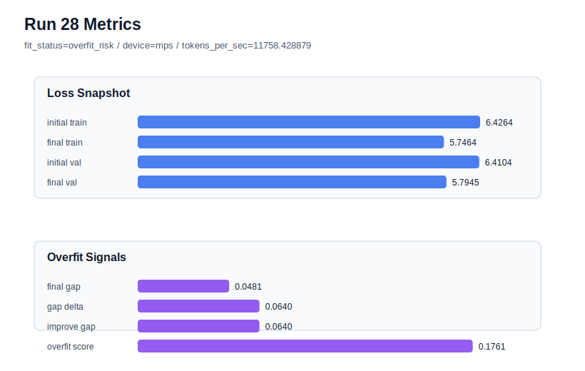

# run 028 실험 보고서

## 이번 가설

best 계열로 복귀한 context_length 로컬 서치: run 021/024의 핵심 개선은 activation보다 context_length=48에서 발생했고, 이후 gelu_exact/silu/swiglu는 best를 갱신하지 못했다. quick_gelu + sdpa + tie_embeddings=True + ffn_dropout_position=none을 유지하고 context_length만 48에서 40으로 더 줄이면, 작은 데이터에서 위치 임베딩 부담과 문맥 암기 범위를 더 낮춰 validation loss와 overfit_score가 추가 개선될 수 있는지 확인한다.

## 왜 이 가설을 세웠는가

run 021은 context_length를 64에서 48로 줄이자 final_val_loss=5.724607, overfit_score=0.0의 best를 만들었고, run 024는 sdpa에서도 같은 품질을 유지했다. 반면 run 025(gelu_exact), run 026(silu), run 027(swiglu)은 모두 low-risk였지만 validation loss가 각각 5.724879, 5.726201, 5.748609로 best를 넘지 못했다. 특히 swiglu는 parameter_count를 611072까지 늘렸지만 loss가 악화되어, 지금은 capacity/activation 확장보다 데이터 윈도우 조건을 더 정밀하게 확인하는 것이 타당하다. context_length=40은 48보다 변화가 작고, 구조 순서를 바꾸지 않으며, MPS에서 더 가볍게 검증할 수 있는 로컬 탐색점이다.

## 가설 작성 주체

llm_plan:docs/train/next_plan.json

## 바꾼 변수

```json
{
  "context_length": 40,
  "activation_name": "quick_gelu",
  "attention_impl": "sdpa"
}
```

## 고정한 변수

seed=134, vocab_size=600, stride=null, batch_size=8, max_steps=40, learning_rate=0.0003, weight_decay=0.01, grad_clip=1.0, emb_dim=128, n_heads=4, n_layers=2, drop_rate=0.1, qkv_bias=False, ffn_mult=4, norm_first=False, norm_eps=1e-5, ffn_dropout_position=none, tie_embeddings=True, init_std=0.02

## 기대 결과

성공 기준은 run 024의 final_val_loss=5.724607보다 낮거나 거의 같고, overfit_score가 0.05 이하로 유지되는 것이다. context_length=40에서 validation loss가 개선되면 더 짧은 문맥이 현재 corpus에 더 맞는다는 신호다. 반대로 final_val_loss가 48-token 기준보다 악화되면 문맥 정보 손실 또는 샘플 구성 변화가 손해라고 보고 context_length=48을 유지한다.

## 실험 설정

```json
{
  "run_id": 28,
  "hypothesis": "best 계열로 복귀한 context_length 로컬 서치: run 021/024의 핵심 개선은 activation보다 context_length=48에서 발생했고, 이후 gelu_exact/silu/swiglu는 best를 갱신하지 못했다. quick_gelu + sdpa + tie_embeddings=True + ffn_dropout_position=none을 유지하고 context_length만 48에서 40으로 더 줄이면, 작은 데이터에서 위치 임베딩 부담과 문맥 암기 범위를 더 낮춰 validation loss와 overfit_score가 추가 개선될 수 있는지 확인한다.",
  "seed": 134,
  "vocab_size": 600,
  "min_frequency": 2,
  "context_length": 40,
  "stride": null,
  "batch_size": 8,
  "max_steps": 40,
  "eval_batches": 4,
  "train_ratio": 0.9,
  "learning_rate": 0.0003,
  "weight_decay": 0.01,
  "grad_clip": 1.0,
  "emb_dim": 128,
  "n_heads": 4,
  "n_layers": 2,
  "drop_rate": 0.1,
  "qkv_bias": false,
  "ffn_mult": 4,
  "norm_first": false,
  "norm_eps": 1e-05,
  "activation_name": "quick_gelu",
  "ffn_dropout_position": "none",
  "attention_impl": "sdpa",
  "tie_embeddings": true,
  "init_std": 0.02
}
```

## 실행 환경

```json
{
  "timestamp": "2026-06-02T21:13:41+00:00",
  "hostname": "woonyong-MacBookPro.local",
  "platform": "macOS-26.3.1-arm64-arm-64bit-Mach-O",
  "machine": "arm64",
  "python": "3.13.13",
  "torch": "2.12.0",
  "cpu_count": 10,
  "memory_gb": 24.0,
  "cuda_available": false,
  "cuda_device_count": 0,
  "mps_available": true,
  "resolved_device": "mps",
  "profile": "mps_balanced"
}
```

- corpus: `src/learning/the-verdict.txt`
- artifact_dir: `docs/train/runs/run_028_artifacts`

## 실제 결과

| 지표 | 값 |
| --- | --- |
| initial_train_loss | 6.426361680030823 |
| initial_val_loss | 6.41044553120931 |
| final_train_loss | 5.746422529220581 |
| final_val_loss | 5.794515291849772 |
| final_generalization_gap | 0.04809276262919138 |
| generalization_gap_delta | 0.06400891145070453 |
| train_val_improvement_gap | 0.06400891145070453 |
| overfit_score | 0.17611058553060044 |
| fit_status | overfit_risk |
| parameter_count | 477952 |
| tokens_per_sec | 11758.42887947156 |
| elapsed_sec | 1.0681699169799685 |
| device | mps |

## 시각 지표




- 대시보드: `../dashboard.md`
- 지표 요약 CSV: `../metrics_summary.csv`

## 과적합 판단

과적합 위험. final gap=0.0481, overfit_score=0.1761. 다음 실험은 regularization 강화가 우선이다.

## 결론

현재 best 후보: run 21 / val=5.724607149759929 / status=generalizing

## 다음 실험 제안

- 성공 시: context_length=40이 validation loss를 개선하거나 동등하게 유지하면 seed=151에서 같은 quick_gelu + sdpa + context_length=40 설정을 반복해 짧은 문맥 효과가 seed에 강건한지 확인한다.
- 과적합 시: context_length=40에서 gap이나 overfit_score가 커지거나 validation이 악화되면 context_length=48을 기본 후보로 유지하고, 다음에는 context_length=56처럼 48과 64 사이의 중간값을 확인해 최적 문맥 길이 범위를 좁힌다.
