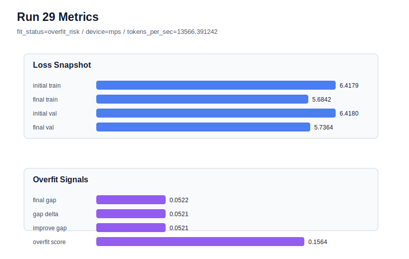

# run 029 실험 보고서

## 이번 가설

context_length 경계 확인 실험: context_length=40은 overfit_risk와 validation 악화를 만들었고, context_length=48은 현재 best이다. quick_gelu + sdpa + tie_embeddings=True + ffn_dropout_position=none을 유지한 채 context_length만 56으로 늘리면, 48보다 조금 더 긴 문맥이 정보량을 보강하면서도 64-token 계열의 과적합 위험으로 돌아가지 않는지 확인할 수 있다.

## 왜 이 가설을 세웠는가

run 021/024는 context_length=48에서 final_val_loss=5.724607, overfit_score=0.0으로 가장 좋은 균형을 만들었다. run 028은 같은 best 계열에서 context_length를 40으로 줄였지만 final_val_loss=5.794515, gap=0.048093, overfit_score=0.176111로 high-risk가 되어 너무 짧은 문맥은 validation 구성과 train/val 균형을 해친다는 증거가 되었다. 반대로 64-token seed=134 계열은 이전에 overfit_risk가 반복되었다. 따라서 56은 48과 64 사이의 경계점으로, 구조와 함수 선택을 유지하면서 문맥 길이의 안정 범위를 좁히는 해석 가능한 단일축 실험이다.

## 가설 작성 주체

llm_plan:docs/train/next_plan.json

## 바꾼 변수

```json
{
  "context_length": 56
}
```

## 고정한 변수

seed=134, vocab_size=600, stride=null, batch_size=8, max_steps=40, learning_rate=0.0003, weight_decay=0.01, grad_clip=1.0, emb_dim=128, n_heads=4, n_layers=2, drop_rate=0.1, qkv_bias=False, ffn_mult=4, norm_first=False, norm_eps=1e-5, activation_name=quick_gelu, ffn_dropout_position=none, attention_impl=sdpa, tie_embeddings=True, init_std=0.02

## 기대 결과

성공 기준은 final_val_loss가 run 024의 5.724607에 근접하거나 더 낮고, overfit_score가 0.05 이하로 유지되는 것이다. 56에서 validation이 48보다 나빠지지만 overfit_score가 낮으면 48이 더 좋은 local optimum으로 판단한다. gap과 overfit_score가 커지면 긴 문맥이 다시 64-token 계열의 overfit_risk로 접근한다고 본다.

## 실험 설정

```json
{
  "run_id": 29,
  "hypothesis": "context_length 경계 확인 실험: context_length=40은 overfit_risk와 validation 악화를 만들었고, context_length=48은 현재 best이다. quick_gelu + sdpa + tie_embeddings=True + ffn_dropout_position=none을 유지한 채 context_length만 56으로 늘리면, 48보다 조금 더 긴 문맥이 정보량을 보강하면서도 64-token 계열의 과적합 위험으로 돌아가지 않는지 확인할 수 있다.",
  "seed": 134,
  "vocab_size": 600,
  "min_frequency": 2,
  "context_length": 56,
  "stride": null,
  "batch_size": 8,
  "max_steps": 40,
  "eval_batches": 4,
  "train_ratio": 0.9,
  "learning_rate": 0.0003,
  "weight_decay": 0.01,
  "grad_clip": 1.0,
  "emb_dim": 128,
  "n_heads": 4,
  "n_layers": 2,
  "drop_rate": 0.1,
  "qkv_bias": false,
  "ffn_mult": 4,
  "norm_first": false,
  "norm_eps": 1e-05,
  "activation_name": "quick_gelu",
  "ffn_dropout_position": "none",
  "attention_impl": "sdpa",
  "tie_embeddings": true,
  "init_std": 0.02
}
```

## 실행 환경

```json
{
  "timestamp": "2026-06-02T21:18:24+00:00",
  "hostname": "woonyong-MacBookPro.local",
  "platform": "macOS-26.3.1-arm64-arm-64bit-Mach-O",
  "machine": "arm64",
  "python": "3.13.13",
  "torch": "2.12.0",
  "cpu_count": 10,
  "memory_gb": 24.0,
  "cuda_available": false,
  "cuda_device_count": 0,
  "mps_available": true,
  "resolved_device": "mps",
  "profile": "mps_balanced"
}
```

- corpus: `src/learning/the-verdict.txt`
- artifact_dir: `docs/train/runs/run_029_artifacts`

## 실제 결과

| 지표 | 값 |
| --- | --- |
| initial_train_loss | 6.417924404144287 |
| initial_val_loss | 6.417952299118042 |
| final_train_loss | 5.6842135190963745 |
| final_val_loss | 5.736375331878662 |
| final_generalization_gap | 0.0521618127822876 |
| generalization_gap_delta | 0.052133917808532715 |
| train_val_improvement_gap | 0.052133917808532715 |
| overfit_score | 0.15642964839935303 |
| fit_status | overfit_risk |
| parameter_count | 480000 |
| tokens_per_sec | 13566.391242370002 |
| elapsed_sec | 1.2961442498490214 |
| device | mps |

## 시각 지표




- 대시보드: `../dashboard.md`
- 지표 요약 CSV: `../metrics_summary.csv`

## 과적합 판단

과적합 위험. final gap=0.0522, overfit_score=0.1564. 다음 실험은 regularization 강화가 우선이다.

## 결론

현재 best 후보: run 21 / val=5.724607149759929 / status=generalizing

## 다음 실험 제안

- 성공 시: context_length=56이 48과 동등하거나 더 좋은 validation/generalization 균형을 만들면 seed=151로 반복해 긴 문맥의 안정성이 seed에 강건한지 확인한다.
- 과적합 시: context_length=56에서 overfit_score가 커지거나 validation이 악화되면 context_length=48을 기본 후보로 고정하고, 다음에는 seed 반복 또는 learning_rate/weight_decay 같은 optimization 축을 48 기준 위에서 탐색한다.
