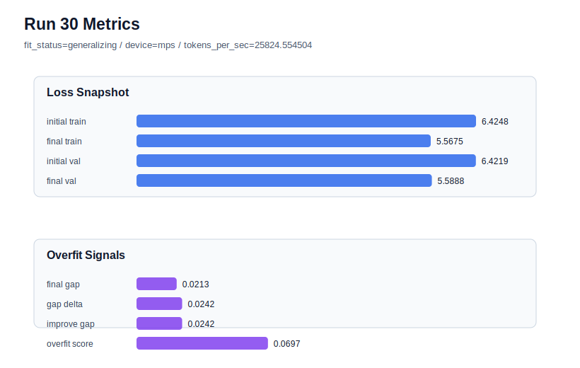

# run 030 실험 보고서

## 이번 가설

context_length=48 기준의 학습 길이 단일축 테스트: context_length 40과 56은 모두 overfit_risk였고, activation/gated FFN 교체도 best를 넘지 못했다. 따라서 quick_gelu + sdpa + context_length=48을 고정하고 max_steps만 40에서 60으로 늘리면, 현재 낮은 overfit_score를 유지하면서 train/val loss를 더 낮출 수 있는지 확인한다.

## 왜 이 가설을 세웠는가

run 021/024는 context_length=48에서 final_val_loss=5.724607, overfit_score=0.0으로 현재 best를 만들었다. 이후 run 025 gelu_exact, run 026 silu, run 027 swiglu는 activation/capacity 축에서 best를 갱신하지 못했고, run 028(context_length=40)과 run 029(context_length=56)는 high-risk로 무너졌다. 즉 현재 탐색의 가장 신뢰할 수 있는 기준은 quick_gelu + context_length=48 + sdpa이다. 이 기준은 final_generalization_gap이 음수에 가깝고 overfit_score가 0이어서, 40 step에서 아직 조금 덜 학습되었을 가능성이 있다. max_steps=60은 MPS에서 여전히 짧은 회차이며, 과적합 감시 하에 학습 길이만 늘리는 해석 가능한 optimization 축이다.

## 가설 작성 주체

llm_plan:docs/train/next_plan.json

## 바꾼 변수

```json
{
  "max_steps": 60
}
```

## 고정한 변수

seed=134, vocab_size=600, context_length=48, stride=null, batch_size=8, learning_rate=0.0003, weight_decay=0.01, grad_clip=1.0, emb_dim=128, n_heads=4, n_layers=2, drop_rate=0.1, qkv_bias=False, ffn_mult=4, norm_first=False, norm_eps=1e-5, activation_name=quick_gelu, ffn_dropout_position=none, attention_impl=sdpa, tie_embeddings=True, init_std=0.02

## 기대 결과

성공 기준은 final_val_loss가 run 024의 5.724607보다 낮아지고, overfit_score가 0.05 이하로 유지되는 것이다. train loss만 낮아지고 validation gap 또는 train_val_improvement_gap이 커지면 60 step은 과학적으로는 학습 지속 효과를 확인했지만 실험 기본값으로는 위험하다고 본다.

## 실험 설정

```json
{
  "run_id": 30,
  "hypothesis": "context_length=48 기준의 학습 길이 단일축 테스트: context_length 40과 56은 모두 overfit_risk였고, activation/gated FFN 교체도 best를 넘지 못했다. 따라서 quick_gelu + sdpa + context_length=48을 고정하고 max_steps만 40에서 60으로 늘리면, 현재 낮은 overfit_score를 유지하면서 train/val loss를 더 낮출 수 있는지 확인한다.",
  "seed": 134,
  "vocab_size": 600,
  "min_frequency": 2,
  "context_length": 48,
  "stride": null,
  "batch_size": 8,
  "max_steps": 60,
  "eval_batches": 4,
  "train_ratio": 0.9,
  "learning_rate": 0.0003,
  "weight_decay": 0.01,
  "grad_clip": 1.0,
  "emb_dim": 128,
  "n_heads": 4,
  "n_layers": 2,
  "drop_rate": 0.1,
  "qkv_bias": false,
  "ffn_mult": 4,
  "norm_first": false,
  "norm_eps": 1e-05,
  "activation_name": "quick_gelu",
  "ffn_dropout_position": "none",
  "attention_impl": "sdpa",
  "tie_embeddings": true,
  "init_std": 0.02
}
```

## 실행 환경

```json
{
  "timestamp": "2026-06-02T21:23:29+00:00",
  "hostname": "woonyong-MacBookPro.local",
  "platform": "macOS-26.3.1-arm64-arm-64bit-Mach-O",
  "machine": "arm64",
  "python": "3.13.13",
  "torch": "2.12.0",
  "cpu_count": 10,
  "memory_gb": 24.0,
  "cuda_available": false,
  "cuda_device_count": 0,
  "mps_available": true,
  "resolved_device": "mps",
  "profile": "mps_balanced"
}
```

- corpus: `src/learning/the-verdict.txt`
- artifact_dir: `docs/train/runs/run_030_artifacts`

## 실제 결과

| 지표 | 값 |
| --- | --- |
| initial_train_loss | 6.424758791923523 |
| initial_val_loss | 6.4218573570251465 |
| final_train_loss | 5.567537546157837 |
| final_val_loss | 5.588832537333171 |
| final_generalization_gap | 0.021294991175333955 |
| generalization_gap_delta | 0.02419642607371042 |
| train_val_improvement_gap | 0.02419642607371042 |
| overfit_score | 0.0696878433227548 |
| fit_status | generalizing |
| parameter_count | 478976 |
| tokens_per_sec | 25824.554504251562 |
| elapsed_sec | 0.8642937091644853 |
| device | mps |

## 시각 지표




- 대시보드: `../dashboard.md`
- 지표 요약 CSV: `../metrics_summary.csv`

## 과적합 판단

일반화 개선 신호. final gap=0.0213, overfit_score=0.0697. seed 반복으로 재현성을 확인할 만하다.

## 결론

현재 best 후보: run 30 / val=5.588832537333171 / status=generalizing

## 다음 실험 제안

- 성공 시: max_steps=60이 validation loss를 낮추면서 low-risk를 유지하면 seed=151에서 같은 60-step 설정을 반복해 학습 길이 이득이 seed에 강건한지 확인한다.
- 과적합 시: max_steps=60에서 overfit_score가 커지거나 validation이 악화되면 max_steps=40을 기본값으로 되돌리고, 다음에는 learning_rate=0.00025 또는 weight_decay=0.02처럼 더 완만한 optimization/regularization 축을 context_length=48 위에서 단일축으로 테스트한다.
