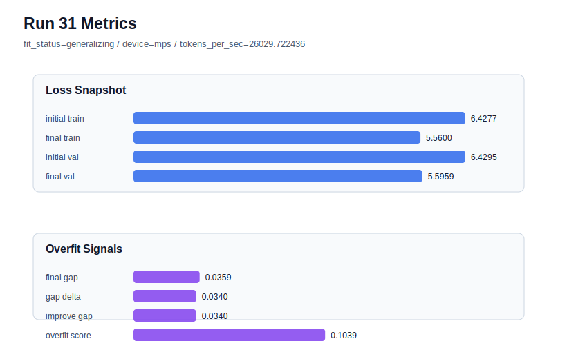

# run 031 실험 보고서

## 이번 가설

max_steps=60 seed 재현성 검증: run 030은 context_length=48 + quick_gelu + sdpa 기준에서 max_steps를 60으로 늘리자 validation loss가 크게 개선되고 generalizing을 유지했다. 같은 설정을 seed=151로 반복하면, 이 개선이 seed=134의 우연인지 아니면 학습 길이 증가가 안정적으로 유효한지 확인할 수 있다.

## 왜 이 가설을 세웠는가

run 030은 final_val_loss=5.588833, final_generalization_gap=0.021295, overfit_score=0.069688, fit_status=generalizing으로 새 best를 만들었다. 기존 40-step 기준의 run 022(seed=151, context_length=48)는 final_val_loss=5.738766, overfit_score=0.011702로 안정적이었지만 충분히 학습되지 않았을 가능성이 있다. context_length 40/56 및 activation/gated FFN 축이 모두 best를 넘지 못했으므로, 현재 가장 유망한 축은 context_length=48을 고정한 학습 길이 증가다. seed=151 반복은 max_steps=60 이득의 재현성과 과적합 위험을 동시에 확인하는 가장 직접적인 다음 실험이다.

## 가설 작성 주체

llm_plan:docs/train/next_plan.json

## 바꾼 변수

```json
{
  "seed": 151
}
```

## 고정한 변수

vocab_size=600, context_length=48, stride=null, batch_size=8, max_steps=60, learning_rate=0.0003, weight_decay=0.01, grad_clip=1.0, emb_dim=128, n_heads=4, n_layers=2, drop_rate=0.1, qkv_bias=False, ffn_mult=4, norm_first=False, norm_eps=1e-5, activation_name=quick_gelu, ffn_dropout_position=none, attention_impl=sdpa, tie_embeddings=True, init_std=0.02

## 기대 결과

성공 기준은 seed=151에서도 final_val_loss가 기존 seed=151 40-step run 022의 5.738766보다 명확히 낮아지고, overfit_score가 0.10 이하 또는 fit_status=generalizing을 유지하는 것이다. validation은 개선되지만 overfit_score가 크게 오르면 60 step은 추가 regularization과 함께 써야 한다고 판단한다.

## 실험 설정

```json
{
  "run_id": 31,
  "hypothesis": "max_steps=60 seed 재현성 검증: run 030은 context_length=48 + quick_gelu + sdpa 기준에서 max_steps를 60으로 늘리자 validation loss가 크게 개선되고 generalizing을 유지했다. 같은 설정을 seed=151로 반복하면, 이 개선이 seed=134의 우연인지 아니면 학습 길이 증가가 안정적으로 유효한지 확인할 수 있다.",
  "seed": 151,
  "vocab_size": 600,
  "min_frequency": 2,
  "context_length": 48,
  "stride": null,
  "batch_size": 8,
  "max_steps": 60,
  "eval_batches": 4,
  "train_ratio": 0.9,
  "learning_rate": 0.0003,
  "weight_decay": 0.01,
  "grad_clip": 1.0,
  "emb_dim": 128,
  "n_heads": 4,
  "n_layers": 2,
  "drop_rate": 0.1,
  "qkv_bias": false,
  "ffn_mult": 4,
  "norm_first": false,
  "norm_eps": 1e-05,
  "activation_name": "quick_gelu",
  "ffn_dropout_position": "none",
  "attention_impl": "sdpa",
  "tie_embeddings": true,
  "init_std": 0.02
}
```

## 실행 환경

```json
{
  "timestamp": "2026-06-02T21:28:25+00:00",
  "hostname": "woonyong-MacBookPro.local",
  "platform": "macOS-26.3.1-arm64-arm-64bit-Mach-O",
  "machine": "arm64",
  "python": "3.13.13",
  "torch": "2.12.0",
  "cpu_count": 10,
  "memory_gb": 24.0,
  "cuda_available": false,
  "cuda_device_count": 0,
  "mps_available": true,
  "resolved_device": "mps",
  "profile": "mps_balanced"
}
```

- corpus: `src/learning/the-verdict.txt`
- artifact_dir: `docs/train/runs/run_031_artifacts`

## 실제 결과

| 지표 | 값 |
| --- | --- |
| initial_train_loss | 6.427652597427368 |
| initial_val_loss | 6.429500897725423 |
| final_train_loss | 5.559990763664246 |
| final_val_loss | 5.595870176951091 |
| final_generalization_gap | 0.035879413286845185 |
| generalization_gap_delta | 0.03403111298879047 |
| train_val_improvement_gap | 0.03403111298879047 |
| overfit_score | 0.10394163926442612 |
| fit_status | generalizing |
| parameter_count | 478976 |
| tokens_per_sec | 26029.722435830558 |
| elapsed_sec | 0.857481291051954 |
| device | mps |

## 시각 지표




- 대시보드: `../dashboard.md`
- 지표 요약 CSV: `../metrics_summary.csv`

## 과적합 판단

일반화 개선 신호. final gap=0.0359, overfit_score=0.1039. seed 반복으로 재현성을 확인할 만하다.

## 결론

현재 best 후보: run 30 / val=5.588832537333171 / status=generalizing

## 다음 실험 제안

- 성공 시: seed=151에서도 max_steps=60이 validation loss를 낮추고 generalizing을 유지하면 seed=202로 반복해 어려운 seed에서도 학습 길이 효과가 유지되는지 확인한다.
- 과적합 시: seed=151에서 max_steps=60이 overfit_risk로 바뀌면 max_steps=60은 seed 민감성이 있다고 보고, context_length=48 기준에서 learning_rate=0.00025 또는 weight_decay=0.02를 단일축으로 추가해 과적합을 완화한다.
