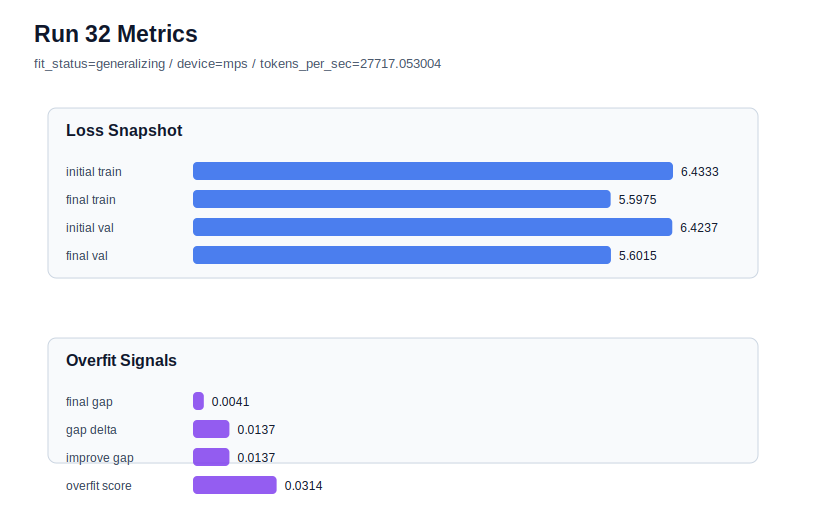

# run 032 실험 보고서

## 이번 가설

max_steps=60 어려운 seed 강건성 검증: seed=134와 seed=151에서 context_length=48 + quick_gelu + sdpa + max_steps=60은 validation loss를 크게 낮추며 generalizing을 유지했다. 같은 설정을 seed=202로 반복하면, 이전에 더 불안정했던 seed에서도 학습 길이 증가가 validation 성능을 개선하면서 과적합을 감당할 수 있는지 확인한다.

## 왜 이 가설을 세웠는가

run 030(seed=134)은 final_val_loss=5.588833, overfit_score=0.069688로 새 best가 되었고, run 031(seed=151)은 final_val_loss=5.595870, overfit_score=0.103942로 best에는 못 미쳤지만 기존 seed=151 40-step run 022의 5.738766보다 크게 개선되었다. seed=202는 40-step context_length=48 run 023에서 final_val_loss=5.750331, overfit_score=0.132983으로 상대적으로 어려운 seed였다. 따라서 seed=202에서 60 step을 적용하면, 학습 길이 증가가 seed 전반의 under-training을 해결하는지 아니면 어려운 seed에서 overfit_risk를 키우는지 판단할 수 있다.

## 가설 작성 주체

llm_plan:docs/train/next_plan.json

## 바꾼 변수

```json
{
  "seed": 202
}
```

## 고정한 변수

vocab_size=600, context_length=48, stride=null, batch_size=8, max_steps=60, learning_rate=0.0003, weight_decay=0.01, grad_clip=1.0, emb_dim=128, n_heads=4, n_layers=2, drop_rate=0.1, qkv_bias=False, ffn_mult=4, norm_first=False, norm_eps=1e-5, activation_name=quick_gelu, ffn_dropout_position=none, attention_impl=sdpa, tie_embeddings=True, init_std=0.02

## 기대 결과

성공 기준은 seed=202에서도 final_val_loss가 기존 run 023의 5.750331보다 명확히 낮아지고, fit_status가 generalizing을 유지하는 것이다. overfit_score가 0.15 이하이면 어려운 seed에서도 감당 가능한 개선으로 본다. validation은 좋아지지만 overfit_score가 0.15를 넘으면 60 step은 유효하지만 추가 regularization 후보가 필요하다.

## 실험 설정

```json
{
  "run_id": 32,
  "hypothesis": "max_steps=60 어려운 seed 강건성 검증: seed=134와 seed=151에서 context_length=48 + quick_gelu + sdpa + max_steps=60은 validation loss를 크게 낮추며 generalizing을 유지했다. 같은 설정을 seed=202로 반복하면, 이전에 더 불안정했던 seed에서도 학습 길이 증가가 validation 성능을 개선하면서 과적합을 감당할 수 있는지 확인한다.",
  "seed": 202,
  "vocab_size": 600,
  "min_frequency": 2,
  "context_length": 48,
  "stride": null,
  "batch_size": 8,
  "max_steps": 60,
  "eval_batches": 4,
  "train_ratio": 0.9,
  "learning_rate": 0.0003,
  "weight_decay": 0.01,
  "grad_clip": 1.0,
  "emb_dim": 128,
  "n_heads": 4,
  "n_layers": 2,
  "drop_rate": 0.1,
  "qkv_bias": false,
  "ffn_mult": 4,
  "norm_first": false,
  "norm_eps": 1e-05,
  "activation_name": "quick_gelu",
  "ffn_dropout_position": "none",
  "attention_impl": "sdpa",
  "tie_embeddings": true,
  "init_std": 0.02
}
```

## 실행 환경

```json
{
  "timestamp": "2026-06-02T21:33:25+00:00",
  "hostname": "woonyong-MacBookPro.local",
  "platform": "macOS-26.3.1-arm64-arm-64bit-Mach-O",
  "machine": "arm64",
  "python": "3.13.13",
  "torch": "2.12.0",
  "cpu_count": 10,
  "memory_gb": 24.0,
  "cuda_available": false,
  "cuda_device_count": 0,
  "mps_available": true,
  "resolved_device": "mps",
  "profile": "mps_balanced"
}
```

- corpus: `src/learning/the-verdict.txt`
- artifact_dir: `docs/train/runs/run_032_artifacts`

## 실제 결과

| 지표 | 값 |
| --- | --- |
| initial_train_loss | 6.433324933052063 |
| initial_val_loss | 6.423727830251058 |
| final_train_loss | 5.597493886947632 |
| final_val_loss | 5.601549784342448 |
| final_generalization_gap | 0.004055897394816377 |
| generalization_gap_delta | 0.013653000195821718 |
| train_val_improvement_gap | 0.013653000195821718 |
| overfit_score | 0.031361897786459814 |
| fit_status | generalizing |
| parameter_count | 478976 |
| tokens_per_sec | 27717.05300366417 |
| elapsed_sec | 0.8052804169710726 |
| device | mps |

## 시각 지표




- 대시보드: `../dashboard.md`
- 지표 요약 CSV: `../metrics_summary.csv`

## 과적합 판단

일반화 개선 신호. final gap=0.0041, overfit_score=0.0314. seed 반복으로 재현성을 확인할 만하다.

## 결론

현재 best 후보: run 32 / val=5.601549784342448 / status=generalizing

## 다음 실험 제안

- 성공 시: seed=202에서도 max_steps=60이 generalizing을 유지하며 validation loss를 낮추면 max_steps=60을 새 기본 학습 길이 후보로 두고, 다음에는 max_steps=80 또는 learning_rate 조정으로 더 긴 학습의 한계를 확인한다.
- 과적합 시: seed=202에서 max_steps=60이 overfit_risk를 만들면 max_steps=60은 효과가 있지만 seed에 따라 과적합이 커지는 것으로 보고, context_length=48 + max_steps=60 위에서 weight_decay=0.02 또는 drop_rate=0.12를 단일축으로 테스트한다.
