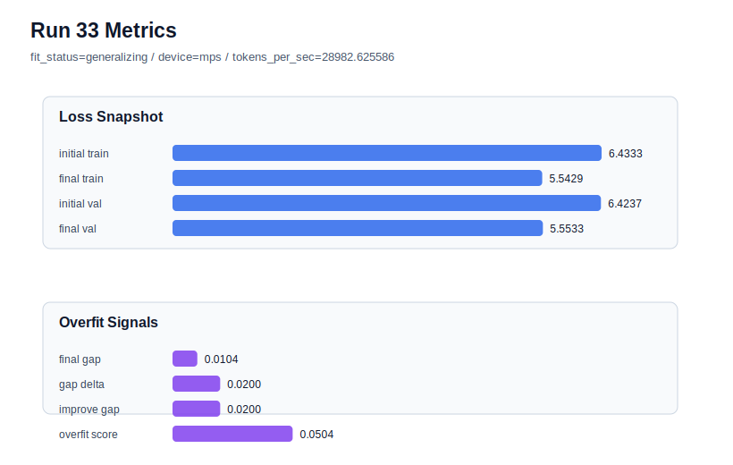

# run 033 실험 보고서

## 이번 가설

max_steps=80 학습 한계 테스트: context_length=48 + quick_gelu + sdpa 기준에서 max_steps=60은 seed=134/151/202 모두 validation을 크게 개선하며 generalizing을 유지했다. seed=202에서 max_steps만 80으로 늘리면, 더 긴 학습이 validation loss를 추가로 낮출 수 있는지 또는 과적합 신호가 급격히 커지는지 확인할 수 있다.

## 왜 이 가설을 세웠는가

run 030(seed=134), run 031(seed=151), run 032(seed=202)은 모두 context_length=48 + quick_gelu + sdpa + max_steps=60에서 기존 40-step 기준보다 validation loss를 크게 낮췄고 fit_status=generalizing을 유지했다. 특히 run 032는 어려운 seed=202에서도 final_val_loss=5.601550, gap=0.004056, overfit_score=0.031362로 매우 안정적이었다. 따라서 다음 자연스러운 질문은 60 step이 아직 under-training인지, 아니면 더 길게 학습하면 gap이 커지는지다. seed=202는 overfit_score가 가장 낮게 나온 최신 후보라 max_steps=80의 리스크를 관찰하기 좋은 시작점이다.

## 가설 작성 주체

llm_plan:docs/train/next_plan.json

## 바꾼 변수

```json
{
  "max_steps": 80
}
```

## 고정한 변수

seed=202, vocab_size=600, context_length=48, stride=null, batch_size=8, learning_rate=0.0003, weight_decay=0.01, grad_clip=1.0, emb_dim=128, n_heads=4, n_layers=2, drop_rate=0.1, qkv_bias=False, ffn_mult=4, norm_first=False, norm_eps=1e-5, activation_name=quick_gelu, ffn_dropout_position=none, attention_impl=sdpa, tie_embeddings=True, init_std=0.02

## 기대 결과

성공 기준은 final_val_loss가 run 032의 5.601550보다 낮고, overfit_score가 0.10 이하 또는 fit_status=generalizing을 유지하는 것이다. validation loss가 조금 낮아져도 gap과 overfit_score가 크게 커지면 80 step은 과학적으로는 학습 한계를 보여주지만 기본 후보로는 보류한다.

## 실험 설정

```json
{
  "run_id": 33,
  "hypothesis": "max_steps=80 학습 한계 테스트: context_length=48 + quick_gelu + sdpa 기준에서 max_steps=60은 seed=134/151/202 모두 validation을 크게 개선하며 generalizing을 유지했다. seed=202에서 max_steps만 80으로 늘리면, 더 긴 학습이 validation loss를 추가로 낮출 수 있는지 또는 과적합 신호가 급격히 커지는지 확인할 수 있다.",
  "seed": 202,
  "vocab_size": 600,
  "min_frequency": 2,
  "context_length": 48,
  "stride": null,
  "batch_size": 8,
  "max_steps": 80,
  "eval_batches": 4,
  "train_ratio": 0.9,
  "learning_rate": 0.0003,
  "weight_decay": 0.01,
  "grad_clip": 1.0,
  "emb_dim": 128,
  "n_heads": 4,
  "n_layers": 2,
  "drop_rate": 0.1,
  "qkv_bias": false,
  "ffn_mult": 4,
  "norm_first": false,
  "norm_eps": 1e-05,
  "activation_name": "quick_gelu",
  "ffn_dropout_position": "none",
  "attention_impl": "sdpa",
  "tie_embeddings": true,
  "init_std": 0.02
}
```

## 실행 환경

```json
{
  "timestamp": "2026-06-02T21:38:20+00:00",
  "hostname": "woonyong-MacBookPro.local",
  "platform": "macOS-26.3.1-arm64-arm-64bit-Mach-O",
  "machine": "arm64",
  "python": "3.13.13",
  "torch": "2.12.0",
  "cpu_count": 10,
  "memory_gb": 24.0,
  "cuda_available": false,
  "cuda_device_count": 0,
  "mps_available": true,
  "resolved_device": "mps",
  "profile": "mps_balanced"
}
```

- corpus: `src/learning/the-verdict.txt`
- artifact_dir: `docs/train/runs/run_033_artifacts`

## 실제 결과

| 지표 | 값 |
| --- | --- |
| initial_train_loss | 6.433324933052063 |
| initial_val_loss | 6.423727830251058 |
| final_train_loss | 5.542914152145386 |
| final_val_loss | 5.553315162658691 |
| final_generalization_gap | 0.010401010513305664 |
| generalization_gap_delta | 0.019998113314311006 |
| train_val_improvement_gap | 0.019998113314311006 |
| overfit_score | 0.050397237141927675 |
| fit_status | generalizing |
| parameter_count | 478976 |
| tokens_per_sec | 28982.62558597752 |
| elapsed_sec | 1.0268220838624984 |
| device | mps |

## 시각 지표




- 대시보드: `../dashboard.md`
- 지표 요약 CSV: `../metrics_summary.csv`

## 과적합 판단

일반화 개선 신호. final gap=0.0104, overfit_score=0.0504. seed 반복으로 재현성을 확인할 만하다.

## 결론

현재 best 후보: run 33 / val=5.553315162658691 / status=generalizing

## 다음 실험 제안

- 성공 시: max_steps=80이 seed=202에서 validation을 개선하고 generalizing을 유지하면 seed=134 또는 seed=151로 반복해 80-step 이득이 seed에 강건한지 확인한다.
- 과적합 시: max_steps=80에서 overfit_score가 커지거나 validation이 악화되면 max_steps=60을 기본 후보로 유지하고, 다음에는 learning_rate=0.00025 또는 weight_decay=0.02를 max_steps=80과 결합하기 전에 단일축으로 검증한다.
