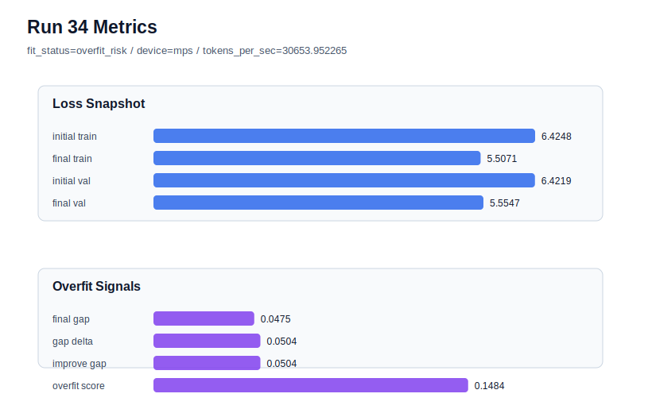

# run 034 실험 보고서

## 이번 가설

max_steps=80 seed=134 재현성 검증: run 033에서 seed=202는 max_steps=80으로 validation loss를 5.553315까지 낮추면서 gap=0.010401, overfit_score=0.050397의 generalizing 상태를 유지했다. 같은 context_length=48 + quick_gelu + sdpa 기준에서 seed만 134로 바꾸면, 80-step 이득이 특정 seed의 우연인지 아니면 현재 best 계열의 안정적인 학습 길이 효과인지 확인할 수 있다.

## 왜 이 가설을 세웠는가

최근 추세는 context_length=48이 40/56보다 명확히 안정적이고, quick_gelu가 gelu_exact/silu/swiglu보다 validation과 처리량 균형이 좋으며, sdpa가 품질을 유지하면서 MPS 처리량을 개선한다는 쪽으로 모였다. run 030/031/032에서 max_steps=60은 seed=134/151/202 모두 validation을 크게 낮췄고, run 033은 seed=202에서 max_steps=80도 추가 개선을 만들었다. 다만 80-step은 아직 seed=202에서만 확인되었으므로, seed=134 반복이 가장 직접적인 강건성 검증이다. seed=134는 60-step run 030에서 pure val이 강했던 seed라, 80-step이 더 좋아지는지 혹은 gap이 커지는지 관찰 가치가 크다.

## 가설 작성 주체

llm_plan:docs/train/next_plan.json

## 바꾼 변수

```json
{
  "seed": 134
}
```

## 고정한 변수

vocab_size=600, context_length=48, stride=null, batch_size=8, learning_rate=0.0003, weight_decay=0.01, grad_clip=1.0, emb_dim=128, n_heads=4, n_layers=2, drop_rate=0.1, qkv_bias=false, ffn_mult=4, norm_first=false, norm_eps=1e-5, activation_name=quick_gelu, ffn_dropout_position=none, attention_impl=sdpa, tie_embeddings=true, init_std=0.02, max_steps=80

## 기대 결과

성공 기준은 seed=134에서도 final_val_loss가 run 030의 60-step 결과 5.588833보다 낮아지고, overfit_score가 0.12 이하 또는 fit_status=generalizing을 유지하는 것이다. final_val_loss가 좋아져도 final_generalization_gap과 train_val_improvement_gap이 크게 커지면 80-step은 추가 regularization이 필요한 학습 길이로 본다.

## 실험 설정

```json
{
  "run_id": 34,
  "hypothesis": "max_steps=80 seed=134 재현성 검증: run 033에서 seed=202는 max_steps=80으로 validation loss를 5.553315까지 낮추면서 gap=0.010401, overfit_score=0.050397의 generalizing 상태를 유지했다. 같은 context_length=48 + quick_gelu + sdpa 기준에서 seed만 134로 바꾸면, 80-step 이득이 특정 seed의 우연인지 아니면 현재 best 계열의 안정적인 학습 길이 효과인지 확인할 수 있다.",
  "seed": 134,
  "vocab_size": 600,
  "min_frequency": 2,
  "context_length": 48,
  "stride": null,
  "batch_size": 8,
  "max_steps": 80,
  "eval_batches": 4,
  "train_ratio": 0.9,
  "learning_rate": 0.0003,
  "weight_decay": 0.01,
  "grad_clip": 1.0,
  "emb_dim": 128,
  "n_heads": 4,
  "n_layers": 2,
  "drop_rate": 0.1,
  "qkv_bias": false,
  "ffn_mult": 4,
  "norm_first": false,
  "norm_eps": 1e-05,
  "activation_name": "quick_gelu",
  "ffn_dropout_position": "none",
  "attention_impl": "sdpa",
  "tie_embeddings": true,
  "init_std": 0.02
}
```

## 실행 환경

```json
{
  "timestamp": "2026-06-02T21:43:58+00:00",
  "hostname": "woonyong-MacBookPro.local",
  "platform": "macOS-26.3.1-arm64-arm-64bit-Mach-O",
  "machine": "arm64",
  "python": "3.13.13",
  "torch": "2.12.0",
  "cpu_count": 10,
  "memory_gb": 24.0,
  "cuda_available": false,
  "cuda_device_count": 0,
  "mps_available": true,
  "resolved_device": "mps",
  "profile": "mps_balanced"
}
```

- corpus: `src/learning/the-verdict.txt`
- artifact_dir: `docs/train/runs/run_034_artifacts`

## 실제 결과

| 지표 | 값 |
| --- | --- |
| initial_train_loss | 6.424758791923523 |
| initial_val_loss | 6.4218573570251465 |
| final_train_loss | 5.507128357887268 |
| final_val_loss | 5.554664134979248 |
| final_generalization_gap | 0.04753577709197998 |
| generalization_gap_delta | 0.050437211990356445 |
| train_val_improvement_gap | 0.050437211990356445 |
| overfit_score | 0.14841020107269287 |
| fit_status | overfit_risk |
| parameter_count | 478976 |
| tokens_per_sec | 30653.95226521722 |
| elapsed_sec | 0.9708372917957604 |
| device | mps |

## 시각 지표




- 대시보드: `../dashboard.md`
- 지표 요약 CSV: `../metrics_summary.csv`

## 과적합 판단

과적합 위험. final gap=0.0475, overfit_score=0.1484. 다음 실험은 regularization 강화가 우선이다.

## 결론

현재 best 후보: run 33 / val=5.553315162658691 / status=generalizing

## 다음 실험 제안

- 성공 시: seed=134에서도 80-step이 validation을 개선하고 generalizing을 유지하면 seed=151로 같은 max_steps=80을 반복해 세 seed 모두에서 강건한지 확인한다. 세 seed가 안정적이면 다음에는 max_steps=100의 한계 테스트보다 먼저 learning_rate=0.00025 또는 weight_decay=0.02를 80-step 기준에서 비교해 더 낮은 validation과 낮은 overfit_score의 균형을 찾는다.
- 과적합 시: seed=134에서 80-step이 overfit_risk를 만들거나 gap이 크게 증가하면 max_steps=60을 더 안전한 기본 후보로 유지한다. 이후에는 max_steps=80을 계속 밀기보다 weight_decay=0.02, drop_rate=0.12, learning_rate=0.00025 중 하나를 단일축으로 붙여 긴 학습의 과적합 완화 가능성을 검증한다.
