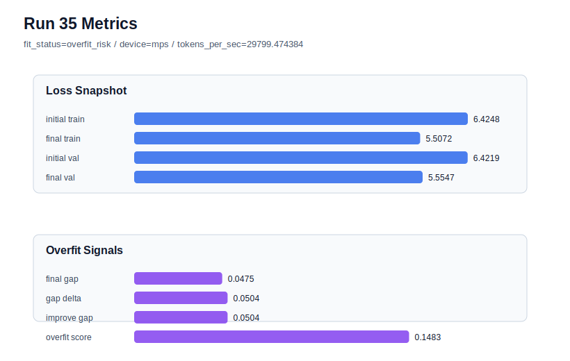

# run 035 실험 보고서

## 이번 가설

max_steps=80 seed=134 과적합 완화 단일축 테스트: run 034는 seed=134에서 validation loss를 5.554664까지 낮췄지만 final_generalization_gap=0.047536, overfit_score=0.148410으로 overfit_risk가 되었다. 같은 80-step 설정에서 weight_decay만 0.01에서 0.02로 올리면, train loss 과도 개선을 억제해 validation 성능을 유지하면서 gap과 overfit_score를 낮출 수 있는지 확인한다.

## 왜 이 가설을 세웠는가

run 033(seed=202, max_steps=80)은 generalizing으로 best가 되었지만 run 034(seed=134, max_steps=80)는 거의 같은 final_val_loss에도 gap과 overfit_score가 크게 증가했다. 이는 max_steps=80 자체가 무조건 나쁜 것이 아니라 seed=134에서 긴 학습이 train 쪽으로 더 빠르게 맞춰지는 문제일 가능성을 보여준다. context_length=48, quick_gelu, sdpa, tie_embeddings=True, ffn_dropout_position=none은 최근 실험에서 가장 안정적인 구조/함수 조합이므로 유지하고, 모델 구조나 activation을 바꾸기 전에 regularization 단일축인 weight_decay를 먼저 확인하는 것이 해석 가능하다.

## 가설 작성 주체

llm_plan:docs/train/next_plan.json

## 바꾼 변수

```json
{
  "weight_decay": 0.02
}
```

## 고정한 변수

seed=134, vocab_size=600, context_length=48, stride=null, batch_size=8, max_steps=80, learning_rate=0.0003, grad_clip=1.0, emb_dim=128, n_heads=4, n_layers=2, drop_rate=0.1, qkv_bias=false, ffn_mult=4, norm_first=false, norm_eps=1e-5, activation_name=quick_gelu, ffn_dropout_position=none, attention_impl=sdpa, tie_embeddings=true, init_std=0.02

## 기대 결과

성공 기준은 run 034 대비 final_generalization_gap과 overfit_score가 낮아지고, final_val_loss가 5.57 이하로 유지되는 것이다. 특히 overfit_score가 0.12 이하로 내려가거나 fit_status가 generalizing으로 돌아오면 80-step에는 약한 weight_decay 강화가 필요하다는 가설을 지지한다. validation loss가 악화되고 gap만 줄면 under-training 또는 과도한 regularization으로 해석한다.

## 실험 설정

```json
{
  "run_id": 35,
  "hypothesis": "max_steps=80 seed=134 과적합 완화 단일축 테스트: run 034는 seed=134에서 validation loss를 5.554664까지 낮췄지만 final_generalization_gap=0.047536, overfit_score=0.148410으로 overfit_risk가 되었다. 같은 80-step 설정에서 weight_decay만 0.01에서 0.02로 올리면, train loss 과도 개선을 억제해 validation 성능을 유지하면서 gap과 overfit_score를 낮출 수 있는지 확인한다.",
  "seed": 134,
  "vocab_size": 600,
  "min_frequency": 2,
  "context_length": 48,
  "stride": null,
  "batch_size": 8,
  "max_steps": 80,
  "eval_batches": 4,
  "train_ratio": 0.9,
  "learning_rate": 0.0003,
  "weight_decay": 0.02,
  "grad_clip": 1.0,
  "emb_dim": 128,
  "n_heads": 4,
  "n_layers": 2,
  "drop_rate": 0.1,
  "qkv_bias": false,
  "ffn_mult": 4,
  "norm_first": false,
  "norm_eps": 1e-05,
  "activation_name": "quick_gelu",
  "ffn_dropout_position": "none",
  "attention_impl": "sdpa",
  "tie_embeddings": true,
  "init_std": 0.02
}
```

## 실행 환경

```json
{
  "timestamp": "2026-06-02T21:48:27+00:00",
  "hostname": "woonyong-MacBookPro.local",
  "platform": "macOS-26.3.1-arm64-arm-64bit-Mach-O",
  "machine": "arm64",
  "python": "3.13.13",
  "torch": "2.12.0",
  "cpu_count": 10,
  "memory_gb": 24.0,
  "cuda_available": false,
  "cuda_device_count": 0,
  "mps_available": true,
  "resolved_device": "mps",
  "profile": "mps_balanced"
}
```

- corpus: `src/learning/the-verdict.txt`
- artifact_dir: `docs/train/runs/run_035_artifacts`

## 실제 결과

| 지표 | 값 |
| --- | --- |
| initial_train_loss | 6.424758791923523 |
| initial_val_loss | 6.4218573570251465 |
| final_train_loss | 5.507203578948975 |
| final_val_loss | 5.554707686106364 |
| final_generalization_gap | 0.04750410715738962 |
| generalization_gap_delta | 0.050405542055766084 |
| train_val_improvement_gap | 0.050405542055766084 |
| overfit_score | 0.1483151912689218 |
| fit_status | overfit_risk |
| parameter_count | 478976 |
| tokens_per_sec | 29799.47438419806 |
| elapsed_sec | 0.9986753328703344 |
| device | mps |

## 시각 지표




- 대시보드: `../dashboard.md`
- 지표 요약 CSV: `../metrics_summary.csv`

## 과적합 판단

과적합 위험. final gap=0.0475, overfit_score=0.1483. 다음 실험은 regularization 강화가 우선이다.

## 결론

현재 best 후보: run 33 / val=5.553315162658691 / status=generalizing

## 다음 실험 제안

- 성공 시: weight_decay=0.02가 seed=134의 overfit_score를 낮추면서 validation을 유지하면, 같은 설정을 seed=202 또는 seed=151에 반복해 regularization 이득이 seed 전반에 해롭지 않은지 확인한다. 이후 best 후보는 max_steps=80 + weight_decay=0.02 계열과 run 033의 weight_decay=0.01 계열을 score 기준으로 비교한다.
- 과적합 시: weight_decay=0.02에서도 overfit_risk가 유지되면 weight_decay만으로는 긴 학습의 seed=134 과적합을 막기 어렵다고 보고, 다음에는 learning_rate=0.00025 또는 drop_rate=0.12를 단일축으로 테스트한다. validation이 크게 나빠지면 max_steps=60을 더 안전한 기본 학습 길이로 되돌린다.
