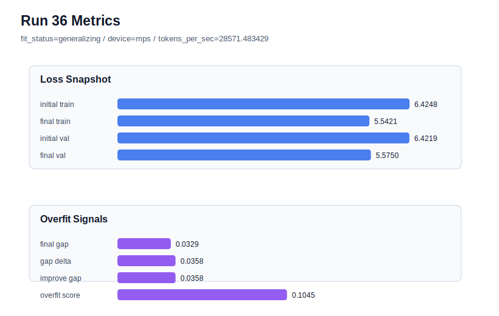

# run 036 실험 보고서

## 이번 가설

max_steps=80 seed=134 learning_rate 완화 단일축 테스트: run 034와 run 035는 validation loss가 5.55대까지 내려갔지만 train loss가 빠르게 낮아지며 gap≈0.0475, overfit_score≈0.148의 overfit_risk를 반복했다. weight_decay=0.02는 거의 효과가 없었으므로, 이번에는 weight_decay를 0.01로 되돌리고 learning_rate만 0.0003에서 0.00025로 낮춰 긴 학습의 train 편향을 완화할 수 있는지 확인한다.

## 왜 이 가설을 세웠는가

최근 evidence는 context_length=48 + quick_gelu + sdpa + tie_embeddings=True + ffn_dropout_position=none 조합이 가장 안정적인 구조/함수 후보임을 보여준다. max_steps=60은 seed=134/151/202 모두 개선됐고, max_steps=80은 seed=202에서 best generalizing을 만들었지만 seed=134에서는 overfit_risk가 되었다. run 035에서 weight_decay만 올려도 gap과 overfit_score가 거의 줄지 않았으므로, 단순 가중치 감쇠보다 optimization 속도가 seed=134 과적합의 원인일 가능성이 크다. learning_rate를 낮추는 것은 구조를 유지하면서 학습 궤적만 바꾸는 해석 가능한 단일축이다.

## 가설 작성 주체

llm_plan:docs/train/next_plan.json

## 바꾼 변수

```json
{
  "learning_rate": 0.00025
}
```

## 고정한 변수

seed=134, vocab_size=600, context_length=48, stride=null, batch_size=8, max_steps=80, weight_decay=0.01, grad_clip=1.0, emb_dim=128, n_heads=4, n_layers=2, drop_rate=0.1, qkv_bias=false, ffn_mult=4, norm_first=false, norm_eps=1e-5, activation_name=quick_gelu, ffn_dropout_position=none, attention_impl=sdpa, tie_embeddings=true, init_std=0.02

## 기대 결과

성공 기준은 run 034 대비 final_generalization_gap과 overfit_score가 의미 있게 낮아지고, final_val_loss가 5.57 이하로 유지되는 것이다. overfit_score가 0.12 이하로 내려가거나 fit_status가 generalizing으로 돌아오면 80-step seed=134 문제는 learning_rate 속도 문제였다는 가설을 지지한다. final_val_loss가 5.59 이상으로 악화되면 learning_rate를 낮춘 만큼 under-training이 생긴 것으로 보고 max_steps=60이나 다른 regularization 축을 우선한다.

## 실험 설정

```json
{
  "run_id": 36,
  "hypothesis": "max_steps=80 seed=134 learning_rate 완화 단일축 테스트: run 034와 run 035는 validation loss가 5.55대까지 내려갔지만 train loss가 빠르게 낮아지며 gap≈0.0475, overfit_score≈0.148의 overfit_risk를 반복했다. weight_decay=0.02는 거의 효과가 없었으므로, 이번에는 weight_decay를 0.01로 되돌리고 learning_rate만 0.0003에서 0.00025로 낮춰 긴 학습의 train 편향을 완화할 수 있는지 확인한다.",
  "seed": 134,
  "vocab_size": 600,
  "min_frequency": 2,
  "context_length": 48,
  "stride": null,
  "batch_size": 8,
  "max_steps": 80,
  "eval_batches": 4,
  "train_ratio": 0.9,
  "learning_rate": 0.00025,
  "weight_decay": 0.01,
  "grad_clip": 1.0,
  "emb_dim": 128,
  "n_heads": 4,
  "n_layers": 2,
  "drop_rate": 0.1,
  "qkv_bias": false,
  "ffn_mult": 4,
  "norm_first": false,
  "norm_eps": 1e-05,
  "activation_name": "quick_gelu",
  "ffn_dropout_position": "none",
  "attention_impl": "sdpa",
  "tie_embeddings": true,
  "init_std": 0.02
}
```

## 실행 환경

```json
{
  "timestamp": "2026-06-02T21:53:29+00:00",
  "hostname": "woonyong-MacBookPro.local",
  "platform": "macOS-26.3.1-arm64-arm-64bit-Mach-O",
  "machine": "arm64",
  "python": "3.13.13",
  "torch": "2.12.0",
  "cpu_count": 10,
  "memory_gb": 24.0,
  "cuda_available": false,
  "cuda_device_count": 0,
  "mps_available": true,
  "resolved_device": "mps",
  "profile": "mps_balanced"
}
```

- corpus: `src/learning/the-verdict.txt`
- artifact_dir: `docs/train/runs/run_036_artifacts`

## 실제 결과

| 지표 | 값 |
| --- | --- |
| initial_train_loss | 6.424758791923523 |
| initial_val_loss | 6.4218573570251465 |
| final_train_loss | 5.542137503623962 |
| final_val_loss | 5.575037797292073 |
| final_generalization_gap | 0.03290029366811087 |
| generalization_gap_delta | 0.035801728566487334 |
| train_val_improvement_gap | 0.035801728566487334 |
| overfit_score | 0.10450375080108554 |
| fit_status | generalizing |
| parameter_count | 478976 |
| tokens_per_sec | 28571.483429499123 |
| elapsed_sec | 1.0415980000980198 |
| device | mps |

## 시각 지표




- 대시보드: `../dashboard.md`
- 지표 요약 CSV: `../metrics_summary.csv`

## 과적합 판단

일반화 개선 신호. final gap=0.0329, overfit_score=0.1045. seed 반복으로 재현성을 확인할 만하다.

## 결론

현재 best 후보: run 33 / val=5.553315162658691 / status=generalizing

## 다음 실험 제안

- 성공 시: learning_rate=0.00025가 seed=134에서 gap을 줄이고 validation을 유지하면 같은 설정을 seed=202 또는 seed=151에 반복해 best run033의 성능을 더 낮은 overfit_score로 재현할 수 있는지 확인한다. 이후에는 0.00025와 0.0003 사이의 중간값을 탐색하기보다 seed 반복을 먼저 해서 안정성을 본다.
- 과적합 시: learning_rate=0.00025에서도 overfit_risk가 유지되면 80-step seed=134의 문제는 학습 속도만으로 해결되지 않는 것으로 보고, max_steps=60을 안전 기본 후보로 되돌리거나 drop_rate=0.12를 단일축으로 테스트한다. validation이 크게 악화되면 낮은 learning_rate는 under-training으로 판단한다.
