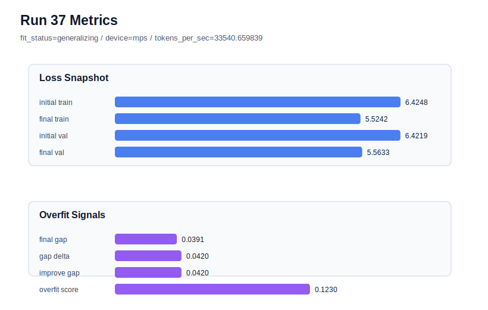

# run 037 실험 보고서

## 이번 가설

max_steps=80 seed=134 learning_rate 중간값 균형 테스트: run 034는 learning_rate=0.0003에서 final_val_loss=5.554664로 강했지만 overfit_risk였고, run 036은 learning_rate=0.00025에서 generalizing으로 회복했지만 final_val_loss가 5.575038로 악화되었다. 같은 설정에서 learning_rate만 0.000275로 두면, 0.0003의 validation 성능을 일부 유지하면서 0.00025가 보여준 gap/overfit_score 완화 효과를 얻을 수 있는지 확인한다.

## 왜 이 가설을 세웠는가

run 035의 weight_decay=0.02는 run 034 대비 gap과 overfit_score를 거의 줄이지 못했으므로 seed=134의 80-step 과적합은 단순 가중치 감쇠보다 optimization 속도와 더 관련 있어 보인다. run 036은 learning_rate를 0.00025로 낮추자 fit_status가 overfit_risk에서 generalizing으로 돌아왔지만 validation loss 손실이 컸다. 따라서 seed를 바꾸기 전에 같은 seed=134에서 0.0003과 0.00025 사이의 중간 learning_rate를 테스트하면, 과적합 완화와 validation 성능 사이의 균형점이 존재하는지 더 직접적으로 알 수 있다. 구조, activation, attention 구현은 모두 유지한다.

## 가설 작성 주체

llm_plan:docs/train/next_plan.json

## 바꾼 변수

```json
{
  "learning_rate": 0.000275
}
```

## 고정한 변수

seed=134, vocab_size=600, context_length=48, stride=null, batch_size=8, max_steps=80, weight_decay=0.01, grad_clip=1.0, emb_dim=128, n_heads=4, n_layers=2, drop_rate=0.1, qkv_bias=false, ffn_mult=4, norm_first=false, norm_eps=1e-5, activation_name=quick_gelu, ffn_dropout_position=none, attention_impl=sdpa, tie_embeddings=true, init_std=0.02

## 기대 결과

성공 기준은 final_val_loss가 run 036의 5.575038보다 낮고, run 034/035보다 final_generalization_gap과 overfit_score가 낮으며, fit_status가 generalizing 또는 최소한 overfit_score 0.12 이하를 유지하는 것이다. final_val_loss가 5.56 안팎이고 overfit_score가 0.12 이하이면 0.000275가 seed=134의 균형점 후보가 된다. val은 좋아지지만 overfit_risk가 반복되면 0.0003 쪽 학습 속도 문제가 여전히 남은 것으로 본다.

## 실험 설정

```json
{
  "run_id": 37,
  "hypothesis": "max_steps=80 seed=134 learning_rate 중간값 균형 테스트: run 034는 learning_rate=0.0003에서 final_val_loss=5.554664로 강했지만 overfit_risk였고, run 036은 learning_rate=0.00025에서 generalizing으로 회복했지만 final_val_loss가 5.575038로 악화되었다. 같은 설정에서 learning_rate만 0.000275로 두면, 0.0003의 validation 성능을 일부 유지하면서 0.00025가 보여준 gap/overfit_score 완화 효과를 얻을 수 있는지 확인한다.",
  "seed": 134,
  "vocab_size": 600,
  "min_frequency": 2,
  "context_length": 48,
  "stride": null,
  "batch_size": 8,
  "max_steps": 80,
  "eval_batches": 4,
  "train_ratio": 0.9,
  "learning_rate": 0.000275,
  "weight_decay": 0.01,
  "grad_clip": 1.0,
  "emb_dim": 128,
  "n_heads": 4,
  "n_layers": 2,
  "drop_rate": 0.1,
  "qkv_bias": false,
  "ffn_mult": 4,
  "norm_first": false,
  "norm_eps": 1e-05,
  "activation_name": "quick_gelu",
  "ffn_dropout_position": "none",
  "attention_impl": "sdpa",
  "tie_embeddings": true,
  "init_std": 0.02
}
```

## 실행 환경

```json
{
  "timestamp": "2026-06-02T21:58:45+00:00",
  "hostname": "woonyong-MacBookPro.local",
  "platform": "macOS-26.3.1-arm64-arm-64bit-Mach-O",
  "machine": "arm64",
  "python": "3.13.13",
  "torch": "2.12.0",
  "cpu_count": 10,
  "memory_gb": 24.0,
  "cuda_available": false,
  "cuda_device_count": 0,
  "mps_available": true,
  "resolved_device": "mps",
  "profile": "mps_balanced"
}
```

- corpus: `src/learning/the-verdict.txt`
- artifact_dir: `docs/train/runs/run_037_artifacts`

## 실제 결과

| 지표 | 값 |
| --- | --- |
| initial_train_loss | 6.424758791923523 |
| initial_val_loss | 6.4218573570251465 |
| final_train_loss | 5.524239540100098 |
| final_val_loss | 5.5632913907368975 |
| final_generalization_gap | 0.039051850636799834 |
| generalization_gap_delta | 0.0419532855351763 |
| train_val_improvement_gap | 0.0419532855351763 |
| overfit_score | 0.12295842170715243 |
| fit_status | generalizing |
| parameter_count | 478976 |
| tokens_per_sec | 33540.6598385011 |
| elapsed_sec | 0.8872812921181321 |
| device | mps |

## 시각 지표




- 대시보드: `../dashboard.md`
- 지표 요약 CSV: `../metrics_summary.csv`

## 과적합 판단

일반화 개선 신호. final gap=0.0391, overfit_score=0.1230. seed 반복으로 재현성을 확인할 만하다.

## 결론

현재 best 후보: run 33 / val=5.553315162658691 / status=generalizing

## 다음 실험 제안

- 성공 시: learning_rate=0.000275가 seed=134에서 validation과 overfit_score 균형을 만들면, 같은 설정을 seed=202에 반복해 run 033의 best 성능을 더 안정적인 gap으로 재현할 수 있는지 확인한다. 그 뒤 seed=151 반복으로 평균 후보를 판단한다.
- 과적합 시: 0.000275에서도 overfit_risk가 유지되면 learning_rate를 낮추는 것만으로는 seed=134의 80-step 균형이 어렵다고 보고, max_steps=60을 더 안전한 기본값으로 유지하거나 drop_rate=0.12 단일축을 테스트한다. validation이 run036보다 악화되면 80-step의 낮은 learning_rate는 under-training으로 판단한다.
