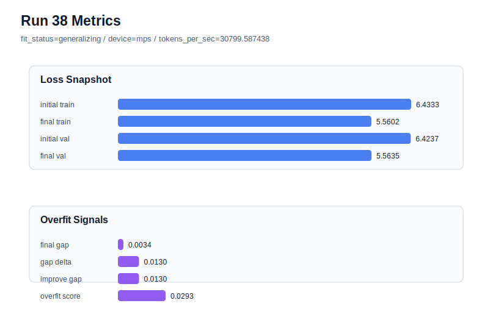

# run 038 실험 보고서

## 이번 가설

learning_rate=0.000275 seed=202 강건성 검증: seed=134에서는 learning_rate=0.000275가 0.0003의 과적합 위험과 0.00025의 validation 손실 사이에서 중간 균형을 만들었다. 같은 max_steps=80 + context_length=48 + quick_gelu + sdpa 기준을 seed=202에 적용하면, best run033의 낮은 validation loss를 유지하면서 generalization gap과 overfit_score를 더 낮추거나 안정화할 수 있는지 확인한다.

## 왜 이 가설을 세웠는가

run 033은 seed=202, learning_rate=0.0003, max_steps=80에서 final_val_loss=5.553315, gap=0.010401, overfit_score=0.050397로 현재 best다. 반면 seed=134에서는 같은 learning_rate=0.0003이 run 034에서 overfit_risk를 만들었고, learning_rate=0.000275는 run 037에서 final_val_loss=5.563291, gap=0.039052, overfit_score=0.122958의 generalizing 중간점을 만들었다. seed=202는 이미 안정적이므로, 낮춘 learning_rate가 불필요하게 underfit을 만들지 아니면 best 후보의 gap을 더 낮추는지 확인하는 것이 다음으로 해석 가능하다.

## 가설 작성 주체

llm_plan:docs/train/next_plan.json

## 바꾼 변수

```json
{
  "seed": 202
}
```

## 고정한 변수

vocab_size=600, context_length=48, stride=null, batch_size=8, max_steps=80, learning_rate=0.000275, weight_decay=0.01, grad_clip=1.0, emb_dim=128, n_heads=4, n_layers=2, drop_rate=0.1, qkv_bias=false, ffn_mult=4, norm_first=false, norm_eps=1e-5, activation_name=quick_gelu, ffn_dropout_position=none, attention_impl=sdpa, tie_embeddings=true, init_std=0.02

## 기대 결과

성공 기준은 final_val_loss가 run 033의 5.553315에 근접하거나 더 낮고, overfit_score가 0.05 안팎 이하로 유지되는 것이다. final_val_loss가 5.57 이상으로 악화되면 seed=202에서는 0.0003이 더 적절하고 0.000275는 under-training 쪽이라고 본다. gap과 overfit_score가 좋아져도 validation이 명확히 나빠지면 best 후보는 유지하지 않는다.

## 실험 설정

```json
{
  "run_id": 38,
  "hypothesis": "learning_rate=0.000275 seed=202 강건성 검증: seed=134에서는 learning_rate=0.000275가 0.0003의 과적합 위험과 0.00025의 validation 손실 사이에서 중간 균형을 만들었다. 같은 max_steps=80 + context_length=48 + quick_gelu + sdpa 기준을 seed=202에 적용하면, best run033의 낮은 validation loss를 유지하면서 generalization gap과 overfit_score를 더 낮추거나 안정화할 수 있는지 확인한다.",
  "seed": 202,
  "vocab_size": 600,
  "min_frequency": 2,
  "context_length": 48,
  "stride": null,
  "batch_size": 8,
  "max_steps": 80,
  "eval_batches": 4,
  "train_ratio": 0.9,
  "learning_rate": 0.000275,
  "weight_decay": 0.01,
  "grad_clip": 1.0,
  "emb_dim": 128,
  "n_heads": 4,
  "n_layers": 2,
  "drop_rate": 0.1,
  "qkv_bias": false,
  "ffn_mult": 4,
  "norm_first": false,
  "norm_eps": 1e-05,
  "activation_name": "quick_gelu",
  "ffn_dropout_position": "none",
  "attention_impl": "sdpa",
  "tie_embeddings": true,
  "init_std": 0.02
}
```

## 실행 환경

```json
{
  "timestamp": "2026-06-02T22:03:32+00:00",
  "hostname": "woonyong-MacBookPro.local",
  "platform": "macOS-26.3.1-arm64-arm-64bit-Mach-O",
  "machine": "arm64",
  "python": "3.13.13",
  "torch": "2.12.0",
  "cpu_count": 10,
  "memory_gb": 24.0,
  "cuda_available": false,
  "cuda_device_count": 0,
  "mps_available": true,
  "resolved_device": "mps",
  "profile": "mps_balanced"
}
```

- corpus: `src/learning/the-verdict.txt`
- artifact_dir: `docs/train/runs/run_038_artifacts`

## 실제 결과

| 지표 | 값 |
| --- | --- |
| initial_train_loss | 6.433324933052063 |
| initial_val_loss | 6.423727830251058 |
| final_train_loss | 5.5601924657821655 |
| final_val_loss | 5.563548405965169 |
| final_generalization_gap | 0.0033559401830034474 |
| generalization_gap_delta | 0.012953042984008789 |
| train_val_improvement_gap | 0.012953042984008789 |
| overfit_score | 0.029262026151021026 |
| fit_status | generalizing |
| parameter_count | 478976 |
| tokens_per_sec | 30799.587437624352 |
| elapsed_sec | 0.9662467089947313 |
| device | mps |

## 시각 지표




- 대시보드: `../dashboard.md`
- 지표 요약 CSV: `../metrics_summary.csv`

## 과적합 판단

일반화 개선 신호. final gap=0.0034, overfit_score=0.0293. seed 반복으로 재현성을 확인할 만하다.

## 결론

현재 best 후보: run 33 / val=5.553315162658691 / status=generalizing

## 다음 실험 제안

- 성공 시: seed=202에서도 learning_rate=0.000275가 run033과 비슷한 validation에 더 낮은 overfit_score를 만들면 seed=151로 반복해 세 seed 평균 후보로 평가한다. 성공 시 0.000275를 max_steps=80 기본 learning_rate 후보로 올린다.
- 과적합 시: seed=202에서 overfit_score가 커지거나 validation이 나빠지면 learning_rate=0.000275는 seed=134용 보정에 가깝다고 보고, best run033 설정을 유지한다. 다음에는 seed=151에서 max_steps=80 learning_rate=0.0003을 먼저 확인하거나 drop_rate=0.12를 seed=134에 단일축으로 테스트한다.
