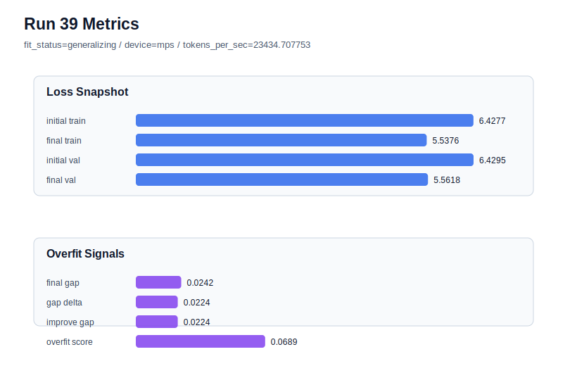

# run 039 실험 보고서

## 이번 가설

learning_rate=0.000275 seed=151 평균 후보 검증: seed=134와 seed=202에서 learning_rate=0.000275는 max_steps=80 조건의 과적합 위험을 줄이면서 generalizing을 유지했다. 같은 설정을 seed=151에 반복하면, 0.000275가 특정 seed 보정이 아니라 세 seed 평균에서 안정적인 learning_rate 후보인지 판단할 수 있다.

## 왜 이 가설을 세웠는가

run 037(seed=134, lr=0.000275)은 final_val_loss=5.563291, overfit_score=0.122958로 run 034의 overfit_risk를 피하면서 validation 손실도 0.00025보다 줄였다. run 038(seed=202, lr=0.000275)은 final_val_loss=5.563548로 run 033보다 조금 나빴지만 gap=0.003356, overfit_score=0.029262로 매우 안정적이었다. seed=151은 max_steps=60에서 medium-risk generalizing을 보였으므로, max_steps=80과 lr=0.000275의 조합이 평균 성능과 과적합 균형을 유지하는지 확인하기 좋은 남은 seed다.

## 가설 작성 주체

llm_plan:docs/train/next_plan.json

## 바꾼 변수

```json
{
  "seed": 151
}
```

## 고정한 변수

vocab_size=600, context_length=48, stride=null, batch_size=8, max_steps=80, learning_rate=0.000275, weight_decay=0.01, grad_clip=1.0, emb_dim=128, n_heads=4, n_layers=2, drop_rate=0.1, qkv_bias=false, ffn_mult=4, norm_first=false, norm_eps=1e-5, activation_name=quick_gelu, ffn_dropout_position=none, attention_impl=sdpa, tie_embeddings=true, init_std=0.02

## 기대 결과

성공 기준은 final_val_loss가 seed=151의 max_steps=60 결과인 run 031의 5.595870보다 낮고, overfit_score가 0.12 이하 또는 fit_status=generalizing을 유지하는 것이다. final_val_loss가 5.56~5.58 범위이고 overfit_score가 0.12 안팎 이하이면 0.000275를 세 seed 평균 후보로 볼 수 있다. validation이 좋아져도 overfit_risk가 되면 seed=151에는 추가 regularization이나 max_steps=60 유지가 필요하다.

## 실험 설정

```json
{
  "run_id": 39,
  "hypothesis": "learning_rate=0.000275 seed=151 평균 후보 검증: seed=134와 seed=202에서 learning_rate=0.000275는 max_steps=80 조건의 과적합 위험을 줄이면서 generalizing을 유지했다. 같은 설정을 seed=151에 반복하면, 0.000275가 특정 seed 보정이 아니라 세 seed 평균에서 안정적인 learning_rate 후보인지 판단할 수 있다.",
  "seed": 151,
  "vocab_size": 600,
  "min_frequency": 2,
  "context_length": 48,
  "stride": null,
  "batch_size": 8,
  "max_steps": 80,
  "eval_batches": 4,
  "train_ratio": 0.9,
  "learning_rate": 0.000275,
  "weight_decay": 0.01,
  "grad_clip": 1.0,
  "emb_dim": 128,
  "n_heads": 4,
  "n_layers": 2,
  "drop_rate": 0.1,
  "qkv_bias": false,
  "ffn_mult": 4,
  "norm_first": false,
  "norm_eps": 1e-05,
  "activation_name": "quick_gelu",
  "ffn_dropout_position": "none",
  "attention_impl": "sdpa",
  "tie_embeddings": true,
  "init_std": 0.02
}
```

## 실행 환경

```json
{
  "timestamp": "2026-06-02T22:08:29+00:00",
  "hostname": "woonyong-MacBookPro.local",
  "platform": "macOS-26.3.1-arm64-arm-64bit-Mach-O",
  "machine": "arm64",
  "python": "3.13.13",
  "torch": "2.12.0",
  "cpu_count": 10,
  "memory_gb": 24.0,
  "cuda_available": false,
  "cuda_device_count": 0,
  "mps_available": true,
  "resolved_device": "mps",
  "profile": "mps_balanced"
}
```

- corpus: `src/learning/the-verdict.txt`
- artifact_dir: `docs/train/runs/run_039_artifacts`

## 실제 결과

| 지표 | 값 |
| --- | --- |
| initial_train_loss | 6.427652597427368 |
| initial_val_loss | 6.429500897725423 |
| final_train_loss | 5.537592887878418 |
| final_val_loss | 5.561801274617513 |
| final_generalization_gap | 0.024208386739094756 |
| generalization_gap_delta | 0.02236008644104004 |
| train_val_improvement_gap | 0.02236008644104004 |
| overfit_score | 0.06892855962117483 |
| fit_status | generalizing |
| parameter_count | 478976 |
| tokens_per_sec | 23434.707752632366 |
| elapsed_sec | 1.2699112920090556 |
| device | mps |

## 시각 지표




- 대시보드: `../dashboard.md`
- 지표 요약 CSV: `../metrics_summary.csv`

## 과적합 판단

일반화 개선 신호. final gap=0.0242, overfit_score=0.0689. seed 반복으로 재현성을 확인할 만하다.

## 결론

현재 best 후보: run 33 / val=5.553315162658691 / status=generalizing

## 다음 실험 제안

- 성공 시: seed=151에서도 learning_rate=0.000275가 generalizing을 유지하면, 세 seed의 평균 validation/overfit_score를 기준으로 lr=0.000275와 run033의 lr=0.0003 best 후보를 비교한다. 이후에는 drop_rate=0.12를 seed=134 또는 seed=151에서 단일축으로 테스트해 0.0003의 낮은 loss와 0.000275의 안정성을 결합할 수 있는지 확인한다.
- 과적합 시: seed=151에서 overfit_risk가 생기면 lr=0.000275는 seed=202에는 안정적이지만 평균 후보로는 불충분하다고 보고, max_steps=60을 안전 기준으로 유지하거나 drop_rate=0.12/learning_rate=0.00025 중 하나를 seed=151에서 단일축으로 검토한다.
