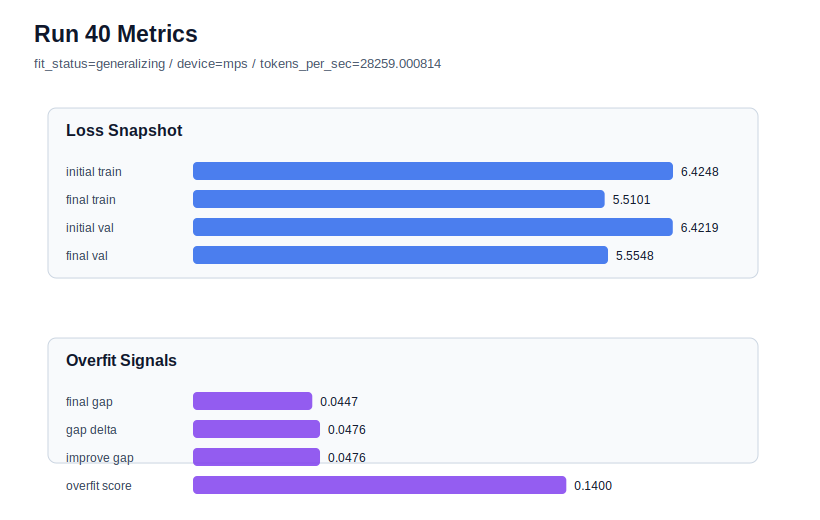

# run 040 실험 보고서

## 이번 가설

drop_rate=0.12 seed=134 과적합 완화 테스트: run034는 learning_rate=0.0003, max_steps=80에서 validation loss는 5.554664로 강했지만 gap=0.047536, overfit_score=0.148410의 overfit_risk가 되었다. weight_decay=0.02는 거의 효과가 없었고, learning_rate=0.000275는 안정적이지만 validation loss가 약간 밀렸다. 따라서 learning_rate=0.0003의 낮은 validation 후보를 유지한 채 drop_rate만 0.10에서 0.12로 아주 작게 올리면 train 쪽 과도 적합을 줄이면서 low-loss 영역을 보존할 수 있는지 확인한다.

## 왜 이 가설을 세웠는가

최근 run037-run039는 learning_rate=0.000275가 세 seed에서 generalizing을 유지한다는 것을 보여줬지만, best run033 및 seed=134의 run034보다 validation loss는 약간 높았다. run034와 run035의 비교는 weight_decay 증가가 gap과 overfit_score를 거의 낮추지 못한다는 증거이고, run036-run039는 learning_rate를 낮추면 과적합은 줄지만 validation의 최저점도 일부 포기한다는 증거다. 다음으로 해석 가능한 축은 구조나 activation을 바꾸지 않는 dropout 강도다. drop_rate=0.12는 기존 0.10에서 작은 이동이라 MPS 회차를 길게 점유하지 않으면서, 0.0003 학습률의 낮은 validation loss와 0.000275 계열의 안정성 사이의 결합 가능성을 볼 수 있다.

## 가설 작성 주체

llm_plan:docs/train/next_plan.json

## 바꾼 변수

```json
{
  "drop_rate": 0.12
}
```

## 고정한 변수

vocab_size=600, context_length=48, stride=null, batch_size=8, max_steps=80, learning_rate=0.0003, weight_decay=0.01, grad_clip=1.0, emb_dim=128, n_heads=4, n_layers=2, qkv_bias=false, ffn_mult=4, norm_first=false, norm_eps=1e-5, activation_name=quick_gelu, ffn_dropout_position=none, attention_impl=sdpa, tie_embeddings=true, init_std=0.02, seed=134

## 기대 결과

성공 기준은 run034 대비 final_generalization_gap이 0.0475보다 낮아지고 overfit_score가 0.12 이하 또는 fit_status=generalizing으로 회복되면서, final_val_loss가 5.565 이하에 머무는 것이다. final_val_loss가 5.57 이상으로 악화되면 dropout 증가가 under-training을 만든 것으로 본다. gap과 overfit_score가 거의 그대로면 seed=134의 80-step 문제는 dropout 강도보다 optimization 또는 데이터 window 쪽 원인일 가능성이 높다.

## 실험 설정

```json
{
  "run_id": 40,
  "hypothesis": "drop_rate=0.12 seed=134 과적합 완화 테스트: run034는 learning_rate=0.0003, max_steps=80에서 validation loss는 5.554664로 강했지만 gap=0.047536, overfit_score=0.148410의 overfit_risk가 되었다. weight_decay=0.02는 거의 효과가 없었고, learning_rate=0.000275는 안정적이지만 validation loss가 약간 밀렸다. 따라서 learning_rate=0.0003의 낮은 validation 후보를 유지한 채 drop_rate만 0.10에서 0.12로 아주 작게 올리면 train 쪽 과도 적합을 줄이면서 low-loss 영역을 보존할 수 있는지 확인한다.",
  "seed": 134,
  "vocab_size": 600,
  "min_frequency": 2,
  "context_length": 48,
  "stride": null,
  "batch_size": 8,
  "max_steps": 80,
  "eval_batches": 4,
  "train_ratio": 0.9,
  "learning_rate": 0.0003,
  "weight_decay": 0.01,
  "grad_clip": 1.0,
  "emb_dim": 128,
  "n_heads": 4,
  "n_layers": 2,
  "drop_rate": 0.12,
  "qkv_bias": false,
  "ffn_mult": 4,
  "norm_first": false,
  "norm_eps": 1e-05,
  "activation_name": "quick_gelu",
  "ffn_dropout_position": "none",
  "attention_impl": "sdpa",
  "tie_embeddings": true,
  "init_std": 0.02
}
```

## 실행 환경

```json
{
  "timestamp": "2026-06-02T22:16:53+00:00",
  "hostname": "woonyong-MacBookPro.local",
  "platform": "macOS-26.3.1-arm64-arm-64bit-Mach-O",
  "machine": "arm64",
  "python": "3.13.13",
  "torch": "2.12.0",
  "cpu_count": 10,
  "memory_gb": 24.0,
  "cuda_available": false,
  "cuda_device_count": 0,
  "mps_available": true,
  "resolved_device": "mps",
  "profile": "mps_balanced"
}
```

- corpus: `src/learning/the-verdict.txt`
- artifact_dir: `docs/train/runs/run_040_artifacts`

## 실제 결과

| 지표 | 값 |
| --- | --- |
| initial_train_loss | 6.424758791923523 |
| initial_val_loss | 6.4218573570251465 |
| final_train_loss | 5.510094881057739 |
| final_val_loss | 5.554825623830159 |
| final_generalization_gap | 0.04473074277241995 |
| generalization_gap_delta | 0.047632177670796416 |
| train_val_improvement_gap | 0.047632177670796416 |
| overfit_score | 0.13999509811401278 |
| fit_status | generalizing |
| parameter_count | 478976 |
| tokens_per_sec | 28259.000813938168 |
| elapsed_sec | 1.0531157911755145 |
| device | mps |

## 시각 지표




- 대시보드: `../dashboard.md`
- 지표 요약 CSV: `../metrics_summary.csv`

## 과적합 판단

일반화 개선 신호. final gap=0.0447, overfit_score=0.1400. seed 반복으로 재현성을 확인할 만하다.

## 결론

현재 best 후보: run 33 / val=5.553315162658691 / status=generalizing

## 다음 실험 제안

- 성공 시: drop_rate=0.12가 validation을 유지하며 overfit_score를 낮추면 seed=151 또는 seed=202에서 같은 설정을 반복해 regularization 이득이 seed 전반에 해롭지 않은지 확인한다. 이후 lr=0.0003/drop_rate=0.12 계열과 lr=0.000275/drop_rate=0.10 계열을 평균 validation, gap, overfit_score 기준으로 비교한다.
- 과적합 시: drop_rate=0.12에서도 overfit_risk가 유지되면 dropout만으로는 seed=134의 80-step 과적합을 막기 어렵다고 보고, lr=0.000275를 안정 기본 후보로 유지하거나 max_steps=60을 안전 기준으로 되돌린다. 다음 후보는 drop_rate=0.12를 lr=0.000275와 결합하는 보수적 실험 또는 max_steps=70 중간 길이 테스트가 된다.
