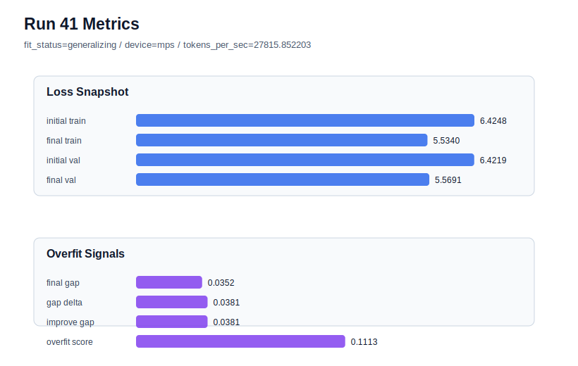

# run 041 실험 보고서

## 이번 가설

max_steps=70 seed=134 학습 길이 경계 테스트: run030의 max_steps=60은 seed=134에서 generalizing을 유지했지만 final_val_loss=5.588833으로 아직 덜 학습된 신호가 있었고, run034의 max_steps=80은 final_val_loss=5.554664까지 좋아졌지만 gap=0.047536, overfit_score=0.148410의 overfit_risk가 되었다. run040의 drop_rate=0.12는 validation을 거의 유지하며 status를 generalizing으로 되돌렸지만 gap과 overfit_score 감소폭은 작았다. 따라서 dropout을 더 건드리기 전에 max_steps만 70으로 줄이면, 80-step의 낮은 validation 이득을 상당 부분 유지하면서 seed=134의 과적합 신호를 줄일 수 있는지 확인한다.

## 왜 이 가설을 세웠는가

최근 증거를 종합하면 context_length=48 + quick_gelu + sdpa + tie_embeddings=True + ffn_dropout_position=none은 유지할 가치가 높다. 과적합 완화 축에서는 weight_decay=0.02가 거의 무효였고, drop_rate=0.12는 약한 개선만 만들었다. learning_rate=0.000275는 세 seed에서 안정적이지만 best validation보다 조금 높다. 남은 핵심 질문은 learning_rate=0.0003 자체가 나쁜 것이 아니라 80 step까지 밀었을 때 seed=134에서 train 쪽 개선이 과하게 진행되는지다. max_steps=70은 구조와 함수 교체 없이 학습 길이만 조절하는 단일축이며, MPS balanced 장비에서 짧게 확인할 수 있다.

## 가설 작성 주체

llm_plan:docs/train/next_plan.json

## 바꾼 변수

```json
{
  "max_steps": 70
}
```

## 고정한 변수

vocab_size=600, context_length=48, stride=null, batch_size=8, learning_rate=0.0003, weight_decay=0.01, grad_clip=1.0, emb_dim=128, n_heads=4, n_layers=2, drop_rate=0.1, qkv_bias=false, ffn_mult=4, norm_first=false, norm_eps=1e-5, activation_name=quick_gelu, ffn_dropout_position=none, attention_impl=sdpa, tie_embeddings=true, init_std=0.02, seed=134

## 기대 결과

성공 기준은 run030(max_steps=60)보다 final_val_loss가 낮고, run034(max_steps=80)보다 final_generalization_gap과 overfit_score가 낮아지는 것이다. 구체적으로 final_val_loss가 5.565 이하이고 overfit_score가 0.12 이하 또는 gap이 0.04 이하이면 max_steps=70을 seed=134의 균형점 후보로 본다. final_val_loss가 5.58 이상이면 70 step도 under-training에 가깝고, gap이 0.047 전후로 유지되면 학습 길이만으로는 seed=134 과적합을 충분히 조절하지 못한 것으로 본다.

## 실험 설정

```json
{
  "run_id": 41,
  "hypothesis": "max_steps=70 seed=134 학습 길이 경계 테스트: run030의 max_steps=60은 seed=134에서 generalizing을 유지했지만 final_val_loss=5.588833으로 아직 덜 학습된 신호가 있었고, run034의 max_steps=80은 final_val_loss=5.554664까지 좋아졌지만 gap=0.047536, overfit_score=0.148410의 overfit_risk가 되었다. run040의 drop_rate=0.12는 validation을 거의 유지하며 status를 generalizing으로 되돌렸지만 gap과 overfit_score 감소폭은 작았다. 따라서 dropout을 더 건드리기 전에 max_steps만 70으로 줄이면, 80-step의 낮은 validation 이득을 상당 부분 유지하면서 seed=134의 과적합 신호를 줄일 수 있는지 확인한다.",
  "seed": 134,
  "vocab_size": 600,
  "min_frequency": 2,
  "context_length": 48,
  "stride": null,
  "batch_size": 8,
  "max_steps": 70,
  "eval_batches": 4,
  "train_ratio": 0.9,
  "learning_rate": 0.0003,
  "weight_decay": 0.01,
  "grad_clip": 1.0,
  "emb_dim": 128,
  "n_heads": 4,
  "n_layers": 2,
  "drop_rate": 0.1,
  "qkv_bias": false,
  "ffn_mult": 4,
  "norm_first": false,
  "norm_eps": 1e-05,
  "activation_name": "quick_gelu",
  "ffn_dropout_position": "none",
  "attention_impl": "sdpa",
  "tie_embeddings": true,
  "init_std": 0.02
}
```

## 실행 환경

```json
{
  "timestamp": "2026-06-02T22:18:58+00:00",
  "hostname": "woonyong-MacBookPro.local",
  "platform": "macOS-26.3.1-arm64-arm-64bit-Mach-O",
  "machine": "arm64",
  "python": "3.13.13",
  "torch": "2.12.0",
  "cpu_count": 10,
  "memory_gb": 24.0,
  "cuda_available": false,
  "cuda_device_count": 0,
  "mps_available": true,
  "resolved_device": "mps",
  "profile": "mps_balanced"
}
```

- corpus: `src/learning/the-verdict.txt`
- artifact_dir: `docs/train/runs/run_041_artifacts`

## 실제 결과

| 지표 | 값 |
| --- | --- |
| initial_train_loss | 6.424758791923523 |
| initial_val_loss | 6.4218573570251465 |
| final_train_loss | 5.533980846405029 |
| final_val_loss | 5.569135665893555 |
| final_generalization_gap | 0.03515481948852539 |
| generalization_gap_delta | 0.038056254386901855 |
| train_val_improvement_gap | 0.038056254386901855 |
| overfit_score | 0.1112673282623291 |
| fit_status | generalizing |
| parameter_count | 478976 |
| tokens_per_sec | 27815.8522026886 |
| elapsed_sec | 0.940470915986225 |
| device | mps |

## 시각 지표




- 대시보드: `../dashboard.md`
- 지표 요약 CSV: `../metrics_summary.csv`

## 과적합 판단

일반화 개선 신호. final gap=0.0352, overfit_score=0.1113. seed 반복으로 재현성을 확인할 만하다.

## 결론

현재 best 후보: run 33 / val=5.553315162658691 / status=generalizing

## 다음 실험 제안

- 성공 시: max_steps=70이 validation과 overfit_score의 균형을 만들면 seed=151 또는 seed=202에서 같은 설정을 반복해 70-step이 평균적으로 안정적인지 확인한다. 성공하면 lr=0.0003/max_steps=70 계열, lr=0.000275/max_steps=80 계열, run033의 lr=0.0003/max_steps=80 seed=202 계열을 seed 평균 기준으로 비교한다.
- 과적합 시: max_steps=70에서도 gap과 overfit_score가 크게 유지되면 seed=134에서는 learning_rate=0.0003 자체가 빠른 학습으로 train 편향을 만든다고 보고 lr=0.000275를 안정 기본 후보로 유지한다. 다음에는 lr=0.000275와 drop_rate=0.12의 결합 또는 max_steps=60 seed 반복을 선택한다.
