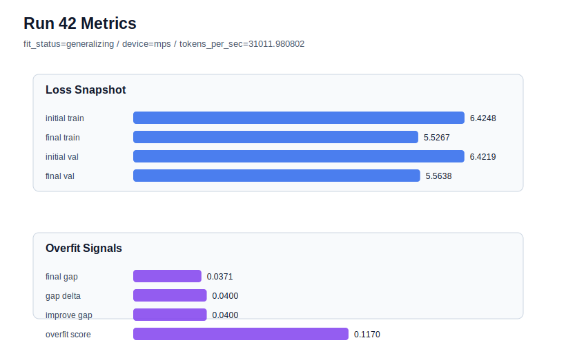

# run 042 실험 보고서

## 이번 가설

learning_rate=0.000275 + drop_rate=0.12 seed=134 결합 테스트: run037은 learning_rate=0.000275에서 run034의 overfit_risk를 피하며 final_val_loss=5.563291, gap=0.039052, overfit_score=0.122958을 만들었고, run040은 learning_rate=0.0003에서 drop_rate=0.12를 적용해 validation을 거의 유지했지만 overfit_score 감소폭은 작았다. 따라서 안정 learning rate 계열인 0.000275 위에서 drop_rate만 0.10에서 0.12로 올리면, validation 손실을 크게 늘리지 않으면서 overfit_score를 0.10 이하로 낮출 수 있는지 확인한다.

## 왜 이 가설을 세웠는가

최근 run041의 max_steps=70은 gap과 overfit_score를 줄였지만 final_val_loss가 5.569136으로 악화되어, 학습 길이 축만으로는 low-loss와 low-overfit의 균형이 충분하지 않았다. run035의 weight_decay 증가는 무효에 가까웠고, run040의 dropout 증가는 lr=0.0003 조건에서만 약한 개선을 보였다. 반면 learning_rate=0.000275는 seed=134/151/202에서 모두 generalizing을 유지해 가장 안정적인 optimization 후보로 볼 수 있다. 이번 실험은 run037을 기준으로 drop_rate만 바꾸는 단일축 결합 검증이며, 모델 구조와 함수 선택은 그대로 유지한다.

## 가설 작성 주체

llm_plan:docs/train/next_plan.json

## 바꾼 변수

```json
{
  "drop_rate": 0.12
}
```

## 고정한 변수

vocab_size=600, context_length=48, stride=null, batch_size=8, max_steps=80, learning_rate=0.000275, weight_decay=0.01, grad_clip=1.0, emb_dim=128, n_heads=4, n_layers=2, qkv_bias=false, ffn_mult=4, norm_first=false, norm_eps=1e-5, activation_name=quick_gelu, ffn_dropout_position=none, attention_impl=sdpa, tie_embeddings=true, init_std=0.02, seed=134

## 기대 결과

성공 기준은 run037 대비 final_generalization_gap과 overfit_score가 낮아지고, final_val_loss가 5.57 이하에 머무는 것이다. 특히 overfit_score가 0.10 이하 또는 risk가 low로 내려가면 lr=0.000275에 약한 dropout을 결합하는 방향이 의미 있다고 본다. final_val_loss가 5.58 이상이면 dropout 추가가 under-training을 만든 것으로 보고, gap이 거의 줄지 않으면 seed=134 과적합은 dropout보다 optimization 경로 또는 데이터 window 특성의 영향이 크다고 본다.

## 실험 설정

```json
{
  "run_id": 42,
  "hypothesis": "learning_rate=0.000275 + drop_rate=0.12 seed=134 결합 테스트: run037은 learning_rate=0.000275에서 run034의 overfit_risk를 피하며 final_val_loss=5.563291, gap=0.039052, overfit_score=0.122958을 만들었고, run040은 learning_rate=0.0003에서 drop_rate=0.12를 적용해 validation을 거의 유지했지만 overfit_score 감소폭은 작았다. 따라서 안정 learning rate 계열인 0.000275 위에서 drop_rate만 0.10에서 0.12로 올리면, validation 손실을 크게 늘리지 않으면서 overfit_score를 0.10 이하로 낮출 수 있는지 확인한다.",
  "seed": 134,
  "vocab_size": 600,
  "min_frequency": 2,
  "context_length": 48,
  "stride": null,
  "batch_size": 8,
  "max_steps": 80,
  "eval_batches": 4,
  "train_ratio": 0.9,
  "learning_rate": 0.000275,
  "weight_decay": 0.01,
  "grad_clip": 1.0,
  "emb_dim": 128,
  "n_heads": 4,
  "n_layers": 2,
  "drop_rate": 0.12,
  "qkv_bias": false,
  "ffn_mult": 4,
  "norm_first": false,
  "norm_eps": 1e-05,
  "activation_name": "quick_gelu",
  "ffn_dropout_position": "none",
  "attention_impl": "sdpa",
  "tie_embeddings": true,
  "init_std": 0.02
}
```

## 실행 환경

```json
{
  "timestamp": "2026-06-02T22:24:07+00:00",
  "hostname": "woonyong-MacBookPro.local",
  "platform": "macOS-26.3.1-arm64-arm-64bit-Mach-O",
  "machine": "arm64",
  "python": "3.13.13",
  "torch": "2.12.0",
  "cpu_count": 10,
  "memory_gb": 24.0,
  "cuda_available": false,
  "cuda_device_count": 0,
  "mps_available": true,
  "resolved_device": "mps",
  "profile": "mps_balanced"
}
```

- corpus: `src/learning/the-verdict.txt`
- artifact_dir: `docs/train/runs/run_042_artifacts`

## 실제 결과

| 지표 | 값 |
| --- | --- |
| initial_train_loss | 6.424758791923523 |
| initial_val_loss | 6.4218573570251465 |
| final_train_loss | 5.526726603507996 |
| final_val_loss | 5.563780466715495 |
| final_generalization_gap | 0.03705386320749948 |
| generalization_gap_delta | 0.03995529810587595 |
| train_val_improvement_gap | 0.03995529810587595 |
| overfit_score | 0.11696445941925138 |
| fit_status | generalizing |
| parameter_count | 478976 |
| tokens_per_sec | 31011.98080162986 |
| elapsed_sec | 0.9596291249617934 |
| device | mps |

## 시각 지표




- 대시보드: `../dashboard.md`
- 지표 요약 CSV: `../metrics_summary.csv`

## 과적합 판단

일반화 개선 신호. final gap=0.0371, overfit_score=0.1170. seed 반복으로 재현성을 확인할 만하다.

## 결론

현재 best 후보: run 33 / val=5.553315162658691 / status=generalizing

## 다음 실험 제안

- 성공 시: 성공하면 같은 lr=0.000275 + drop_rate=0.12 설정을 seed=151 또는 seed=202에 반복해 평균적으로 validation을 유지하는지 확인한다. 세 seed에서 안정적이면 이 계열을 low-risk 기본 후보로 두고, run033의 low-val 후보와 평균 score 기준으로 비교한다.
- 과적합 시: 과적합이 유지되거나 validation이 악화되면 lr=0.000275/drop_rate=0.10을 안정 기본 후보로 유지하고, 다음에는 activation_name=gelu_exact 또는 norm_eps 같은 함수/수치 안정성 축을 다시 작은 단일축으로 탐색한다. 또는 seed=151에서 lr=0.0003/max_steps=80을 확인해 seed 평균 비교를 보완한다.
