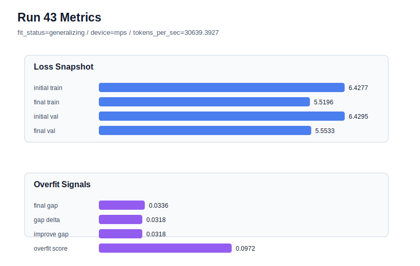

# run 043 실험 보고서

## 이번 가설

learning_rate=0.0003 max_steps=80 seed=151 평균 후보 보완 테스트: run033은 seed=202에서 final_val_loss=5.553315, gap=0.010401, overfit_score=0.050397로 현재 best를 만들었고, run034는 seed=134에서 비슷한 validation loss를 얻었지만 overfit_risk가 되었다. seed=151은 아직 learning_rate=0.0003, max_steps=80 조합으로 직접 확인하지 않았다. 같은 설정을 seed=151에 적용하면 0.0003/80-step 계열이 평균적으로 낮은 validation을 만드는지, 아니면 seed에 따라 과적합 위험이 너무 큰지 판단할 수 있다.

## 왜 이 가설을 세웠는가

최근 run040-run042는 dropout이나 max_steps=70, learning_rate=0.000275와 dropout 결합이 과적합 신호를 조금 낮추지만 best validation을 넘지는 못한다는 것을 보여줬다. 따라서 더 많은 regularization을 누르기보다, 먼저 최고 validation 계열의 seed 평균 근거를 보완하는 것이 다음 의사결정에 더 중요하다. seed=151은 run031(max_steps=60, lr=0.0003)에서 final_val_loss=5.595870, run039(max_steps=80, lr=0.000275)에서 final_val_loss=5.561801을 보여서, 80-step과 0.0003 학습률의 추가 이득과 과적합 비용을 동시에 관찰하기 좋은 남은 seed다.

## 가설 작성 주체

llm_plan:docs/train/next_plan.json

## 바꾼 변수

```json
{
  "seed": 151,
  "learning_rate": 0.0003,
  "drop_rate": 0.1
}
```

## 고정한 변수

vocab_size=600, context_length=48, stride=null, batch_size=8, max_steps=80, weight_decay=0.01, grad_clip=1.0, emb_dim=128, n_heads=4, n_layers=2, qkv_bias=false, ffn_mult=4, norm_first=false, norm_eps=1e-5, activation_name=quick_gelu, ffn_dropout_position=none, attention_impl=sdpa, tie_embeddings=true, init_std=0.02

## 기대 결과

성공 기준은 seed=151에서도 final_val_loss가 run039의 5.561801보다 낮거나 비슷하고, overfit_score가 0.12 이하 또는 fit_status=generalizing을 유지하는 것이다. final_val_loss가 5.55대까지 내려가고 gap이 0.04 이하이면 0.0003/80-step은 평균 후보로 계속 유지한다. validation은 좋아지지만 overfit_score가 0.14 이상이면 0.0003은 low-loss 후보지만 seed 민감한 과적합 축으로 분류한다.

## 실험 설정

```json
{
  "run_id": 43,
  "hypothesis": "learning_rate=0.0003 max_steps=80 seed=151 평균 후보 보완 테스트: run033은 seed=202에서 final_val_loss=5.553315, gap=0.010401, overfit_score=0.050397로 현재 best를 만들었고, run034는 seed=134에서 비슷한 validation loss를 얻었지만 overfit_risk가 되었다. seed=151은 아직 learning_rate=0.0003, max_steps=80 조합으로 직접 확인하지 않았다. 같은 설정을 seed=151에 적용하면 0.0003/80-step 계열이 평균적으로 낮은 validation을 만드는지, 아니면 seed에 따라 과적합 위험이 너무 큰지 판단할 수 있다.",
  "seed": 151,
  "vocab_size": 600,
  "min_frequency": 2,
  "context_length": 48,
  "stride": null,
  "batch_size": 8,
  "max_steps": 80,
  "eval_batches": 4,
  "train_ratio": 0.9,
  "learning_rate": 0.0003,
  "weight_decay": 0.01,
  "grad_clip": 1.0,
  "emb_dim": 128,
  "n_heads": 4,
  "n_layers": 2,
  "drop_rate": 0.1,
  "qkv_bias": false,
  "ffn_mult": 4,
  "norm_first": false,
  "norm_eps": 1e-05,
  "activation_name": "quick_gelu",
  "ffn_dropout_position": "none",
  "attention_impl": "sdpa",
  "tie_embeddings": true,
  "init_std": 0.02
}
```

## 실행 환경

```json
{
  "timestamp": "2026-06-02T22:29:05+00:00",
  "hostname": "woonyong-MacBookPro.local",
  "platform": "macOS-26.3.1-arm64-arm-64bit-Mach-O",
  "machine": "arm64",
  "python": "3.13.13",
  "torch": "2.12.0",
  "cpu_count": 10,
  "memory_gb": 24.0,
  "cuda_available": false,
  "cuda_device_count": 0,
  "mps_available": true,
  "resolved_device": "mps",
  "profile": "mps_balanced"
}
```

- corpus: `src/learning/the-verdict.txt`
- artifact_dir: `docs/train/runs/run_043_artifacts`

## 실제 결과

| 지표 | 값 |
| --- | --- |
| initial_train_loss | 6.427652597427368 |
| initial_val_loss | 6.429500897725423 |
| final_train_loss | 5.519646525382996 |
| final_val_loss | 5.553295294443767 |
| final_generalization_gap | 0.03364876906077097 |
| generalization_gap_delta | 0.03180046876271625 |
| train_val_improvement_gap | 0.03180046876271625 |
| overfit_score | 0.09724970658620347 |
| fit_status | generalizing |
| parameter_count | 478976 |
| tokens_per_sec | 30639.392699826676 |
| elapsed_sec | 0.9712986249942333 |
| device | mps |

## 시각 지표




- 대시보드: `../dashboard.md`
- 지표 요약 CSV: `../metrics_summary.csv`

## 과적합 판단

일반화 개선 신호. final gap=0.0336, overfit_score=0.0972. seed 반복으로 재현성을 확인할 만하다.

## 결론

현재 best 후보: run 33 / val=5.553315162658691 / status=generalizing

## 다음 실험 제안

- 성공 시: 성공하면 lr=0.0003/max_steps=80의 세 seed 결과를 평균 validation, gap, overfit_score로 정리하고, best run033의 seed 특이성 여부를 판단한다. 이후에는 activation_name=gelu_exact 또는 norm_eps 같은 함수/수치 안정성 축을 이 best 계열 위에서 작게 테스트한다.
- 과적합 시: 과적합이 커지면 lr=0.0003/max_steps=80은 seed 202에서는 best지만 평균 위험이 큰 후보로 본다. 다음에는 lr=0.000275/max_steps=80을 안정 기본 후보로 유지하거나, lr=0.0003에 대해서는 max_steps=70 또는 drop_rate=0.12를 seed별로 제한적으로 비교한다.
