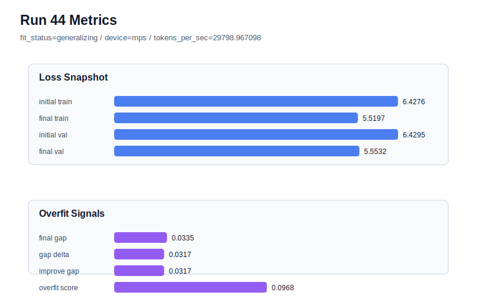

# run 044 실험 보고서

## 이번 가설

gelu_exact activation 단일축 재검증: run043에서 learning_rate=0.0003, max_steps=80, seed=151은 final_val_loss=5.553295로 run033과 거의 같은 최상위 validation을 만들었지만 gap=0.033649, overfit_score=0.097250으로 low-risk까지는 내려가지 않았다. 같은 학습 조건에서 activation_name만 quick_gelu에서 gelu_exact로 바꾸면, GELU 근사 대신 정확한 GELU 곡선이 train 쪽 과도한 sharpness를 조금 줄여 validation과 overfit_score 균형을 개선할 수 있는지 확인한다.

## 왜 이 가설을 세웠는가

최근 실험은 lr=0.0003/max_steps=80 계열이 seed=151과 seed=202에서 강한 validation을 만들고, seed=134에서만 과적합 위험이 커진다는 것을 보여줬다. dropout, weight_decay, max_steps=70, lr=0.000275 조합은 과적합 신호를 조금 낮췄지만 best validation을 넘지 못했다. 따라서 이제 regularization을 더 누르기보다 구조를 바꾸지 않는 함수 교체 축으로 넘어가는 것이 자연스럽다. gelu_exact는 이전 40-step 조건에서 quick_gelu와 거의 동등했지만, 현재처럼 80-step 저손실 구간에서는 근사 차이가 gap과 overfit_score에 다르게 나타날 수 있다.

## 가설 작성 주체

llm_plan:docs/train/next_plan.json

## 바꾼 변수

```json
{
  "activation_name": "gelu_exact"
}
```

## 고정한 변수

seed=151, vocab_size=600, context_length=48, stride=null, batch_size=8, max_steps=80, learning_rate=0.0003, weight_decay=0.01, grad_clip=1.0, emb_dim=128, n_heads=4, n_layers=2, drop_rate=0.1, qkv_bias=false, ffn_mult=4, norm_first=false, norm_eps=1e-5, ffn_dropout_position=none, attention_impl=sdpa, tie_embeddings=true, init_std=0.02

## 기대 결과

성공 기준은 run043 대비 final_val_loss가 5.56 이하를 유지하면서 final_generalization_gap 또는 overfit_score가 낮아지는 것이다. overfit_score가 0.08 이하로 내려가면 gelu_exact가 best 계열의 안정화 후보가 된다. final_val_loss가 비슷하지만 tokens_per_sec가 크게 나빠지면 quick_gelu를 기본 activation으로 유지한다. validation이 5.57 이상으로 악화되면 activation 변경보다 quick_gelu가 현재 학습 조건에 더 적합하다고 본다.

## 실험 설정

```json
{
  "run_id": 44,
  "hypothesis": "gelu_exact activation 단일축 재검증: run043에서 learning_rate=0.0003, max_steps=80, seed=151은 final_val_loss=5.553295로 run033과 거의 같은 최상위 validation을 만들었지만 gap=0.033649, overfit_score=0.097250으로 low-risk까지는 내려가지 않았다. 같은 학습 조건에서 activation_name만 quick_gelu에서 gelu_exact로 바꾸면, GELU 근사 대신 정확한 GELU 곡선이 train 쪽 과도한 sharpness를 조금 줄여 validation과 overfit_score 균형을 개선할 수 있는지 확인한다.",
  "seed": 151,
  "vocab_size": 600,
  "min_frequency": 2,
  "context_length": 48,
  "stride": null,
  "batch_size": 8,
  "max_steps": 80,
  "eval_batches": 4,
  "train_ratio": 0.9,
  "learning_rate": 0.0003,
  "weight_decay": 0.01,
  "grad_clip": 1.0,
  "emb_dim": 128,
  "n_heads": 4,
  "n_layers": 2,
  "drop_rate": 0.1,
  "qkv_bias": false,
  "ffn_mult": 4,
  "norm_first": false,
  "norm_eps": 1e-05,
  "activation_name": "gelu_exact",
  "ffn_dropout_position": "none",
  "attention_impl": "sdpa",
  "tie_embeddings": true,
  "init_std": 0.02
}
```

## 실행 환경

```json
{
  "timestamp": "2026-06-02T22:34:03+00:00",
  "hostname": "woonyong-MacBookPro.local",
  "platform": "macOS-26.3.1-arm64-arm-64bit-Mach-O",
  "machine": "arm64",
  "python": "3.13.13",
  "torch": "2.12.0",
  "cpu_count": 10,
  "memory_gb": 24.0,
  "cuda_available": false,
  "cuda_device_count": 0,
  "mps_available": true,
  "resolved_device": "mps",
  "profile": "mps_balanced"
}
```

- corpus: `src/learning/the-verdict.txt`
- artifact_dir: `docs/train/runs/run_044_artifacts`

## 실제 결과

| 지표 | 값 |
| --- | --- |
| initial_train_loss | 6.427632451057434 |
| initial_val_loss | 6.429474512736003 |
| final_train_loss | 5.519706606864929 |
| final_val_loss | 5.553210894266765 |
| final_generalization_gap | 0.03350428740183542 |
| generalization_gap_delta | 0.0316622257232666 |
| train_val_improvement_gap | 0.0316622257232666 |
| overfit_score | 0.09682873884836862 |
| fit_status | generalizing |
| parameter_count | 478976 |
| tokens_per_sec | 29798.967098162433 |
| elapsed_sec | 0.9986923339311033 |
| device | mps |

## 시각 지표




- 대시보드: `../dashboard.md`
- 지표 요약 CSV: `../metrics_summary.csv`

## 과적합 판단

일반화 개선 신호. final gap=0.0335, overfit_score=0.0968. seed 반복으로 재현성을 확인할 만하다.

## 결론

현재 best 후보: run 33 / val=5.553315162658691 / status=generalizing

## 다음 실험 제안

- 성공 시: 성공하면 같은 gelu_exact 설정을 seed=202 또는 seed=134에 반복해 activation 효과가 seed에 강건한지 확인한다. 특히 seed=134에서 overfit_score를 낮추는지 보면 quick_gelu의 빠른 학습 성향이 과적합에 기여했는지 해석할 수 있다.
- 과적합 시: gelu_exact에서도 gap이 커지거나 validation이 악화되면 quick_gelu를 유지하고, 다음에는 norm_eps=1e-6 또는 norm_eps=1e-4처럼 LayerNorm 수치 안정성 축을 작은 단일축으로 테스트한다. activation 계열 확장은 swiglu/geglu처럼 parameter_count를 바꾸는 후보보다 mish/silu 같은 동일 parameter_count 후보를 먼저 본다.
