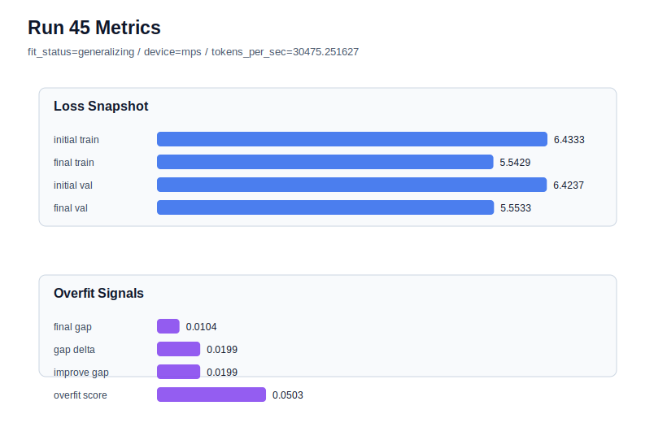

# run 045 실험 보고서

## 이번 가설

best seed=202에서 gelu_exact activation 단일축 검증: run044에서 seed=151은 quick_gelu 대비 gelu_exact가 final_val_loss와 overfit_score를 아주 작게 개선했다. 현재 best인 run033은 seed=202, learning_rate=0.0003, max_steps=80, quick_gelu 조건에서 final_val_loss=5.553315, gap=0.010401, overfit_score=0.050397을 만들었다. 같은 best 조건에서 activation_name만 gelu_exact로 바꾸면, seed=151에서 보인 미세한 개선이 seed=202에서도 재현되어 best 후보를 갱신할 수 있는지 확인한다.

## 왜 이 가설을 세웠는가

최근 결과는 lr=0.0003/max_steps=80 계열이 seed=151과 seed=202에서 가장 낮은 validation을 만들고, seed=134에서만 과적합 위험이 커진다는 패턴을 보인다. run044의 gelu_exact는 parameter_count와 구조를 바꾸지 않고 run043보다 final_val_loss를 0.000084 낮추고 overfit_score도 아주 작게 낮췄다. 이 차이는 작지만 실험 조건이 동일하므로 해석 가치가 있다. 이번에는 best run033과 완전히 같은 seed=202 조건에서 activation만 교체해, gelu_exact가 실제 best 계열의 기본 activation 후보가 될 수 있는지 검증한다.

## 가설 작성 주체

llm_plan:docs/train/next_plan.json

## 바꾼 변수

```json
{
  "activation_name": "gelu_exact"
}
```

## 고정한 변수

seed=202, vocab_size=600, context_length=48, stride=null, batch_size=8, max_steps=80, learning_rate=0.0003, weight_decay=0.01, grad_clip=1.0, emb_dim=128, n_heads=4, n_layers=2, drop_rate=0.1, qkv_bias=false, ffn_mult=4, norm_first=false, norm_eps=1e-5, ffn_dropout_position=none, attention_impl=sdpa, tie_embeddings=true, init_std=0.02

## 기대 결과

성공 기준은 run033 대비 final_val_loss가 같거나 더 낮고, overfit_score가 0.05 이하 또는 gap이 0.011 이하로 유지되는 것이다. final_val_loss가 5.5530 이하로 내려가면 best 후보 갱신 가능성이 높다. final_val_loss가 비슷하지만 tokens_per_sec가 크게 느려지면 quick_gelu의 실용성이 더 높다고 본다. validation이나 gap이 악화되면 seed=151의 gelu_exact 개선은 작은 노이즈 또는 seed-specific 효과로 해석한다.

## 실험 설정

```json
{
  "run_id": 45,
  "hypothesis": "best seed=202에서 gelu_exact activation 단일축 검증: run044에서 seed=151은 quick_gelu 대비 gelu_exact가 final_val_loss와 overfit_score를 아주 작게 개선했다. 현재 best인 run033은 seed=202, learning_rate=0.0003, max_steps=80, quick_gelu 조건에서 final_val_loss=5.553315, gap=0.010401, overfit_score=0.050397을 만들었다. 같은 best 조건에서 activation_name만 gelu_exact로 바꾸면, seed=151에서 보인 미세한 개선이 seed=202에서도 재현되어 best 후보를 갱신할 수 있는지 확인한다.",
  "seed": 202,
  "vocab_size": 600,
  "min_frequency": 2,
  "context_length": 48,
  "stride": null,
  "batch_size": 8,
  "max_steps": 80,
  "eval_batches": 4,
  "train_ratio": 0.9,
  "learning_rate": 0.0003,
  "weight_decay": 0.01,
  "grad_clip": 1.0,
  "emb_dim": 128,
  "n_heads": 4,
  "n_layers": 2,
  "drop_rate": 0.1,
  "qkv_bias": false,
  "ffn_mult": 4,
  "norm_first": false,
  "norm_eps": 1e-05,
  "activation_name": "gelu_exact",
  "ffn_dropout_position": "none",
  "attention_impl": "sdpa",
  "tie_embeddings": true,
  "init_std": 0.02
}
```

## 실행 환경

```json
{
  "timestamp": "2026-06-02T22:39:44+00:00",
  "hostname": "woonyong-MacBookPro.local",
  "platform": "macOS-26.3.1-arm64-arm-64bit-Mach-O",
  "machine": "arm64",
  "python": "3.13.13",
  "torch": "2.12.0",
  "cpu_count": 10,
  "memory_gb": 24.0,
  "cuda_available": false,
  "cuda_device_count": 0,
  "mps_available": true,
  "resolved_device": "mps",
  "profile": "mps_balanced"
}
```

- corpus: `src/learning/the-verdict.txt`
- artifact_dir: `docs/train/runs/run_045_artifacts`

## 실제 결과

| 지표 | 값 |
| --- | --- |
| initial_train_loss | 6.433309078216553 |
| initial_val_loss | 6.42373784383138 |
| final_train_loss | 5.542949199676514 |
| final_val_loss | 5.553322792053223 |
| final_generalization_gap | 0.010373592376708984 |
| generalization_gap_delta | 0.019944826761881806 |
| train_val_improvement_gap | 0.019944826761881806 |
| overfit_score | 0.0502632459004726 |
| fit_status | generalizing |
| parameter_count | 478976 |
| tokens_per_sec | 30475.25162654971 |
| elapsed_sec | 0.9765300829894841 |
| device | mps |

## 시각 지표




- 대시보드: `../dashboard.md`
- 지표 요약 CSV: `../metrics_summary.csv`

## 과적합 판단

일반화 개선 신호. final gap=0.0104, overfit_score=0.0503. seed 반복으로 재현성을 확인할 만하다.

## 결론

현재 best 후보: run 45 / val=5.553322792053223 / status=generalizing

## 다음 실험 제안

- 성공 시: 성공하면 gelu_exact를 seed=134에 적용해 과적합이 컸던 seed에서도 gap과 overfit_score를 낮추는지 확인한다. seed=202와 seed=151 모두에서 개선되면 gelu_exact를 best 계열 activation 후보로 올리고, 다음에는 norm_eps 단일축을 gelu_exact 위에서 테스트한다.
- 과적합 시: gelu_exact가 seed=202에서 validation이나 overfit_score를 악화시키면 quick_gelu를 기본 activation으로 유지한다. 다음에는 activation 대신 norm_eps=1e-6 또는 norm_eps=1e-4처럼 LayerNorm 수치 안정성 축을 best run033 조건에서 테스트한다.
