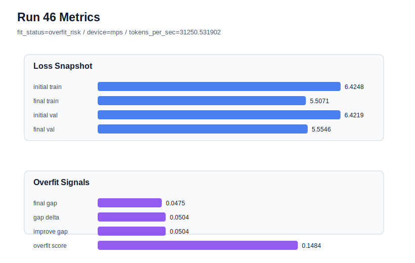

# run 046 실험 보고서

## 이번 가설

seed=134 과적합 구간에서 gelu_exact activation 단일축 검증: run034는 learning_rate=0.0003, max_steps=80, seed=134, quick_gelu 조건에서 final_val_loss=5.554664까지 낮아졌지만 gap=0.047536, overfit_score=0.148410으로 overfit_risk가 되었다. 반면 run044(seed=151)와 run045(seed=202)에서는 같은 저손실 계열에서 gelu_exact가 quick_gelu 대비 validation 또는 overfit_score를 아주 작게 개선했다. 따라서 run034와 동일한 seed=134 조건에서 activation_name만 gelu_exact로 바꾸면 낮은 validation은 유지하면서 train 쪽 과도 적합 신호를 줄일 수 있는지 확인한다.

## 왜 이 가설을 세웠는가

현재 best는 run045이지만, 그 개선은 seed=202에서 gap이 이미 낮은 조건의 미세 개선이다. 연구적으로 더 중요한 질문은 seed=134처럼 0.0003/80-step 계열이 overfit_risk를 보이는 경우에도 gelu_exact가 안정화 효과를 내는지다. weight_decay=0.02, drop_rate=0.12, max_steps=70, learning_rate=0.000275는 모두 gap을 일부 낮췄지만 best validation을 명확히 넘지 못했다. activation 교체는 구조 순서를 바꾸지 않고 parameter_count도 유지하므로, 과적합 원인이 quick_gelu의 근사/스케일 특성과 관련 있는지 해석하기 좋은 단일 함수 교체 실험이다.

## 가설 작성 주체

llm_plan:docs/train/next_plan.json

## 바꾼 변수

```json
{
  "activation_name": "gelu_exact"
}
```

## 고정한 변수

seed=134, vocab_size=600, context_length=48, stride=null, batch_size=8, max_steps=80, learning_rate=0.0003, weight_decay=0.01, grad_clip=1.0, emb_dim=128, n_heads=4, n_layers=2, drop_rate=0.1, qkv_bias=false, ffn_mult=4, norm_first=false, norm_eps=1e-5, ffn_dropout_position=none, attention_impl=sdpa, tie_embeddings=true, init_std=0.02

## 기대 결과

성공 기준은 run034 대비 final_val_loss가 5.56 이하를 유지하면서 final_generalization_gap이 0.0475보다 낮아지고 overfit_score가 0.14 이하 또는 fit_status=generalizing으로 내려오는 것이다. final_val_loss가 거의 같고 gap/overfit_score만 낮아지면 gelu_exact를 best 저손실 계열의 기본 activation 후보로 올린다. validation은 유지되지만 gap이 그대로면 activation 차이는 seed=134 과적합 완화에는 충분하지 않다고 본다. validation이 5.57 이상으로 악화되면 gelu_exact 개선은 seed=151/202의 미세 노이즈로 분류한다.

## 실험 설정

```json
{
  "run_id": 46,
  "hypothesis": "seed=134 과적합 구간에서 gelu_exact activation 단일축 검증: run034는 learning_rate=0.0003, max_steps=80, seed=134, quick_gelu 조건에서 final_val_loss=5.554664까지 낮아졌지만 gap=0.047536, overfit_score=0.148410으로 overfit_risk가 되었다. 반면 run044(seed=151)와 run045(seed=202)에서는 같은 저손실 계열에서 gelu_exact가 quick_gelu 대비 validation 또는 overfit_score를 아주 작게 개선했다. 따라서 run034와 동일한 seed=134 조건에서 activation_name만 gelu_exact로 바꾸면 낮은 validation은 유지하면서 train 쪽 과도 적합 신호를 줄일 수 있는지 확인한다.",
  "seed": 134,
  "vocab_size": 600,
  "min_frequency": 2,
  "context_length": 48,
  "stride": null,
  "batch_size": 8,
  "max_steps": 80,
  "eval_batches": 4,
  "train_ratio": 0.9,
  "learning_rate": 0.0003,
  "weight_decay": 0.01,
  "grad_clip": 1.0,
  "emb_dim": 128,
  "n_heads": 4,
  "n_layers": 2,
  "drop_rate": 0.1,
  "qkv_bias": false,
  "ffn_mult": 4,
  "norm_first": false,
  "norm_eps": 1e-05,
  "activation_name": "gelu_exact",
  "ffn_dropout_position": "none",
  "attention_impl": "sdpa",
  "tie_embeddings": true,
  "init_std": 0.02
}
```

## 실행 환경

```json
{
  "timestamp": "2026-06-02T22:44:10+00:00",
  "hostname": "woonyong-MacBookPro.local",
  "platform": "macOS-26.3.1-arm64-arm-64bit-Mach-O",
  "machine": "arm64",
  "python": "3.13.13",
  "torch": "2.12.0",
  "cpu_count": 10,
  "memory_gb": 24.0,
  "cuda_available": false,
  "cuda_device_count": 0,
  "mps_available": true,
  "resolved_device": "mps",
  "profile": "mps_balanced"
}
```

- corpus: `src/learning/the-verdict.txt`
- artifact_dir: `docs/train/runs/run_046_artifacts`

## 실제 결과

| 지표 | 값 |
| --- | --- |
| initial_train_loss | 6.4247660636901855 |
| initial_val_loss | 6.421878337860107 |
| final_train_loss | 5.50708544254303 |
| final_val_loss | 5.554612954457601 |
| final_generalization_gap | 0.04752751191457083 |
| generalization_gap_delta | 0.050415237744648955 |
| train_val_improvement_gap | 0.050415237744648955 |
| overfit_score | 0.14835798740386874 |
| fit_status | overfit_risk |
| parameter_count | 478976 |
| tokens_per_sec | 31250.53190244882 |
| elapsed_sec | 0.9523037909530103 |
| device | mps |

## 시각 지표




- 대시보드: `../dashboard.md`
- 지표 요약 CSV: `../metrics_summary.csv`

## 과적합 판단

과적합 위험. final gap=0.0475, overfit_score=0.1484. 다음 실험은 regularization 강화가 우선이다.

## 결론

현재 best 후보: run 45 / val=5.553322792053223 / status=generalizing

## 다음 실험 제안

- 성공 시: 성공하면 gelu_exact가 세 seed에서 모두 저손실 계열에 해롭지 않고 seed=134 과적합도 완화한다는 근거가 생긴다. 다음 실험은 gelu_exact를 유지한 채 norm_eps=1e-6 또는 1e-4를 단일축으로 테스트해 LayerNorm 수치 안정성이 gap을 더 낮추는지 본다.
- 과적합 시: overfit_risk가 유지되면 quick_gelu와 gelu_exact의 차이는 과적합 원인이 아니라고 보고 activation 계열 확장을 잠시 멈춘다. 다음에는 seed=134에서 learning_rate=0.000275 또는 max_steps=70 계열을 기준으로 norm_eps나 ffn_dropout_position 같은 수치/드롭아웃 위치 축을 더 보수적으로 확인한다.
