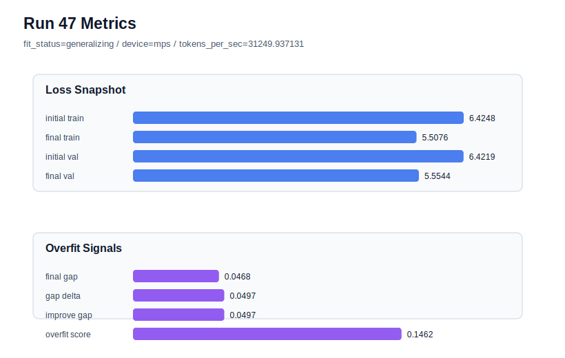

# run 047 실험 보고서

## 이번 가설

seed=134 저손실 과적합 구간에서 FFN dropout 위치 단일축 검증: run034와 run046은 learning_rate=0.0003, max_steps=80, seed=134 조건에서 final_val_loss를 5.55대까지 낮췄지만 gap≈0.0475, overfit_score≈0.148의 overfit_risk를 반복했다. weight_decay 증가와 gelu_exact 교체는 거의 효과가 없었고, drop_rate=0.12는 약하게만 완화했다. 따라서 기존 구조 순서는 유지한 채 ffn_dropout_position만 none에서 after_activation으로 바꾸면, FFN hidden activation 직후에 regularization이 걸려 train 쪽 과도 적합을 줄이면서 낮은 validation loss를 유지할 수 있는지 확인한다.

## 왜 이 가설을 세웠는가

최근 evidence는 seed=134의 문제를 activation 근사 차이나 weight_decay로 설명하기 어렵다는 쪽으로 모였다. run040은 dropout 강도를 0.12로 올렸을 때 final_val_loss를 유지하면서 overfit_score를 0.148에서 0.140으로 조금 낮췄지만 충분하지 않았다. ffn_dropout_position=after_activation은 drop_rate 자체를 더 키우지 않고 FFN의 확장 hidden 표현에 dropout을 적용하므로, output 직후나 none보다 train memorization을 다르게 억제할 수 있다. parameter_count와 Transformer block 순서는 그대로이며, 실험 가능한 작은 함수/위치 교체 축이라 해석 가능성이 높다.

## 가설 작성 주체

llm_plan:docs/train/next_plan.json

## 바꾼 변수

```json
{
  "ffn_dropout_position": "after_activation"
}
```

## 고정한 변수

seed=134, vocab_size=600, context_length=48, stride=null, batch_size=8, max_steps=80, learning_rate=0.0003, weight_decay=0.01, grad_clip=1.0, emb_dim=128, n_heads=4, n_layers=2, drop_rate=0.1, qkv_bias=false, ffn_mult=4, norm_first=false, norm_eps=1e-5, activation_name=quick_gelu, attention_impl=sdpa, tie_embeddings=true, init_std=0.02

## 기대 결과

성공 기준은 run034 대비 final_val_loss가 5.565 이하를 유지하면서 final_generalization_gap이 0.04 이하 또는 overfit_score가 0.12 이하로 내려가는 것이다. final_val_loss가 5.55대에 머물고 fit_status가 generalizing으로 바뀌면 FFN 내부 dropout 위치가 seed=134의 과적합 완화에 의미 있다고 본다. gap이 거의 줄지 않으면 FFN dropout 위치보다 learning_rate 또는 학습 길이가 핵심 원인이다. validation이 5.58 이상으로 악화되면 after_activation dropout은 under-training을 만든 것으로 본다.

## 실험 설정

```json
{
  "run_id": 47,
  "hypothesis": "seed=134 저손실 과적합 구간에서 FFN dropout 위치 단일축 검증: run034와 run046은 learning_rate=0.0003, max_steps=80, seed=134 조건에서 final_val_loss를 5.55대까지 낮췄지만 gap≈0.0475, overfit_score≈0.148의 overfit_risk를 반복했다. weight_decay 증가와 gelu_exact 교체는 거의 효과가 없었고, drop_rate=0.12는 약하게만 완화했다. 따라서 기존 구조 순서는 유지한 채 ffn_dropout_position만 none에서 after_activation으로 바꾸면, FFN hidden activation 직후에 regularization이 걸려 train 쪽 과도 적합을 줄이면서 낮은 validation loss를 유지할 수 있는지 확인한다.",
  "seed": 134,
  "vocab_size": 600,
  "min_frequency": 2,
  "context_length": 48,
  "stride": null,
  "batch_size": 8,
  "max_steps": 80,
  "eval_batches": 4,
  "train_ratio": 0.9,
  "learning_rate": 0.0003,
  "weight_decay": 0.01,
  "grad_clip": 1.0,
  "emb_dim": 128,
  "n_heads": 4,
  "n_layers": 2,
  "drop_rate": 0.1,
  "qkv_bias": false,
  "ffn_mult": 4,
  "norm_first": false,
  "norm_eps": 1e-05,
  "activation_name": "quick_gelu",
  "ffn_dropout_position": "after_activation",
  "attention_impl": "sdpa",
  "tie_embeddings": true,
  "init_std": 0.02
}
```

## 실행 환경

```json
{
  "timestamp": "2026-06-02T22:49:05+00:00",
  "hostname": "woonyong-MacBookPro.local",
  "platform": "macOS-26.3.1-arm64-arm-64bit-Mach-O",
  "machine": "arm64",
  "python": "3.13.13",
  "torch": "2.12.0",
  "cpu_count": 10,
  "memory_gb": 24.0,
  "cuda_available": false,
  "cuda_device_count": 0,
  "mps_available": true,
  "resolved_device": "mps",
  "profile": "mps_balanced"
}
```

- corpus: `src/learning/the-verdict.txt`
- artifact_dir: `docs/train/runs/run_047_artifacts`

## 실제 결과

| 지표 | 값 |
| --- | --- |
| initial_train_loss | 6.424758791923523 |
| initial_val_loss | 6.4218573570251465 |
| final_train_loss | 5.507611155509949 |
| final_val_loss | 5.55439821879069 |
| final_generalization_gap | 0.04678706328074167 |
| generalization_gap_delta | 0.049688498179118135 |
| train_val_improvement_gap | 0.049688498179118135 |
| overfit_score | 0.14616405963897794 |
| fit_status | generalizing |
| parameter_count | 478976 |
| tokens_per_sec | 31249.937131050952 |
| elapsed_sec | 0.9523219158872962 |
| device | mps |

## 시각 지표




- 대시보드: `../dashboard.md`
- 지표 요약 CSV: `../metrics_summary.csv`

## 과적합 판단

일반화 개선 신호. final gap=0.0468, overfit_score=0.1462. seed 반복으로 재현성을 확인할 만하다.

## 결론

현재 best 후보: run 45 / val=5.553322792053223 / status=generalizing

## 다음 실험 제안

- 성공 시: 성공하면 같은 ffn_dropout_position=after_activation 설정을 seed=151 또는 seed=202에 반복해 best 저손실 계열을 해치지 않는지 확인한다. 세 seed에서 안정적이면 after_activation을 low-overfit 후보로 두고, 이후 norm_eps 단일축을 이 조건 위에서 테스트한다.
- 과적합 시: overfit_risk가 유지되면 dropout 위치만으로는 seed=134의 train 편향을 막기 어렵다고 보고, learning_rate=0.000275 또는 max_steps=70을 핵심 안정화 축으로 채택한다. 다음에는 lr=0.000275 계열에서 norm_eps=1e-6 또는 ffn_dropout_position=after_activation을 보수적으로 결합해 gap을 낮추는지 확인한다.
