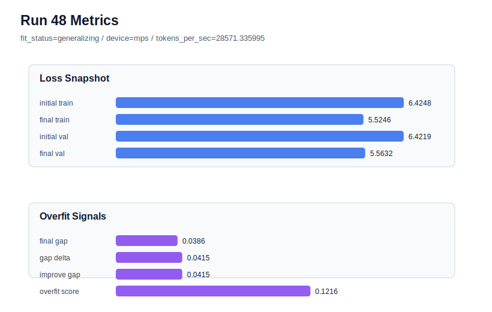

# run 048 실험 보고서

## 이번 가설

learning_rate=0.000275 안정화 계열에서 FFN dropout 위치 결합 검증: run037은 seed=134에서 learning_rate를 0.000275로 낮추자 run034의 overfit_risk를 generalizing으로 되돌렸지만 gap=0.039052, overfit_score=0.122958로 아직 medium-risk에 가까웠다. run047은 높은 learning_rate=0.0003 조건에서 ffn_dropout_position=after_activation이 validation을 유지하며 overfit_score를 0.148에서 0.146으로 아주 작게 낮췄다. 따라서 run037과 같은 안정 learning_rate 조건에서 ffn_dropout_position만 after_activation으로 바꾸면, validation 손실을 크게 늘리지 않고 gap과 overfit_score를 더 낮출 수 있는지 확인한다.

## 왜 이 가설을 세웠는가

최근 결과는 seed=134 과적합의 주요 원인이 activation이나 weight_decay보다 optimization 속도에 가깝다는 쪽으로 모였다. learning_rate=0.000275는 세 seed에서 generalizing을 유지한 안정 축이고, after_activation dropout 위치는 단독으로는 약했지만 train memorization을 아주 조금 완화했다. 이번 실험은 run037을 기준으로 dropout 위치만 바꾸는 단일축 결합 검증이다. 구조 순서, parameter_count, context_length, attention_impl, activation은 유지되므로 해석 가능성이 높고, MPS balanced 장비에서도 80 step이 1초 안팎이라 자동 루프 점유가 작다.

## 가설 작성 주체

llm_plan:docs/train/next_plan.json

## 바꾼 변수

```json
{
  "ffn_dropout_position": "after_activation"
}
```

## 고정한 변수

seed=134, vocab_size=600, context_length=48, stride=null, batch_size=8, max_steps=80, learning_rate=0.000275, weight_decay=0.01, grad_clip=1.0, emb_dim=128, n_heads=4, n_layers=2, drop_rate=0.1, qkv_bias=false, ffn_mult=4, norm_first=false, norm_eps=1e-5, activation_name=quick_gelu, attention_impl=sdpa, tie_embeddings=true, init_std=0.02

## 기대 결과

성공 기준은 run037 대비 final_generalization_gap이 0.039 이하로 낮아지고 overfit_score가 0.115 이하로 내려가며, final_val_loss가 5.57 이하에 머무는 것이다. 특히 run042의 lr=0.000275 + drop_rate=0.12 결과인 overfit_score=0.116964보다 낮아지면 dropout 강도 증가보다 FFN 내부 위치 변경이 더 효율적인 regularization일 수 있다. final_val_loss가 5.58 이상으로 악화되면 after_activation 위치가 안정 lr 위에서는 under-training을 만든 것으로 본다. gap과 overfit_score가 거의 그대로면 다음에는 norm_eps 축으로 이동한다.

## 실험 설정

```json
{
  "run_id": 48,
  "hypothesis": "learning_rate=0.000275 안정화 계열에서 FFN dropout 위치 결합 검증: run037은 seed=134에서 learning_rate를 0.000275로 낮추자 run034의 overfit_risk를 generalizing으로 되돌렸지만 gap=0.039052, overfit_score=0.122958로 아직 medium-risk에 가까웠다. run047은 높은 learning_rate=0.0003 조건에서 ffn_dropout_position=after_activation이 validation을 유지하며 overfit_score를 0.148에서 0.146으로 아주 작게 낮췄다. 따라서 run037과 같은 안정 learning_rate 조건에서 ffn_dropout_position만 after_activation으로 바꾸면, validation 손실을 크게 늘리지 않고 gap과 overfit_score를 더 낮출 수 있는지 확인한다.",
  "seed": 134,
  "vocab_size": 600,
  "min_frequency": 2,
  "context_length": 48,
  "stride": null,
  "batch_size": 8,
  "max_steps": 80,
  "eval_batches": 4,
  "train_ratio": 0.9,
  "learning_rate": 0.000275,
  "weight_decay": 0.01,
  "grad_clip": 1.0,
  "emb_dim": 128,
  "n_heads": 4,
  "n_layers": 2,
  "drop_rate": 0.1,
  "qkv_bias": false,
  "ffn_mult": 4,
  "norm_first": false,
  "norm_eps": 1e-05,
  "activation_name": "quick_gelu",
  "ffn_dropout_position": "after_activation",
  "attention_impl": "sdpa",
  "tie_embeddings": true,
  "init_std": 0.02
}
```

## 실행 환경

```json
{
  "timestamp": "2026-06-02T22:54:16+00:00",
  "hostname": "woonyong-MacBookPro.local",
  "platform": "macOS-26.3.1-arm64-arm-64bit-Mach-O",
  "machine": "arm64",
  "python": "3.13.13",
  "torch": "2.12.0",
  "cpu_count": 10,
  "memory_gb": 24.0,
  "cuda_available": false,
  "cuda_device_count": 0,
  "mps_available": true,
  "resolved_device": "mps",
  "profile": "mps_balanced"
}
```

- corpus: `src/learning/the-verdict.txt`
- artifact_dir: `docs/train/runs/run_048_artifacts`

## 실제 결과

| 지표 | 값 |
| --- | --- |
| initial_train_loss | 6.424758791923523 |
| initial_val_loss | 6.4218573570251465 |
| final_train_loss | 5.52458393573761 |
| final_val_loss | 5.563193480173747 |
| final_generalization_gap | 0.03860954443613718 |
| generalization_gap_delta | 0.04151097933451364 |
| train_val_improvement_gap | 0.04151097933451364 |
| overfit_score | 0.12163150310516446 |
| fit_status | generalizing |
| parameter_count | 478976 |
| tokens_per_sec | 28571.335994555273 |
| elapsed_sec | 1.0416033749934286 |
| device | mps |

## 시각 지표




- 대시보드: `../dashboard.md`
- 지표 요약 CSV: `../metrics_summary.csv`

## 과적합 판단

일반화 개선 신호. final gap=0.0386, overfit_score=0.1216. seed 반복으로 재현성을 확인할 만하다.

## 결론

현재 best 후보: run 45 / val=5.553322792053223 / status=generalizing

## 다음 실험 제안

- 성공 시: 성공하면 ffn_dropout_position=after_activation을 lr=0.000275 안정 후보에 붙인 뒤 seed=151 또는 seed=202로 반복해 평균적으로 validation 손실 없이 gap을 낮추는지 확인한다. 세 seed에서 안정되면 이 계열을 low-risk 기본 후보로 두고, 이후 norm_eps=1e-6 또는 1e-4를 단일축으로 테스트한다.
- 과적합 시: overfit_score가 유지되거나 validation이 악화되면 ffn_dropout_position 축은 seed=134 문제의 핵심 해결책이 아니라고 보고 중단한다. 다음 실험은 run037 또는 run042 조건에서 norm_eps=1e-6/1e-4를 비교하거나, max_steps=70 계열을 seed=151/202로 반복해 학습 길이 안정성을 확인한다.
