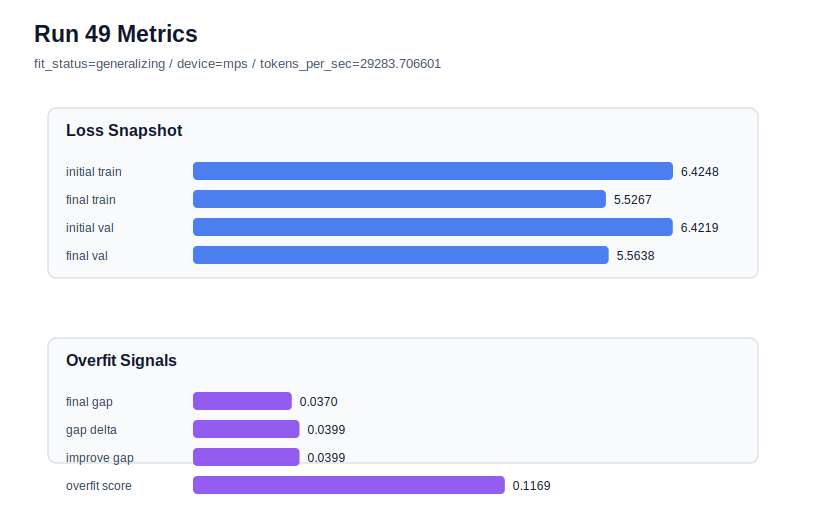

# run 049 실험 보고서

## 이번 가설

learning_rate=0.000275 + drop_rate=0.12 안정 조합에서 norm_eps=1e-4 단일축 검증: run042는 seed=134에서 learning_rate=0.000275와 drop_rate=0.12를 결합해 final_val_loss=5.563780, gap=0.037054, overfit_score=0.116964로 run037보다 과적합 신호를 낮췄다. run048의 ffn_dropout_position=after_activation은 validation은 약간 좋았지만 overfit_score가 0.121632로 run042보다 높았다. 따라서 run042 조건을 기준으로 norm_eps만 1e-5에서 1e-4로 키우면 LayerNorm 분모 안정화가 train 쪽 sharp fitting을 조금 완화해 validation을 유지하면서 gap과 overfit_score를 더 낮출 수 있는지 확인한다.

## 왜 이 가설을 세웠는가

최근 실험들은 seed=134의 과적합이 activation이나 weight_decay보다 optimization 속도와 regularization 위치/강도에 더 민감하다는 것을 보여줬다. drop_rate=0.12는 high learning_rate에서는 약했고, learning_rate=0.000275 위에서는 run042처럼 overfit_score를 0.116964까지 낮췄다. ffn_dropout_position은 단독 및 결합 모두 작게만 개선됐다. 이제 구조와 학습 길이를 유지하면서 남은 해석 가능한 단일축은 LayerNorm 수치 안정성이다. norm_eps=1e-4는 parameter_count와 Transformer 순서를 바꾸지 않고 normalization을 조금 더 부드럽게 만들어 seed=134의 train/val gap을 줄일 가능성이 있다.

## 가설 작성 주체

llm_plan:docs/train/next_plan.json

## 바꾼 변수

```json
{
  "norm_eps": 0.0001
}
```

## 고정한 변수

seed=134, vocab_size=600, context_length=48, stride=null, batch_size=8, max_steps=80, learning_rate=0.000275, weight_decay=0.01, grad_clip=1.0, emb_dim=128, n_heads=4, n_layers=2, drop_rate=0.12, qkv_bias=false, ffn_mult=4, norm_first=false, activation_name=quick_gelu, ffn_dropout_position=none, attention_impl=sdpa, tie_embeddings=true, init_std=0.02

## 기대 결과

성공 기준은 run042 대비 final_val_loss가 5.57 이하를 유지하고, final_generalization_gap이 0.037 이하 또는 overfit_score가 0.11 이하로 내려가는 것이다. validation이 거의 같고 overfit_score만 낮아지면 norm_eps=1e-4를 seed=134 안정화 후보로 본다. final_val_loss가 5.58 이상으로 악화되면 큰 eps가 normalization을 과도하게 둔화해 under-training을 만든 것으로 본다. gap과 overfit_score가 거의 같으면 norm_eps는 현 설정에서 의미 있는 축이 아니며 다음에는 max_steps=70 또는 seed 반복으로 이동한다.

## 실험 설정

```json
{
  "run_id": 49,
  "hypothesis": "learning_rate=0.000275 + drop_rate=0.12 안정 조합에서 norm_eps=1e-4 단일축 검증: run042는 seed=134에서 learning_rate=0.000275와 drop_rate=0.12를 결합해 final_val_loss=5.563780, gap=0.037054, overfit_score=0.116964로 run037보다 과적합 신호를 낮췄다. run048의 ffn_dropout_position=after_activation은 validation은 약간 좋았지만 overfit_score가 0.121632로 run042보다 높았다. 따라서 run042 조건을 기준으로 norm_eps만 1e-5에서 1e-4로 키우면 LayerNorm 분모 안정화가 train 쪽 sharp fitting을 조금 완화해 validation을 유지하면서 gap과 overfit_score를 더 낮출 수 있는지 확인한다.",
  "seed": 134,
  "vocab_size": 600,
  "min_frequency": 2,
  "context_length": 48,
  "stride": null,
  "batch_size": 8,
  "max_steps": 80,
  "eval_batches": 4,
  "train_ratio": 0.9,
  "learning_rate": 0.000275,
  "weight_decay": 0.01,
  "grad_clip": 1.0,
  "emb_dim": 128,
  "n_heads": 4,
  "n_layers": 2,
  "drop_rate": 0.12,
  "qkv_bias": false,
  "ffn_mult": 4,
  "norm_first": false,
  "norm_eps": 0.0001,
  "activation_name": "quick_gelu",
  "ffn_dropout_position": "none",
  "attention_impl": "sdpa",
  "tie_embeddings": true,
  "init_std": 0.02
}
```

## 실행 환경

```json
{
  "timestamp": "2026-06-02T22:59:02+00:00",
  "hostname": "woonyong-MacBookPro.local",
  "platform": "macOS-26.3.1-arm64-arm-64bit-Mach-O",
  "machine": "arm64",
  "python": "3.13.13",
  "torch": "2.12.0",
  "cpu_count": 10,
  "memory_gb": 24.0,
  "cuda_available": false,
  "cuda_device_count": 0,
  "mps_available": true,
  "resolved_device": "mps",
  "profile": "mps_balanced"
}
```

- corpus: `src/learning/the-verdict.txt`
- artifact_dir: `docs/train/runs/run_049_artifacts`

## 실제 결과

| 지표 | 값 |
| --- | --- |
| initial_train_loss | 6.4247565269470215 |
| initial_val_loss | 6.421862443288167 |
| final_train_loss | 5.526736855506897 |
| final_val_loss | 5.5637868245442705 |
| final_generalization_gap | 0.037049969037373565 |
| generalization_gap_delta | 0.03994405269622803 |
| train_val_improvement_gap | 0.03994405269622803 |
| overfit_score | 0.11693807442982962 |
| fit_status | generalizing |
| parameter_count | 478976 |
| tokens_per_sec | 29283.706601207632 |
| elapsed_sec | 1.0162647920660675 |
| device | mps |

## 시각 지표




- 대시보드: `../dashboard.md`
- 지표 요약 CSV: `../metrics_summary.csv`

## 과적합 판단

일반화 개선 신호. final gap=0.0370, overfit_score=0.1169. seed 반복으로 재현성을 확인할 만하다.

## 결론

현재 best 후보: run 45 / val=5.553322792053223 / status=generalizing

## 다음 실험 제안

- 성공 시: 성공하면 norm_eps=1e-4를 learning_rate=0.000275 + drop_rate=0.12 계열에 유지한 채 seed=151 또는 seed=202로 반복해 평균적으로 validation 손실 없이 overfit_score를 낮추는지 확인한다. 안정되면 이 계열을 low-risk 후보로 두고 best run45의 low-val 후보와 평균 score로 비교한다.
- 과적합 시: overfit_score가 유지되거나 validation이 악화되면 norm_eps=1e-4는 포기하고 기본 1e-5로 되돌린다. 다음에는 norm_eps=1e-6처럼 반대 방향의 수치 안정성 축을 짧게 확인하거나, max_steps=70 계열을 seed=151/202로 반복해 학습 길이 안정성을 비교한다.
