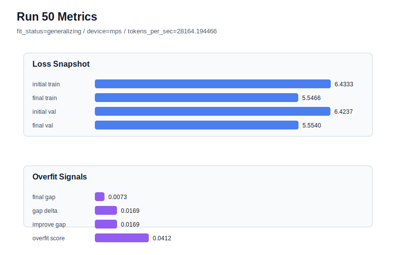

# run 050 실험 보고서

## 이번 가설

현재 best run45 위에서 drop_rate=0.12 단일축 검증: run45는 seed=202, learning_rate=0.0003, max_steps=80, gelu_exact 조건에서 final_val_loss=5.553323, gap=0.010374, overfit_score=0.050263으로 현재 best다. 최근 seed=134 실험들은 drop_rate=0.12가 validation을 크게 해치지 않으면서 overfit_score를 아주 약하게 낮추는 경향을 보였다. 따라서 run45와 동일한 조건에서 drop_rate만 0.10에서 0.12로 올리면 낮은 validation을 유지하면서 gap과 overfit_score를 더 낮춰 best 후보를 갱신할 수 있는지 확인한다.

## 왜 이 가설을 세웠는가

최근 run046-run049는 seed=134의 과적합을 완화하려고 activation, FFN dropout 위치, norm_eps를 확인했지만 개선 폭은 작았다. 반면 현재 best는 seed=202에서 이미 low-risk라서 작은 regularization 조정이 pure validation을 크게 훼손하지 않으면 score 개선 가능성이 있다. drop_rate는 구조 순서를 바꾸지 않고 parameter_count도 유지하며, run040에서 high learning_rate 조건의 validation을 거의 유지한 축이다. 이번 실험은 seed=134 안정화 탐색에서 잠시 벗어나 현재 best를 직접 개선할 수 있는지 보는 exploitation 성격의 단일축 테스트다.

## 가설 작성 주체

llm_plan:docs/train/next_plan.json

## 바꾼 변수

```json
{
  "drop_rate": 0.12
}
```

## 고정한 변수

seed=202, vocab_size=600, context_length=48, stride=null, batch_size=8, max_steps=80, learning_rate=0.0003, weight_decay=0.01, grad_clip=1.0, emb_dim=128, n_heads=4, n_layers=2, qkv_bias=false, ffn_mult=4, norm_first=false, norm_eps=1e-5, activation_name=gelu_exact, ffn_dropout_position=none, attention_impl=sdpa, tie_embeddings=true, init_std=0.02

## 기대 결과

성공 기준은 run45 대비 final_val_loss가 5.56 이하를 유지하고, final_generalization_gap이 0.010 이하 또는 overfit_score가 0.05 이하로 낮아지는 것이다. final_val_loss가 거의 같고 overfit_score가 낮아지면 drop_rate=0.12를 best 계열의 후보로 올린다. final_val_loss가 5.565 이상으로 악화되면 seed=202 best 조건에서는 dropout 증가가 under-training 또는 과도 regularization을 만든 것으로 본다. gap과 overfit_score가 거의 같으면 drop_rate 축은 best 개선에 유효하지 않다고 보고 seed 반복 검증으로 이동한다.

## 실험 설정

```json
{
  "run_id": 50,
  "hypothesis": "현재 best run45 위에서 drop_rate=0.12 단일축 검증: run45는 seed=202, learning_rate=0.0003, max_steps=80, gelu_exact 조건에서 final_val_loss=5.553323, gap=0.010374, overfit_score=0.050263으로 현재 best다. 최근 seed=134 실험들은 drop_rate=0.12가 validation을 크게 해치지 않으면서 overfit_score를 아주 약하게 낮추는 경향을 보였다. 따라서 run45와 동일한 조건에서 drop_rate만 0.10에서 0.12로 올리면 낮은 validation을 유지하면서 gap과 overfit_score를 더 낮춰 best 후보를 갱신할 수 있는지 확인한다.",
  "seed": 202,
  "vocab_size": 600,
  "min_frequency": 2,
  "context_length": 48,
  "stride": null,
  "batch_size": 8,
  "max_steps": 80,
  "eval_batches": 4,
  "train_ratio": 0.9,
  "learning_rate": 0.0003,
  "weight_decay": 0.01,
  "grad_clip": 1.0,
  "emb_dim": 128,
  "n_heads": 4,
  "n_layers": 2,
  "drop_rate": 0.12,
  "qkv_bias": false,
  "ffn_mult": 4,
  "norm_first": false,
  "norm_eps": 1e-05,
  "activation_name": "gelu_exact",
  "ffn_dropout_position": "none",
  "attention_impl": "sdpa",
  "tie_embeddings": true,
  "init_std": 0.02
}
```

## 실행 환경

```json
{
  "timestamp": "2026-06-02T23:05:12+00:00",
  "hostname": "woonyong-MacBookPro.local",
  "platform": "macOS-26.3.1-arm64-arm-64bit-Mach-O",
  "machine": "arm64",
  "python": "3.13.13",
  "torch": "2.12.0",
  "cpu_count": 10,
  "memory_gb": 24.0,
  "cuda_available": false,
  "cuda_device_count": 0,
  "mps_available": true,
  "resolved_device": "mps",
  "profile": "mps_balanced"
}
```

- corpus: `src/learning/the-verdict.txt`
- artifact_dir: `docs/train/runs/run_050_artifacts`

## 실제 결과

| 지표 | 값 |
| --- | --- |
| initial_train_loss | 6.433309078216553 |
| initial_val_loss | 6.42373784383138 |
| final_train_loss | 5.54661238193512 |
| final_val_loss | 5.553958892822266 |
| final_generalization_gap | 0.007346510887145996 |
| generalization_gap_delta | 0.016917745272318818 |
| train_val_improvement_gap | 0.016917745272318818 |
| overfit_score | 0.04118200143178363 |
| fit_status | generalizing |
| parameter_count | 478976 |
| tokens_per_sec | 28164.19446572996 |
| elapsed_sec | 1.0566607909277081 |
| device | mps |

## 시각 지표




- 대시보드: `../dashboard.md`
- 지표 요약 CSV: `../metrics_summary.csv`

## 과적합 판단

일반화 개선 신호. final gap=0.0073, overfit_score=0.0412. seed 반복으로 재현성을 확인할 만하다.

## 결론

현재 best 후보: run 50 / val=5.553958892822266 / status=generalizing

## 다음 실험 제안

- 성공 시: 성공하면 drop_rate=0.12 + gelu_exact + learning_rate=0.0003 계열을 seed=151에 반복해 best 개선이 seed=202 특이 효과인지 확인한다. seed=151에서도 validation과 overfit_score가 안정되면 이 계열을 저손실 후보로 유지하고, seed=134에는 learning_rate=0.000275 안정화 계열을 별도로 둔다.
- 과적합 시: overfit_score가 높아지거나 validation이 악화되면 run45의 drop_rate=0.10을 유지한다. 다음에는 현재 best 계열의 seed 평균을 더 명확히 하기 위해 seed=151 또는 seed=134에서 drop_rate를 더 건드리지 않고 max_steps=70/80 경계 또는 seed 반복을 진행한다.
