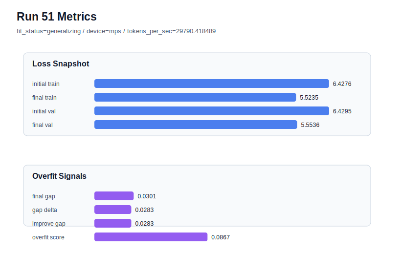

# run 051 실험 보고서

## 이번 가설

새 best run50 조합의 seed=151 재현성 검증: run50은 seed=202, learning_rate=0.0003, max_steps=80, gelu_exact, drop_rate=0.12 조건에서 final_val_loss=5.553959, gap=0.007347, overfit_score=0.041182로 새 best가 되었다. 같은 seed=151 계열의 run44는 gelu_exact와 drop_rate=0.10에서 final_val_loss=5.553211로 validation은 아주 좋았지만 gap=0.033504, overfit_score=0.096829로 low-risk까지는 아니었다. 따라서 run50과 동일한 저손실 조합에서 seed만 151로 바꾸면, drop_rate=0.12가 seed=202 특이 개선이 아니라 seed=151에서도 validation을 유지하면서 gap과 overfit_score를 낮추는지 확인할 수 있다.

## 왜 이 가설을 세웠는가

최근 시각 추세와 leaderboard는 learning_rate=0.0003/max_steps=80 계열이 validation loss 최저권을 안정적으로 만들지만 seed에 따라 과적합 신호가 크게 달라진다는 것을 보여준다. run50은 run45 대비 validation은 0.000636 높아졌지만 gap과 overfit_score를 더 낮춰 overfit-aware score에서 best가 되었다. 이제 새 activation이나 capacity 축으로 이동하기 전에, 같은 조합을 seed=151에 반복해 평균 후보로 삼을 수 있는지 확인하는 것이 해석 가능성이 높다. 이 실험은 Transformer 구조와 함수 조합을 유지하고 seed만 바꾸는 재현성 테스트라, 하드웨어 점유도 짧고 결과 해석도 명확하다.

## 가설 작성 주체

llm_plan:docs/train/next_plan.json

## 바꾼 변수

```json
{
  "seed": 151
}
```

## 고정한 변수

vocab_size=600, context_length=48, stride=null, batch_size=8, max_steps=80, learning_rate=0.0003, weight_decay=0.01, grad_clip=1.0, emb_dim=128, n_heads=4, n_layers=2, drop_rate=0.12, qkv_bias=false, ffn_mult=4, norm_first=false, norm_eps=1e-5, activation_name=gelu_exact, ffn_dropout_position=none, attention_impl=sdpa, tie_embeddings=true, init_std=0.02

## 기대 결과

성공 기준은 seed=151의 기존 gelu_exact run44 대비 final_val_loss가 5.56 이하를 유지하면서 final_generalization_gap이 0.0335보다 낮아지고 overfit_score가 0.09 이하로 내려가는 것이다. final_val_loss가 5.553 전후로 유지되고 overfit_score가 낮아지면 drop_rate=0.12를 best 계열의 평균 후보로 본다. validation이 5.565 이상으로 악화되면 seed=151에서는 dropout 증가가 과도 regularization을 만든 것으로 보고 run44의 drop_rate=0.10을 더 좋은 seed=151 기준으로 유지한다.

## 실험 설정

```json
{
  "run_id": 51,
  "hypothesis": "새 best run50 조합의 seed=151 재현성 검증: run50은 seed=202, learning_rate=0.0003, max_steps=80, gelu_exact, drop_rate=0.12 조건에서 final_val_loss=5.553959, gap=0.007347, overfit_score=0.041182로 새 best가 되었다. 같은 seed=151 계열의 run44는 gelu_exact와 drop_rate=0.10에서 final_val_loss=5.553211로 validation은 아주 좋았지만 gap=0.033504, overfit_score=0.096829로 low-risk까지는 아니었다. 따라서 run50과 동일한 저손실 조합에서 seed만 151로 바꾸면, drop_rate=0.12가 seed=202 특이 개선이 아니라 seed=151에서도 validation을 유지하면서 gap과 overfit_score를 낮추는지 확인할 수 있다.",
  "seed": 151,
  "vocab_size": 600,
  "min_frequency": 2,
  "context_length": 48,
  "stride": null,
  "batch_size": 8,
  "max_steps": 80,
  "eval_batches": 4,
  "train_ratio": 0.9,
  "learning_rate": 0.0003,
  "weight_decay": 0.01,
  "grad_clip": 1.0,
  "emb_dim": 128,
  "n_heads": 4,
  "n_layers": 2,
  "drop_rate": 0.12,
  "qkv_bias": false,
  "ffn_mult": 4,
  "norm_first": false,
  "norm_eps": 1e-05,
  "activation_name": "gelu_exact",
  "ffn_dropout_position": "none",
  "attention_impl": "sdpa",
  "tie_embeddings": true,
  "init_std": 0.02
}
```

## 실행 환경

```json
{
  "timestamp": "2026-06-02T23:09:00+00:00",
  "hostname": "woonyong-MacBookPro.local",
  "platform": "macOS-26.3.1-arm64-arm-64bit-Mach-O",
  "machine": "arm64",
  "python": "3.13.13",
  "torch": "2.12.0",
  "cpu_count": 10,
  "memory_gb": 24.0,
  "cuda_available": false,
  "cuda_device_count": 0,
  "mps_available": true,
  "resolved_device": "mps",
  "profile": "mps_balanced"
}
```

- corpus: `src/learning/the-verdict.txt`
- artifact_dir: `docs/train/runs/run_051_artifacts`

## 실제 결과

| 지표 | 값 |
| --- | --- |
| initial_train_loss | 6.427632451057434 |
| initial_val_loss | 6.429474512736003 |
| final_train_loss | 5.523468613624573 |
| final_val_loss | 5.553611596425374 |
| final_generalization_gap | 0.0301429828008013 |
| generalization_gap_delta | 0.02830092112223248 |
| train_val_improvement_gap | 0.02830092112223248 |
| overfit_score | 0.08674482504526626 |
| fit_status | generalizing |
| parameter_count | 478976 |
| tokens_per_sec | 29790.41848924759 |
| elapsed_sec | 0.9989789170213044 |
| device | mps |

## 시각 지표




- 대시보드: `../dashboard.md`
- 지표 요약 CSV: `../metrics_summary.csv`

## 과적합 판단

일반화 개선 신호. final gap=0.0301, overfit_score=0.0867. seed 반복으로 재현성을 확인할 만하다.

## 결론

현재 best 후보: run 50 / val=5.553958892822266 / status=generalizing

## 다음 실험 제안

- 성공 시: seed=151에서도 drop_rate=0.12가 validation을 유지하며 overfit_score를 낮추면, 다음에는 seed=134에서 같은 gelu_exact/drop_rate=0.12 조합을 확인해 가장 어려운 seed에서도 high learning rate 계열의 과적합을 완화하는지 본다. 세 seed 평균이 안정되면 learning_rate=0.0003/max_steps=80/drop_rate=0.12/gelu_exact를 low-loss 기본 후보로 승격한다.
- 과적합 시: seed=151에서 gap이나 overfit_score가 커지거나 validation이 악화되면 run50은 seed=202 특화 개선으로 분류한다. 다음에는 seed=151은 run44 조건(drop_rate=0.10)을 유지하고, seed=134는 learning_rate=0.000275/drop_rate=0.12 안정화 계열을 기준으로 seed 평균 또는 max_steps 경계 실험을 이어간다.
